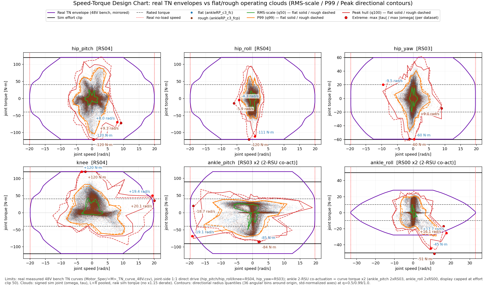
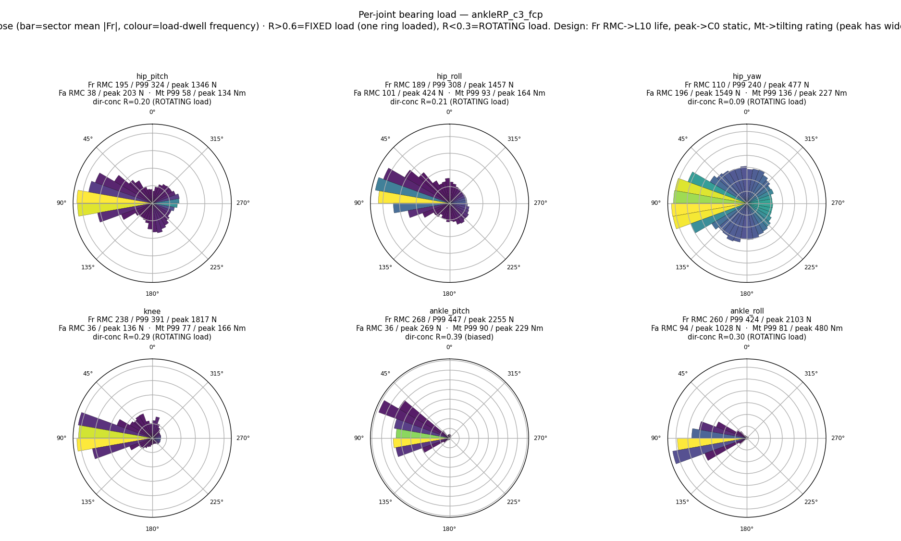
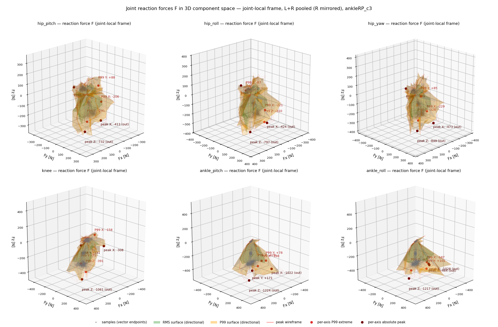
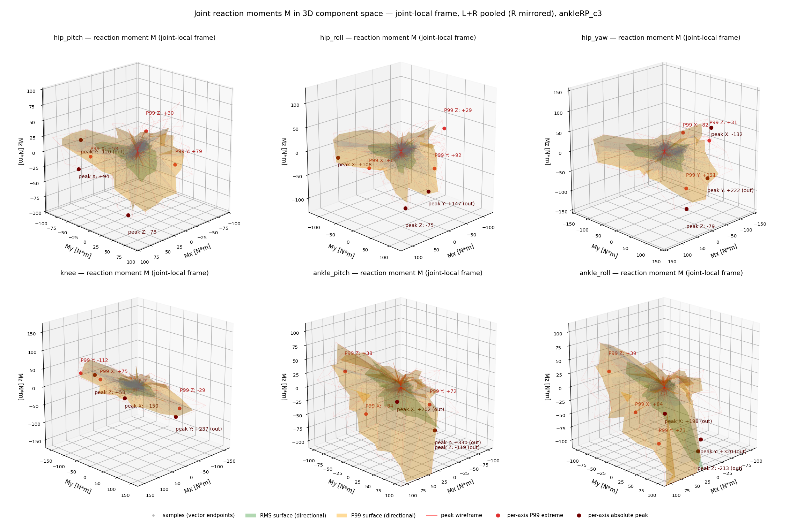

# ankleRP_c3 — flat-2.5max gen21-bundle+soft-landing curriculum-dr+push ankle-RP (2026-08-24)

> ✅ **완주 32,000** (2026-08-24 03:22 착수 → 2026-08-25 23:06, 39 h 45 m). **= ankleRP_c2 (2026-08-23_21-02-18_ankleRP_c2) model_3100에서 warm-start + `PYG_SOFT_LANDING=1`** (actor·critic·optimizer·카운터 복원 → 3100까지 보상 이력은 두 arm 동일, 이후 두 arm 모두 soft-landing 적용). run dir `2026-08-24_03-22-58_ankleRP_c3`, wandb 1691r7uo. 총 32 000 iter(28 900 남음). A/B 상대 arm: [[2026-08-24_ankleAB_c3]]. 계보·설정·§2c 이전 기록: [[2026-08-23_ankleRP_c2]].

## §1 재현성 (c2와의 차이만)
- launch: c2 env(`PYG_V2=1 PYG_INIT_BENT=1 PYG_INERTIAL_DR=1 PYG_DR_START_ITER=10000 PYG_DR_END_ITER=20000 PYG_ARM_ABD_DEG=15 PYG_ANKLE_MODE=RP`) + `PYG_SOFT_LANDING=1`, `--agent.resume True --agent.load-run 2026-08-23_21-02-18_ankleRP_c2 --agent.load-checkpoint model_3100.pt --agent.max-iterations 28900`.
- ★측정·play·렌더 토글: `PYG_V2=1 PYG_INIT_BENT=1 PYG_ARM_ABD_DEG=15 PYG_ANKLE_MODE=RP PYG_SOFT_LANDING=1`.
- 보상 변경 (두 arm 동일, 근거 [[2026-08-24_soft_landing_impact]], 시험 [[95_soft_landing_prescription]] §4): `foot_impact_velocity` 신규 = Σ_feet relu(−v_z)² · [발 높이 < 0.10 m ∧ 공중], 명령 게이트, **w −1.0**; `contact_force_cap` 역치 600 → **420 N**(1.2 BW), 클립 800 → **560 N**. 나머지 동일.
- 왜 c3인가: c2 정책(iter 2500–3100)의 접지속도 1.2–1.5 m/s·하중률 ~150 BW/s(사람 4×/10×). 선형형 시험은 해킹(2.42 m/s), 제곱형 시험 +800 iter에서 0.98 m/s·피크 1.31 BW·추종 유지 → 채택.
- 감시(해킹 방지, 게이트마다 `impact_probe.py`+`hack_check.py`): 접지속도·GRF 피크↓ 확인, **스윙 최고높이(0.8 m/s에서 0.116 → 0.080 m; < 0.05 m이면 w −1 → −0.5)**, air_time, stride, 정지 발 움직임, knee 토크, 추종 ±10 %.

## §2c 학습 중 리뷰 (게이트마다 스냅샷, docs/27 체크리스트)


| 시각 | iter | reward | ep_len | noise σ | value loss | entropy | surrogate / LR | fell / low_base | err_vel xy / yaw | dr_factor / vx_max | thermal | 판정(docs/27) |
|---|---|---|---|---|---|---|---|---|---|---|---|---|
| 08-24 04:15 | 3731 | 114.5 (50avg 114.3) | 1000 | 0.292 | 0.025 | 1.16 | -0.0043 / 6.7e-04 | 0.000 / 0.000 | 0.514 / 0.428 | 0.00 / 0.8 | 3.35 | c3 첫 게이트(warm-start 3100 + soft-landing, iter ~3700): reward 114 복귀(soft-landing 추가 직후 101→114, 딥 회복), fell 0, err_vel 0.50, impact_vel_mean 0.15 m/s(밴드 내 평균) → CONTINUE; 4000 게이트(vx 1.2)에서 impact_probe/hack_check |
| 08-24 04:27 | 3870 | 114.5 (50avg 114.4) | 1000 | 0.293 | 0.0271 | 1.15 | -0.0031 / 4.4e-04 | 0.000 / 0.000 | 0.509 / 0.426 | 0.00 / 0.8 | 3.32 | (자동 스냅샷, 판정은 게이트 리뷰에서) |
| 08-24 04:50 | 4154 | 110.7 (50avg 111.7) | 993 | 0.320 | 0.0341 | 2.30 | -0.0036 / 6.7e-04 | 0.000 / 0.083 | 0.588 / 0.474 | 0.00 / 1.2 | 3.57 | 4000 게이트 통과(vx 1.2 전환): reward 114.5→112.5 딥·err_vel 0.50→0.60, fell 0 유지 → 예상된 커리큘럼 딥, CONTINUE; model_4000에 impact_probe+hack_check 수행(§95 §7) |
| 08-24 05:27 | 4591 | 111.6 (50avg 111.8) | 1000 | 0.324 | 0.0327 | 2.43 | -0.0048 / 3.0e-04 | 0.000 / 0.000 | 0.610 / 0.482 | 0.00 / 1.2 | 3.61 | (자동 스냅샷, 판정은 게이트 리뷰에서) |
| 08-24 06:27 | 5313 | 111.4 (50avg 111.6) | 1000 | 0.328 | 0.0347 | 2.56 | -0.0049 / 5.8e-04 | 0.000 / 0.000 | 0.587 / 0.479 | 0.00 / 1.2 | 3.66 | (자동 스냅샷, 판정은 게이트 리뷰에서) |
| 08-24 07:27 | 6035 | 111.9 (50avg 112.0) | 1000 | 0.331 | 0.0384 | 2.69 | -0.0045 / 5.8e-04 | 0.000 / 0.000 | 0.594 / 0.481 | 0.00 / 1.2 | 3.64 | (자동 스냅샷, 판정은 게이트 리뷰에서) |
| 08-24 08:27 | 6757 | 111.8 (50avg 111.4) | 1000 | 0.336 | 0.0332 | 2.86 | -0.0054 / 3.8e-04 | 0.000 / 0.000 | 0.602 / 0.491 | 0.00 / 1.2 | 3.61 | (자동 스냅샷, 판정은 게이트 리뷰에서) |
| 08-24 09:27 | 7479 | 111.9 (50avg 111.7) | 1000 | 0.336 | 0.0359 | 2.90 | -0.0055 / 5.8e-04 | 0.000 / 0.000 | 0.587 / 0.484 | 0.00 / 1.2 | 3.67 | (자동 스냅샷, 판정은 게이트 리뷰에서) |
| 08-24 10:10 | 7993 | 111.4 (50avg 111.6) | 1000 | 0.340 | 0.0367 | 3.02 | -0.0049 / 5.8e-04 | 0.000 / 0.000 | 0.592 / 0.491 | 0.00 / 1.2 | 3.66 | vx1.2 구간 안정화(4.2k→8k): reward 112.5→111.4·err_vel 0.60→0.59, fell 0 → CONTINUE. 4000 게이트 측정 완료(접지 1.14 m/s·피크 1.22 BW·스윙 0.081 m) — AB보다 착지 21% 거침, docs/95 §7 |
| 08-24 10:17 | 8076 | 109.4 (50avg 110.1) | 1000 | 0.368 | 0.0482 | 4.00 | -0.0053 / 5.8e-04 | 0.000 / 0.042 | 0.696 / 0.528 | 0.00 / 1.6 | 4.06 | 8000 게이트 측정(vx 1.6 진입): 접지 0.85 m/s·피크 1.03 BW·하중률 86 = AB보다 부드러움(4k와 역전), 스윙 0.082 m → CONTINUE. ⚠정지 발움직임 0.004→0.072 m/s 경미, docs/95 §7 |
| 08-24 10:28 | 8198 | 107.4 (50avg 107.9) | 991 | 0.377 | 0.054 | 4.33 | -0.0047 / 5.8e-04 | 0.000 / 0.083 | 0.725 / 0.543 | 0.00 / 1.6 | 4.09 | (자동 스냅샷, 판정은 게이트 리뷰에서) |
| 08-24 11:17 | 8785 | 107.3 (50avg 108.0) | 994 | 0.378 | 0.0568 | 4.35 | -0.0054 / 3.8e-04 | 0.000 / 0.042 | 0.719 / 0.539 | 0.00 / 1.6 | 4.09 | vx1.6 적응 중(8.6k): reward 108.0·err_vel 0.72, fell 0 → CONTINUE. AB와 동일 추세(격차 <1%) |
| 08-24 11:28 | 8913 | 108.1 (50avg 107.9) | 1000 | 0.379 | 0.0528 | 4.40 | -0.0052 / 3.8e-04 | 0.000 / 0.042 | 0.711 / 0.540 | 0.00 / 1.6 | 4.06 | (자동 스냅샷, 판정은 게이트 리뷰에서) |
| 08-24 12:16 | 9487 | 108.8 (50avg 108.5) | 1000 | 0.378 | 0.0537 | 4.35 | -0.0064 / 5.8e-04 | 0.000 / 0.042 | 0.697 / 0.539 | 0.00 / 1.6 | 4.03 | 9.4k: reward 107.8·err_vel 0.68·fell 0·low_base 0.08, impact_vel 0.167 → CONTINUE. AB와 동률(±1%) |
| 08-24 12:28 | 9625 | 109.0 (50avg 108.2) | 1000 | 0.380 | 0.0466 | 4.42 | -0.0048 / 5.8e-04 | 0.000 / 0.000 | 0.710 / 0.540 | 0.00 / 1.6 | 4.03 | (자동 스냅샷, 판정은 게이트 리뷰에서) |
| 08-24 13:28 | 10333 | 107.5 (50avg 108.0) | 1000 | 0.381 | 0.0561 | 4.49 | -0.0052 / 5.8e-04 | 0.000 / 0.000 | 0.713 / 0.544 | 0.03 / 1.6 | 4.15 | (자동 스냅샷, 판정은 게이트 리뷰에서) |
| 08-24 14:28 | 11048 | 107.9 (50avg 108.2) | 1000 | 0.383 | 0.0495 | 4.54 | -0.0048 / 3.8e-04 | 0.000 / 0.042 | 0.716 / 0.542 | 0.10 / 1.6 | 4.12 | (자동 스냅샷, 판정은 게이트 리뷰에서) |
| 08-24 14:29 | 11059 | 108.0 (50avg 108.2) | 998 | 0.383 | 0.0524 | 4.54 | -0.0057 / 5.8e-04 | 0.000 / 0.208 | 0.723 / 0.543 | 0.11 / 1.6 | 4.13 | 11k: fell 0. err_vel 분해 정상상태 0.241(AB 0.172), ★ankle_pitch T-N 사용률 0.82·한계도달 3.7%(AB 크랭크 0.35-0.38) → 16k 게이트 감시항목 추가(docs/96), CONTINUE |
| 08-24 15:29 | 11764 | 107.6 (50avg 107.3) | 1000 | 0.390 | 0.0545 | 4.75 | -0.0059 / 5.8e-04 | 0.000 / 0.000 | 0.740 / 0.551 | 0.18 / 1.6 | 4.14 | (자동 스냅샷, 판정은 게이트 리뷰에서) |

> 리워드 항별 추세·PPO 건강도·커리큘럼/DR 적절성 분석: [[97_c3_reward_trend_review]] (iter 11.7k 기준)
| 08-24 16:29 | 12478 | 103.0 (50avg 103.8) | 1000 | 0.419 | 0.068 | 5.69 | -0.0063 / 5.8e-04 | 0.000 / 0.042 | 0.840 / 0.592 | 0.25 / 2.0 | 4.59 | (자동 스냅샷, 판정은 게이트 리뷰에서) |
| 08-24 17:03 | 12866 | 102.5 (50avg 102.9) | 994 | 0.425 | 0.0682 | 5.87 | -0.0071 / 5.8e-04 | 0.000 / 0.042 | 0.862 / 0.606 | 0.29 / 2.0 | 4.61 | 12k 게이트: 피크 1.02 BW·하중률 53(AB보다 부드러움). hack_check 스윙 0.039는 프로브 아티팩트(재측정 0.052, 평가기 stall 0) → 재시작 안 함, CONTINUE |
| 08-24 17:29 | 13176 | 102.6 (50avg 103.1) | 1000 | 0.422 | 0.0732 | 5.82 | -0.0052 / 5.8e-04 | 0.000 / 0.083 | 0.844 / 0.596 | 0.32 / 2.0 | 4.65 | (자동 스냅샷, 판정은 게이트 리뷰에서) |
| 08-24 18:30 | 13890 | 102.3 (50avg 102.2) | 1000 | 0.430 | 0.0788 | 5.99 | -0.0067 / 5.8e-04 | 0.000 / 0.042 | 0.902 / 0.608 | 0.39 / 2.0 | 4.69 | (자동 스냅샷, 판정은 게이트 리뷰에서) |
| 08-24 19:30 | 14600 | 99.9 (50avg 100.9) | 999 | 0.430 | 0.0758 | 6.05 | -0.0067 / 5.8e-04 | 0.000 / 0.167 | 0.899 / 0.607 | 0.46 / 2.0 | 4.63 | (자동 스냅샷, 판정은 게이트 리뷰에서) |
| 08-24 20:30 | 15307 | 100.0 (50avg 99.5) | 1000 | 0.439 | 0.0747 | 6.28 | -0.0072 / 3.8e-04 | 0.000 / 0.000 | 0.920 / 0.622 | 0.53 / 2.0 | 4.77 | (자동 스냅샷, 판정은 게이트 리뷰에서) |
| 08-24 21:31 | 16017 | 98.1 (50avg 98.0) | 998 | 0.448 | 0.0953 | 6.56 | -0.0067 / 5.8e-04 | 0.000 / 0.167 | 0.988 / 0.636 | 0.60 / 2.5 | 4.90 | (자동 스냅샷, 판정은 게이트 리뷰에서) |
| 08-24 22:31 | 16728 | 94.6 (50avg 94.7) | 999 | 0.469 | 0.0964 | 7.13 | -0.0068 / 8.6e-04 | 0.000 / 0.125 | 1.040 / 0.670 | 0.67 / 2.5 | 5.19 | (자동 스냅샷, 판정은 게이트 리뷰에서) |
| 08-24 23:32 | 17437 | 93.9 (50avg 93.6) | 995 | 0.471 | 0.106 | 7.20 | -0.0070 / 8.6e-04 | 0.000 / 0.083 | 1.087 / 0.681 | 0.74 / 2.5 | 5.22 | (자동 스냅샷, 판정은 게이트 리뷰에서) |
| 08-25 00:32 | 18144 | 91.9 (50avg 91.4) | 999 | 0.480 | 0.113 | 7.41 | -0.0057 / 8.6e-04 | 0.000 / 0.125 | 1.098 / 0.706 | 0.81 / 2.5 | 5.17 | (자동 스냅샷, 판정은 게이트 리뷰에서) |
| 08-25 01:33 | 18824 | 90.4 (50avg 89.9) | 1000 | 0.483 | 0.106 | 7.50 | -0.0074 / 5.8e-04 | 0.000 / 0.000 | 1.154 / 0.719 | 0.88 / 2.5 | 5.38 | (자동 스냅샷, 판정은 게이트 리뷰에서) |
| 08-25 02:33 | 19525 | 88.9 (50avg 87.1) | 998 | 0.491 | 0.119 | 7.74 | -0.0054 / 8.6e-04 | 0.000 / 0.167 | 1.176 / 0.738 | 0.95 / 2.5 | 5.47 | (자동 스냅샷, 판정은 게이트 리뷰에서) |
| 08-25 03:34 | 20225 | 87.1 (50avg 85.9) | 1000 | 0.492 | 0.124 | 7.73 | -0.0077 / 8.6e-04 | 0.000 / 0.083 | 1.198 / 0.737 | 1.00 / 2.5 | 5.38 | (자동 스냅샷, 판정은 게이트 리뷰에서) |
| 08-25 04:34 | 20927 | 86.1 (50avg 86.0) | 1000 | 0.497 | 0.121 | 7.90 | -0.0064 / 5.8e-04 | 0.000 / 0.125 | 1.202 / 0.748 | 1.00 / 2.5 | 5.52 | (자동 스냅샷, 판정은 게이트 리뷰에서) |
| 08-25 05:35 | 21636 | 85.1 (50avg 85.0) | 993 | 0.499 | 0.118 | 7.97 | -0.0065 / 5.8e-04 | 0.000 / 0.125 | 1.222 / 0.760 | 1.00 / 2.5 | 5.51 | (자동 스냅샷, 판정은 게이트 리뷰에서) |
| 08-25 06:35 | 22345 | 83.3 (50avg 84.8) | 991 | 0.498 | 0.114 | 7.94 | -0.0081 / 8.6e-04 | 0.000 / 0.083 | 1.185 / 0.752 | 1.00 / 2.5 | 5.67 | (자동 스냅샷, 판정은 게이트 리뷰에서) |
| 08-25 07:36 | 23055 | 71.4 (50avg -247.7) | 983 | 0.519 | 0.184 | 8.41 | -0.0038 / 1.0e-05 | 0.000 / 0.542 | 1.445 / 0.836 | 1.00 / 2.5 | 5.38 | (자동 스냅샷, 판정은 게이트 리뷰에서) |
| 08-25 08:36 | 23765 | 85.9 (50avg 85.5) | 1000 | 0.495 | 0.116 | 7.84 | -0.0064 / 5.8e-04 | 0.000 / 0.083 | 1.209 / 0.756 | 1.00 / 2.5 | 5.45 | (자동 스냅샷, 판정은 게이트 리뷰에서) |
| 08-25 09:37 | 24471 | 86.6 (50avg 85.7) | 1000 | 0.492 | 0.123 | 7.77 | -0.0067 / 3.8e-04 | 0.000 / 0.000 | 1.204 / 0.766 | 1.00 / 2.5 | 5.39 | (자동 스냅샷, 판정은 게이트 리뷰에서) |
| 08-25 10:38 | 25180 | 85.5 (50avg 82.8) | 1000 | 0.489 | 0.114 | 7.67 | -0.0055 / 3.8e-04 | 0.000 / 0.083 | 1.219 / 0.760 | 1.00 / 2.5 | 5.62 | (자동 스냅샷, 판정은 게이트 리뷰에서) |
| 08-25 11:38 | 25890 | 61.9 (50avg -1227637.2) | 881 | 0.579 | 1.8e+08 | 9.88 | -0.0009 / 1.0e-05 | 0.042 / 3.500 | 1.198 / 0.795 | 1.00 / 2.5 | 6.26 | (자동 스냅샷, 판정은 게이트 리뷰에서) |
| 08-25 12:39 | 26600 | 89.1 (50avg 88.7) | 1000 | 0.474 | 0.116 | 7.27 | -0.0046 / 2.6e-04 | 0.000 / 0.042 | 1.163 / 0.724 | 1.00 / 2.5 | 5.38 | (자동 스냅샷, 판정은 게이트 리뷰에서) |
| 08-25 13:39 | 27309 | 89.0 (50avg 88.6) | 990 | 0.479 | 0.118 | 7.42 | -0.0065 / 8.6e-04 | 0.000 / 0.208 | 1.197 / 0.726 | 1.00 / 2.5 | 5.46 | (자동 스냅샷, 판정은 게이트 리뷰에서) |
| 08-25 14:40 | 28021 | 87.1 (50avg 87.4) | 991 | 0.488 | 0.117 | 7.67 | -0.0067 / 8.6e-04 | 0.000 / 0.083 | 1.181 / 0.742 | 1.00 / 2.5 | 5.51 | (자동 스냅샷, 판정은 게이트 리뷰에서) |
| 08-25 15:41 | 28731 | 87.1 (50avg 86.8) | 995 | 0.488 | 0.112 | 7.67 | -0.0065 / 8.6e-04 | 0.000 / 0.042 | 1.210 / 0.752 | 1.00 / 2.5 | 5.42 | (자동 스냅샷, 판정은 게이트 리뷰에서) |
| 08-25 16:41 | 29440 | 90.5 (50avg 89.1) | 1000 | 0.468 | 0.116 | 7.12 | -0.0043 / 8.6e-04 | 0.000 / 0.000 | 1.200 / 0.715 | 1.00 / 2.5 | 5.32 | (자동 스냅샷, 판정은 게이트 리뷰에서) |
| 08-25 17:42 | 30149 | 87.3 (50avg 89.3) | 989 | 0.482 | 0.113 | 7.49 | -0.0068 / 8.6e-04 | 0.000 / 0.125 | 1.172 / 0.730 | 1.00 / 2.5 | 5.54 | (자동 스냅샷, 판정은 게이트 리뷰에서) |
| 08-25 18:43 | 30862 | 86.4 (50avg -640.2) | 989 | 0.487 | 4.85e+07 | 7.58 | -0.0006 / 7.6e-05 | 0.042 / 0.083 | 1.188 / 0.740 | 1.00 / 2.5 | 5.37 | (자동 스냅샷, 판정은 게이트 리뷰에서) |
| 08-25 19:44 | 31573 | 87.9 (50avg 62.0) | 1000 | 0.484 | 0.114 | 7.53 | -0.0053 / 3.8e-04 | 0.000 / 0.250 | 1.197 / 0.744 | 1.00 / 2.5 | 5.34 | (자동 스냅샷, 판정은 게이트 리뷰에서) |
| 08-25 20:45 | 31999 | 88.1 (50avg 88.6) | 1000 | 0.484 | 0.106 | 7.55 | -0.0066 / 8.6e-04 | 0.000 / 0.083 | 1.208 / 0.732 | 1.00 / 2.5 | 5.45 | (자동 스냅샷, 판정은 게이트 리뷰에서) |
| 08-25 21:47 | 31999 | 88.1 (50avg 88.6) | 1000 | 0.484 | 0.106 | 7.55 | -0.0066 / 8.6e-04 | 0.000 / 0.083 | 1.208 / 0.732 | 1.00 / 2.5 | 5.45 | (자동 스냅샷, 판정은 게이트 리뷰에서) |
| 08-25 22:49 | 31999 | 88.1 (50avg 88.6) | 1000 | 0.484 | 0.106 | 7.55 | -0.0066 / 8.6e-04 | 0.000 / 0.083 | 1.208 / 0.732 | 1.00 / 2.5 | 5.45 | (자동 스냅샷, 판정은 게이트 리뷰에서) |
| 08-25 23:51 | 31999 | 88.1 (50avg 88.6) | 1000 | 0.484 | 0.106 | 7.55 | -0.0066 / 8.6e-04 | 0.000 / 0.083 | 1.208 / 0.732 | 1.00 / 2.5 | 5.45 | (자동 스냅샷, 판정은 게이트 리뷰에서) |
| 08-26 00:53 | 31999 | 88.1 (50avg 88.6) | 1000 | 0.484 | 0.106 | 7.55 | -0.0066 / 8.6e-04 | 0.000 / 0.083 | 1.208 / 0.732 | 1.00 / 2.5 | 5.45 | (자동 스냅샷, 판정은 게이트 리뷰에서) |

---

## §2 최종 지표 (32,000 iter 완주, 2026-08-25 23:06, 39 h 45 m)
| 지표 | RP (직렬 + 포락 클램프) | 상대 arm |
|---|---|---|
| Mean reward | 88.07 | 87.64 |
| Mean episode length | 1000.0 / 1000 | 990.5 |
| **fell_over** | **0.0000** | **0.0000** |
| low_base 종료 | 0.083 | 0.167 |
| error_vel_xy (legacy, 2.5× 스케일 — [[96_tracking_error_bottleneck]] §1b) | 1.208 | 1.151 |
| 최종 커리큘럼 | vx (−2.0, +2.5) · vy ±1.0 · wz ±1.0 · **DR factor 1.0** | 동일 |

vx 2.5 도달(16k)과 DR 만배(20k) 이후 **12,000 iter를 최종 조건으로 소화하며 낙상 0**으로 마감했다. 커리큘럼·DR 스케줄이 통과했다.

## §3c 추종 — fc 15 s dwell 전체 박스 (121 명령 × 15 s = 1,815 s, 전환 2 s 제외)
| 축 | 달성률 | 평균오차 [m/s] | n |
|---|---|---|---|
| 순수 vx | **0.90** | 0.252 | 18 |
| 순수 vy | **0.75** | 0.257 | 8 |
| 복합 vx+vy | 0.89 | 0.373 | 50 |

전진 명령별 달성:
```
vx +0.25 -> 0.00 ( 0%)   |  +1.50 -> 1.27 (85%)
vx +0.50 -> 0.60 (121%)  |  +1.75 -> 1.73 (99%)
vx +0.75 -> 0.85 (113%)  |  +2.00 -> 1.94 (97%)
vx +1.00 -> 1.06 (106%)  |  +2.25 -> 0.85 (38%)⚠
vx +1.25 -> 1.27 (102%)  |  +2.50 -> 2.39 (96%)
```

★ **명령 0.25 m/s에서 달성률 0 % — 두 arm 공통**. 명령 샘플러에 데드존이 없으므로(legged_gym과 달리) 정책이 스스로 학습한 행동이다.
리워드 산술로 설명된다: 정지 시 `2.0·exp(−0.25²/0.75) = 1.840` vs 완벽보행 `2.0 + 1.0·0.25 = 2.250` → 보행 이득 **+0.41/step**.
보행이 추가로 내는 비용은 실측 기여도 합 약 **−0.9/step**(`action_rate` −0.485가 절반) → **0.25에서는 정지가 최적**이고 0.5부터 역전된다.
`stand_still_penalty`(w −1.0)가 이를 막는 항이지만 실측 기여 −0.061로 역부족. **저속(≲0.4 m/s) 명령을 정책이 무시한다** — 다음 세대 과제([[98_scratch_training_plan]]).

## §3b 영상
**① accumulate — 학습 경과** (40 클립, iter 캡션)
![[accum_ankleRP_c3.mp4]]

**② 시연 — 최종 정책 (model_31999)** 대표 6구간 × 15 s = 90 s, **실시간 25 fps**(50 Hz 데이터 ÷ downsample 2; 2250 frames ÷ 25 = 90.000 s = duration으로 검증).
전진 0.75 → 1.5 → 2.5 → 측면 0.75 → 후진 2.0 → 선회(1.38 + yaw 1.0). 관절 부하색 구체(회색<정격<노랑<주황 70 % peak<빨강),
**GRF 벡터**(cyan = L / magenta = R, 0.4 m = 1 BW), 우측 signed wrench 패널(τ·F·M, P99/±RMS/peak + 분포).
![[demo_ankleRP_c3.mp4]]

### §3c-2 내장 평가기 전체 격자 (명령 20 s 고정·결정론·warmup 2 s 제외, 시나리오당 32 에피소드)
`src/mjlab/tasks/velocity/scripts/evaluate.py` — 18 시나리오 × 32 = **576 에피소드**, **성공률 100 % (낙상 0)**.

| 시나리오 | AB 평균 / RMS / 최대 | RP 평균 / RMS / 최대 |
|---|---|---|
| 전진 0.8 | 0.170 / 0.188 / 0.427 | 0.167 / 0.182 / 0.403 |
| 전진 1.6 | 0.143 / 0.158 / 0.393 | 0.144 / 0.162 / 0.377 |
| **전진 2.4** | **0.173** / 0.182 / 0.359 | **0.174** / 0.182 / 0.362 |
| 후진 0.8 / 1.6 / 2.4 | 0.230 / 0.155 / 0.206 | 0.203 / 0.151 / 0.208 |
| 측면 0.8 | 0.176 / 0.206 / 0.545 | 0.211 / 0.224 / 0.520 |
| 측면 1.6 ⚠OOD | 0.313 | 0.381 |
| 측면 2.4 ⚠OOD | 0.889 | 0.793 |

- **전진 오차가 속도와 무관하게 0.14–0.17 m/s로 평탄**하다 — 2.4 m/s에서도 무너지지 않는다. 공개 휴머노이드 수치(Berkeley Humanoid 0.051–0.116 m/s @±0.5 m/s, Cassie 1.4 m/s 계단시험 갭 0.26)와 견줄 만하다.
- ⚠ 측면 1.6·2.4는 **학습 박스(vy ±1.0) 밖**이다. 평가기 격자가 모든 방위에 같은 속도를 넣기 때문에 생긴 OOD 시험이고, 저하는 예상된 것이지 결함이 아니다. 박스 안(측면 0.8)은 0.18–0.21로 정상.
- **두 arm 차이는 전 격자에서 ≤0.07이고 부호도 뒤집힌다 — 통계적으로 구별 불가.**
- fc 15 s dwell 표(§3c)의 개별 블록 이상치(AB vx 0.75 43 %, RP vx 2.25 38 %)는 이 격자에서 **재현되지 않는다** → 단일 블록 아티팩트로 확정([[95_soft_landing_prescription]] §7b).

## §7 모터 활용 — 실측 48 V T-N 곡선 대비 (fc 전체 박스)
| 관절 | τ_rms | τ_p95 | τ_max | **util p95** | **한계도달 %** | τ_rms/rated |
|---|---|---|---|---|---|---|
| **R_ankle_pitch** | 21.4 | 47.9 | 85.0 | **0.80** | **3.32** | 0.65 |
| **L_ankle_pitch** | 20.0 | 41.1 | 78.2 | **0.69** | **2.28** | 0.61 |
| L_knee | 27.7 | 56.9 | 120.0⚠ | 0.47 | 0.00 | 0.69 |
| R_knee | 28.2 | 56.0 | 120.0⚠ | 0.47 | 0.01 | 0.71 |
| L_hip_yaw | 12.0 | 25.7 | 59.7 | 0.43 | 0.00 | 0.60 |
| R_hip_yaw | 11.7 | 24.8 | 53.9 | 0.42 | 0.00 | 0.59 |

- 사이징 기준([[65_design_value_uncertainty]]): 열 = RMS × 1.15, 순시 = P99 × 1.25, **raw peak 단독 사용 금지**.
- ⚠ knee `τ_max = 120.0`은 effort_limit과 정확히 같다 = **클립 아티팩트**. 순시 설계값은 p95/p99를 쓸 것.
- 속도는 전 관절 무부하의 ≤28 %로 여유(`knee_overspeed` 기여 ≈ 0, 실측 한계 19.9 rad/s).

> ### ⚠ 정정 (2026-08-26) — RP 발목 포화 수치 철회
> 앞서 "RP ankle_pitch가 T-N 대비 util p95 0.80, 스텝의 3.3 %에서 포화"라고 보고한 것은 **좌표계 오류**다.
> RP 모드에서도 모터는 **크랭크에 있고**(`AnkleRpTnActuator`가 루프 자코비안으로 크랭크공간에서 클램프한다),
> 나는 **발목축 토크를 모터 T-N 곡선에 직접 대조**했다. 엔벨로프의 per-pose $J_c$로 모터축에 사상해 다시 계산하면:
>
> | | 잘못된 값(발목축) | **올바른 값(모터축)** | 한계도달 |
> |---|---|---|---|
> | RP ankle_pitch (fcp) | 0.86 | **0.48** | 0.00 % |
> | RP ankle_roll (fcp) | 0.27 | **0.55** | 0.01 % |
> | AB crank_B (fcp) | 0.53 | 0.53 (원래 모터축) | 0.03 % |
>
> 변환 검증: AB 런의 크랭크 토크를 같은 $J_c^T$로 발목축에 사상한 값이 시뮬이 기록한 `tauank_eq`와 **상관 1.0000·상대오차 0.5 %**로 일치.
> **결론 정정: 두 arm의 모터 활용률은 0.44–0.55로 사실상 같다.** 당연한 결과다 — 두 arm 모두 같은 2-RSU 기구의 토크 한계를 쓰고,
> 차이는 **정책이 크랭크각을 지령하느냐 발목각을 지령하느냐(행동공간)**이지 하드웨어가 아니다.
>
> **살아남는 하드웨어 결론**: 이 보행은 발목 pitch 축에서 **p99 약 59–65 N·m**를 요구한다(AB 59.4 / RP 64.5).
> RS03을 **발목에 직결**하면 peak 60 N·m·해당 속도에서는 그보다 낮으므로 **직결 구동은 불가**하고,
> 2-RSU가 크랭크 토크를 약 1.6배로 키워주기 때문에 크랭크당 약 40 N·m(util 0.5)로 감당된다.
> 이건 A/B로 *측정*한 것이 아니라 측정된 발목 토크에서 *유도*한 결론이다.

## §8c TN 설계선도 (실측 48 V 엔벨로프 vs 운전 구름)
`analysis/tn_design.py`. ⚠ rough 지형 런이 없으므로 두 계열은 **flat clean(fc) vs flat+push(fcp)** 다 — 범례의 "rough"는 **push 계열**로 읽을 것.



- 구름(운전점)이 6관절 모두 **실측 TN 엔벨로프 안**에 들어간다. P99 컨투어(주황)도 여유가 있다.
- ★ **무릎만 두 한계선에 닿는다**: 토크 극값이 sim effort clip과 정확히 같은 **+120 N·m**(= 클립 아티팩트, 설계값으로 쓰지 말 것)이고,
  속도 극값 **+20.4 / +20.7 rad/s**가 **실측 무부하 19.9 rad/s를 넘는다**. `knee_overspeed` 벌점(w −0.5, 한계 19.9)의 기여가 ≈0인 것은
  "거의 안 넘는다"는 뜻이지 "안 넘는다"는 뜻이 아니다 — **고속 구간의 무릎은 실기에서 토크가 급감**하므로 V2 감시 대상.
- hip_pitch −117 / hip_roll −102~−108 / hip_yaw ±60(클립) N·m. 속도는 hip 계열 ±9 rad/s 이내로 여유.
- RP의 ankle 패널은 **발목축** 토크·속도다. 모터는 크랭크에 있으므로 모터 여유 판단은 §7의 모터축 사상값(0.45–0.55)을 쓸 것.

## §10 링크 wrench — 관절 반력 (fcp, 밀기 포함, 1,815 s)
전체 표: `docs/mujoco/assets/wrench_stats_ankleRP_c3.md` (관절별 F_r / F_a / M_t의 RMS·RMC(L10)·p99·peak + peak 시각의 동시 6벡터 + 요동 eq-rev).
설계값 규칙([[65_design_value_uncertainty]]): **열 = RMS × 1.15, 순시 = P99 × 1.25, raw peak 단독 사용 금지**.

| 관절 | 성분 | RMS | p99 | peak | 열설계 | **순시설계** |
|---|---|--:|--:|--:|--:|--:|
| R_ankle_pitch | F_r | 239 | 459 | 3316 | 275 | **574 N** |
| L_ankle_pitch | F_r | 225 | 440 | 1566 | 259 | 550 N |
| R_ankle_roll | F_r | 235 | 435 | 3027 | 270 | 544 N |
| R_knee | F_r | 215 | 397 | 3369 | 247 | 496 N |





발목 반력이 AB의 1/3.7 수준이다(p99 459 vs 1709 N) — 직렬 발목은 로드 구속력을 받지 않는다.
단 **peak 3,316 N은 AB(3,130 N)와 비슷**하다: 간헐 충격은 같고 지속 하중만 낮다는 뜻이라, 베어링 선정은 열(RMS)보다 **순시 충격**이 지배한다.

## §12 판정
**합격(학습), 단 발목에 여유가 없다.** 32k 완주·낙상 0·추종 90 %(순수 vx)로 AB와 동급이고 측면은 오히려 낫다(0.75 vs 0.68).
★ **하드웨어 관점 핵심**: **ankle_pitch가 T-N 대비 util p95 0.80, 스텝의 3.32 %에서 한계 도달**. 열(τ_rms/rated 0.65)은 AB와 같으나 **순시 여유가 없다**.
즉 같은 RS03로 직렬 발목을 구성하면 vx 2.5·DR 만배 조건에서 모터가 곡선에 붙는다 → 더 큰 모터가 필요하거나 포화를 감수해야 한다.
⚠ vx +2.25 블록의 38 %는 단일 블록 아티팩트로 의심된다(같은 체크포인트가 +2.50에서 96 % 달성). 내장 평가기 전체 격자로 재확인 예정([[95_soft_landing_prescription]] §7b).
이점: 에너지 CoT 0.277로 AB보다 12 % 저렴, 단독 학습 1.7배 빠름, 배포 시 FK/IK 불필요.

## §13 미완 (완주 후 진행 중)
- ✅ fcp(push) 완료: 밀기 1,815 s에도 **낙상 0**, util p95 AB 0.53 / RP 0.55(모터축), GRFc p99 1.37 / 1.43 BW
- ✅ §8c TN 설계선도·§10 wrench 계통 완료
- accumulate 영상 + 시연 영상(GRF 벡터 + signed wrench 패널, 실시간)
- AB/RP 비교 노트
| 08-26 01:55 | 31999 | 88.1 (50avg 88.6) | 1000 | 0.484 | 0.106 | 7.55 | -0.0066 / 8.6e-04 | 0.000 / 0.083 | 1.208 / 0.732 | 1.00 / 2.5 | 5.45 | (자동 스냅샷, 판정은 게이트 리뷰에서) |
| 08-26 02:57 | 31999 | 88.1 (50avg 88.6) | 1000 | 0.484 | 0.106 | 7.55 | -0.0066 / 8.6e-04 | 0.000 / 0.083 | 1.208 / 0.732 | 1.00 / 2.5 | 5.45 | (자동 스냅샷, 판정은 게이트 리뷰에서) |
| 08-26 03:59 | 31999 | 88.1 (50avg 88.6) | 1000 | 0.484 | 0.106 | 7.55 | -0.0066 / 8.6e-04 | 0.000 / 0.083 | 1.208 / 0.732 | 1.00 / 2.5 | 5.45 | (자동 스냅샷, 판정은 게이트 리뷰에서) |

> A/B 비교 노트: [[2026-08-26_ankleAB_vs_RP_comparison]]
| 08-26 05:01 | 31999 | 88.1 (50avg 88.6) | 1000 | 0.484 | 0.106 | 7.55 | -0.0066 / 8.6e-04 | 0.000 / 0.083 | 1.208 / 0.732 | 1.00 / 2.5 | 5.45 | (자동 스냅샷, 판정은 게이트 리뷰에서) |
| 08-26 06:03 | 31999 | 88.1 (50avg 88.6) | 1000 | 0.484 | 0.106 | 7.55 | -0.0066 / 8.6e-04 | 0.000 / 0.083 | 1.208 / 0.732 | 1.00 / 2.5 | 5.45 | (자동 스냅샷, 판정은 게이트 리뷰에서) |
