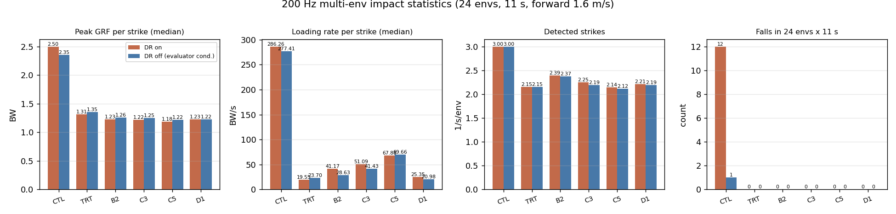

# bundleD1_AB — 채택 3안 동시 시험 (2026-08-26)

> *한 줄*: 번들 시험에서 하나씩 이겼던 세 변경을 **한꺼번에** 넣고 c3에서 +800 iter 더 돌렸다.
> 학습은 이겼다(Mean reward 86.3 vs C3 85.0 vs CTL 77.6). 다만 **셋 중 하나는 내가 생각한 그 변경이 아니었다**(§4).

| | |
|---|---|
| 런 | `logs/rsl_rl/pygmalion_velocity/2026-08-26_15-02-37_bundleD1_AB` |
| 계보 | `ankleAB_c3` `model_31999` → +800 iter → **`model_32798`** (16384 env, 39분 58초) |
| 대조 | `bundleC3_AB`(초기자세 단독) / `bundleCTL_AB`(무변경) — 같은 체크포인트·같은 배치·같은 iter |
| 변인 | `PYG_INIT_MID=1` + `PYG_KNEE_EXT=1`(w −2.0 @25°) + `PYG_SOFT_LANDING_MODE=both` |
| 근거 | [[2026-08-26_human_landing_bundle]] §10–§12 · 레시피 [[103_v2_training_plan]] §4a |

## §1 무엇을 바꿨나
1. **`PYG_INIT_MID`** — 초기자세 무릎 −38.4° → −20.05°, 힙피치 −0.32 → −0.175 rad.
   `use_default_offset=True`라 **기본자세가 곧 액션의 원점**이다. 원점을 인간형 착지 쪽으로 옮긴다.
   부수 효과로 리셋 시 발바닥이 바닥 위 **47 mm → −10 mm**가 되어 리셋 낙하 충격이 사라진다.
2. **`PYG_KNEE_EXT`** — 입각(접촉 게이트) 무릎이 25°를 넘는 만큼만 제곱 벌점, w −2.0. 스윙은 건드리지 않는다.
3. **`PYG_SOFT_LANDING_MODE=both`** — 의도는 "접지속도 항 유지 + 하중률 항 병행"이었다. **§4 참조**.

## §2 학습 지표 (텐서보드 최종값)
| | CTL | C3 | C5 | **D1** |
|---|---|---|---|---|
| Mean reward | 77.63 | 84.95 | 83.01 | **86.34** |
| `error_vel_xy_mean` | 0.4956 | 0.4911 | 0.5364 | **0.4865** |
| `error_vel_xy_steady` | 0.3669 | 0.3667 | 0.4064 | **0.3598** |
| `stance_knee_deg` | — | — | 24.58 | 25.87 |
| `foot_impact_velocity` | −0.0751 | −0.0571 | — | **−0.0290** |
| `stance_knee_extension` | — | — | −0.0302 | −0.0334 |
| `foot_loading_rate` | — | — | — | **0.00000** ⚠ |

D1이 **보상·추종 두 축 모두에서 최고**다. C5가 무릎항 때문에 추종을 잃었던 것(0.5364)과 달리
D1은 무릎항을 넣고도 추종이 가장 좋다 — 초기자세와 함께 쓰면 무릎항의 대가가 사라진다.

## §3 판정 — 평가기 32 ep + 200 Hz 다중 env
계측 대역을 나눠 쟀다: **느린 양(추종·duty·stride·자세) = 평가기 32 ep**, **충격·하중률 = 200 Hz × 24 env**
(50 Hz 평가기는 폭 15–25 ms의 착지 스파이크를 에일리어싱한다, [[2026-08-26_human_landing_bundle]] §11c).

### 3a. 평가기 32 에피소드 (전진 1.6 m/s, 중앙값, p10–p90)
| | CTL | C3 | C5 | B2 | **D1** |
|---|---|---|---|---|---|
| duty | 0.557 | 0.552 | 0.547 | 0.557 | 0.554 |
| stride/s | 2.556 | 2.50 | 2.44 | **2.83** | 2.556 |
| **피크 GRF** (BW) | 1.227 | 1.126 | 1.126 | 1.135 | **1.093** |
| 하중률 (BW/s, *50 Hz라 참고값*) | 10.25 | 14.02 | 14.53 | 8.78 | 13.48 |
| **입각 무릎** | 51.4° | 46.2° | 40.1° | 51.8° | **39.1°** |
| 전진 오차 | 0.163 | 0.119 | 0.142 | **0.117** | 0.133 |
| 에피소드 폭(오차 p10–p90) | 0.023 | — | — | — | **0.011** |

### 3b. 200 Hz × 24 env (DR off = 평가기 조건 / DR on = 강건성)
| | CTL | TRT | B2 | C3 | C5 | **D1** |
|---|---|---|---|---|---|---|
| 피크 GRF (BW) | 2.353 | 1.353 | 1.261 | 1.250 | **1.222** | 1.224 |
| **하중률** (BW/s) | 277.4 | 23.7 | 28.6 | 41.4 | 69.7 | **21.0** |
| 스트라이크/s/env | 3.00 | 2.15 | 2.37 | 2.19 | 2.12 | 2.19 |
| 낙상 (DR **on**, 24 env × 11 s) | **12** | 0 | 0 | 0 | 0 | **0** |

### 3c. 판정: **채택**
- **하중률이 전 arm 최저(21.0 BW/s)이면서 피크도 최저권(1.224 BW)**이다. C5는 피크는 같은 수준이지만 하중률이 **3.3배**(69.7),
  TRT는 하중률은 비슷하지만 피크가 가장 높다(1.353). **D1만 두 축을 동시에 잡았다.**
- 입각 무릎 **39.1°**로 가장 곧다(대조군 51.4°에서 **−12.3°**). C5(40.1°)보다도 낫고, C5가 치른 추종 대가(0.142)를 치르지 않는다(0.133).
- 에피소드 간 오차 폭이 **0.011**로 가장 좁다 = 명령·초기조건에 대한 재현성이 가장 좋다.
- 남는 약점: 추종 오차 0.133이 B2(0.117)·C3(0.119)보다 크다. 무릎항의 잔여 대가로 보인다.
  **자세·충격이 목표면 D1, 순수 추종이 목표면 C3**가 낫다 — 이 프로젝트의 목표(하드웨어 하중)는 전자다.

⇒ **레시피 확정**: `PYG_INIT_MID=1` + `PYG_KNEE_EXT=1`(w −2.0 @25°) + `PYG_SOFT_LANDING_MODE=half`.
RP arm 이식 시험(`bundleCTL_RP` / `bundleD1_RP`, 16384 env, +800 iter) 착수함.

## §4 ⚠ 이 런이 실제로 시험한 것
`Episode_Reward/foot_loading_rate`가 **800 iter 내내 정확히 0**이다. 하중률 항은 접촉력 z의 **부호를 거꾸로 읽어**
터치다운을 한 번도 검출하지 못했다(전문: [[2026-08-26_human_landing_bundle]] §12).
`both` 모드가 실제로 한 일은 **`foot_impact_velocity` 가중치를 절반으로 줄인 것**뿐이다(−0.0571 → −0.0290).

⇒ **D1이 시험한 조합 = 초기자세 중간값 + 입각 무릎 신전항 + 접지속도 벌점 ½.**
결과는 그대로 유효하지만 이름을 바꿔 적어야 한다. 이 설정을 재현하는 플래그로 **`PYG_SOFT_LANDING_MODE=half`**를 신설했다.
하중률 항은 부호 수정 + 가중치 재교정(0.002 → 1e-4) 후 **아직 한 번도 학습에서 돌지 않았다**.

## §R 참조
[[2026-08-26_human_landing_bundle]] · [[103_v2_training_plan]] · [[104_init_pose_gait_style]] · [[2026-08-26_bundleC3_AB]] · [[2026-08-26_bundleC5_AB]]
