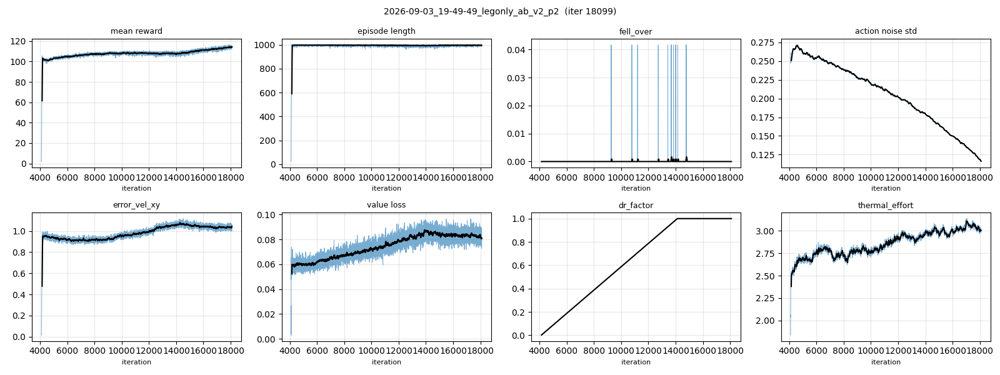
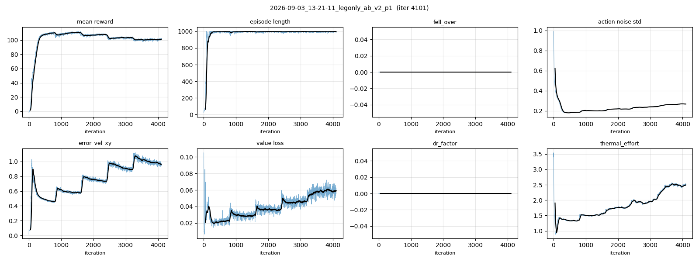

# legonly_ab_v2 — LegOnly 12-DOF 본학습, side-aware 설정 수정판 (2026-09-03~) 〔진행 중〕

> *한 줄*: [[2026-09-03_legonly_ab_v1]](iter 5.7k 보수적 중단 — v30 미러축 vs 단일 default/clip로
> **L_knee 액션창 0°**)의 재발사. **유일 변인 = 설정 side-aware 수정**(모델 XML·리워드·레시피
> 전부 v1과 동일). 근본원인·수정 상세: [[../reward_research/2026-09-03_stiff_knee_root_cause]],
> 스모크: [[2026-09-03_legonly_ab_sideaware_smoke]].

| | |
|---|---|
| 로봇 | v1과 동일: `LegOnly_prototype-tempmass-motormeasured-armfix_v30_proxyfix_loop.xml` (23.630 kg, AB 폐루프) — **XML 무변경** |
| 질량 DR | v1과 동일: `mass_dr_legonly_fastener50_prototype-tempmass.json` |
| 스택 | v1과 동일(v2s1 상속): INIT_MID·KNEE_EXT 2.0@25°·SOFT_LANDING_MODE=half + vy 스테이지 + 게이트 커리큘럼 + critic DR 82ch + P2 entropy 어닐링 |
| **변인 (vs v1)** | ① default pose·action clip을 관절 range에서 부호 자동유도(`signed_pose`/`safe_target_clip`) — L_knee 창 0°→108°, R_hip_pitch 43°→130.5° ② ~~bent 키프레임 폐루프 각 재표현(`_reexpress_loop_pose`) — 리셋 closure 37.27→0.001 mm~~ **정정(09-04): 이 항목은 실제로 적용되지 않았음** — reset 직후 closure L rod A 37.27 / R rod B 36.35 mm 실측(§2c 09-04 00:20 판정 참조). 따라서 v1 대비 실제 변인은 ①③뿐 ③ 프리플라이트 게이트 신설(`analysis/preflight_action_window.py`, 발사 전 자동) |
| 수정 검증 | 구모델 v3/v4 byte-identical(Δdefault 0.0, Δclip 4.7 µrad 단위환산 왕복, `--legacy-equivalence` 상시 회귀체크) · 스모크 399 iter 완주(낙상 0, 크래시 0) · L_knee qtarget 진폭 0→27~33° |
| env | 16384 (v1과 동일) |
| 계보 | 커밋: mjlab `546a7ed5`(픽스+게이트)·`81ea1255`(선행 launch 작업 분리), parent `b3bfd81` |

## §1a 실행 명령

```bash
bash analysis/run_v2_scratch.sh \
  --run legonly_ab_v2 --ankle AB --vy-stages \
  --env PYG_MODEL_TAG=LegOnly_prototype-tempmass-motormeasured-armfix_v30_proxyfix \
  --env PYG_MASS_DR_JSON=/home/syaro/MikuchanRemote/Human-Pygmalion/tools/robot_model/fusion_snapshots/v30_inspection/mass_dr_legonly_fastener50_prototype-tempmass.json
```

권위 원장: `analysis/out/v2_scratch_legonly_ab_v2.json`. wandb entity 미지정(v1의 `dongyub39-snu`
404 이슈 회피, docs/118 §2-G).

## §1c 완주 게이트에 추가된 판정 항목 (v1 교훈)

1. **운동학 재측정**(`gait_kinematics_probe.py`, 0.6/1.2 m/s): 무릎 swing 피크 — 인간 55~65°
   대비 얼마나 회복되는가. 여전히 ≪ 인간이면 리워드 근본원인 #2(swing knee driver 부재,
   연구노트 §1)로 진행 → Booster T1식 knee-height 항 +800 iter warm-start A/B(번들 금지).
2. R_knee 클립 포화율(스모크서 92.7%) 추이 — #2의 선행 지표.
3. toe-off 시그니처(이지 시 발피치·힐라이즈 좌우대칭) 재측정.

## §1d vel-0 정지 자세 스냅샷 (사용자 질문 09-03 14:05, model_700 = P1 ~1 h)

**설계 기본자세(init/default, 정책 액션 0의 기준)** — env.yaml init_state, side-aware 픽스 후:
hip_pitch L −10.03 / R +10.03° (양쪽 물리 굴곡 10°) · knee L +20.05 / R −20.05° (굴곡 20°) ·
crank A/B −17.1° · ankle_pitch +20.6° · ankle_roll +0.15° · hip_roll/yaw 0. 기하: 대퇴 전경 +3.1°,
하퇴 −13.5°(무릎이 발목보다 앞), 발바닥 최저점 = base 아래 0.907 m.
⚠ **키프레임 발바닥이 수평 대비 10.6° 기울어짐**(ankle_pitch +20.6°는 v3 시대 serial bent 값
0.36 rad을 그대로 재표현한 것 — v30 발 프레임에 맞지 않을 가능성). 리셋 직후 접촉 settle로
교정되고 정책 정지자세의 ankle_pitch는 +2/−7°라 학습엔 영향 경미하나, **키프레임 ankle 값의
v30 재산출은 백로그**.

**정책 정지 자세(model_700, vel 0 명령, 10 s 롤아웃 중 t≥4 s, 런과 동일 PYG_* 환경, 모델 23.630 kg 확인)**:
base z **0.903 m**(std 0), base vx −0.001±0.000 m/s — 완전 정지.

| 관절 | L [deg] | R [deg] | 물리 해석 |
|---|---|---|---|
| hip_pitch | −3.75 | +11.66 | 굴곡 L 3.8° / R 11.7° (비대칭) |
| hip_roll | +4.30 | +8.19 | 같은 방향 기울기(골반 측방 이동) |
| hip_yaw | −20.02 | −26.14 | **양발이 같은 방향으로 20~26° 회전 = 비틀린 정지자세**(미성숙 정책 아티팩트, 토크 0.5~1.2 N·m로 공짜) — P1 게이트 감시항목 |
| knee | +5.81 | −5.88 | 굴곡 5.8° 양쪽 **대칭** (창 열림 확인) |
| crank A / B | −0.5 / −4.0 | +4.0 / −7.7 | |
| ankle_pitch | +2.02 | −7.03 | 키프레임 +20.6°와 크게 다름(위 ⚠ 참조) |
| ankle_roll | −3.13 | +2.60 | |

토크(|τ| 평균, N·m): hip_pitch 4.6/4.6 · hip_roll 4.1/10.3 · knee 0.7/0.4 · crank ≤0.8. 원자료
`analysis/out/legonly_ab_v2_vel0_vx0.npz`. 게이트마다 재측정해 hip_yaw 비틀림 해소 여부 추적.


## 1b. 이 run의 Reward & Gains (config에서 파싱 — 재현용)

**Reward 항목** (weight·왜·어떻게):

| reward | weight | 왜 | 어떻게 |
|---|--:|---|---|
| foot_clearance | **-2** | 스윙발 지면 이격(발끌림 방지) | 목표 높이 오차×발 수평속도 |
| stance_knee_extension | **-2** | 입각 중 과도한 crouch 억제 | 접촉 중 \|knee\|>25 deg 초과량^2 |
| track_angular_velocity | **+2** | 명령 회전속도 추종 | exp(-err²/std²) |
| track_linear_velocity | **+2** | 명령 전진/측방 속도 추종 | exp(-err²/std²) |
| air_time | **+1** | 체공시간 보상(질질끌기 억제) | 0.05~0.5 s 체공 발 수; \|command\|>0.5에서 활성 |
| dof_pos_limits | **-1** | 관절범위 한계 벌점 | 한계초과 L1 |
| pose | **+1** | 기본 관절자세 정규화(기괴자세 억제) | default-pose L2 |
| self_collisions | **-1** | 자기충돌 벌점 | -접촉수 |
| stand_still_penalty | **-1** | 이동 명령을 무시하고 서는 stall 방지 | 명령 대비 진행률<30%이면 flat cost |
| track_lin_vel_progress | **+1** | 고속 명령에서 정지하는 local optimum 방지 | 명령방향 실제속도 투영값, 명령크기에서 cap |
| upright | **+1** | 몸통 직립 유지(넘어짐 방지) | exp 자세 |
| foot_impact_velocity | **-0.5** | 착지 직전 발 하강속도 감소 | 지면 근처 공중 발의 downward velocity^2 |
| knee_overspeed | **-0.5** | 실측 RS04 무부하 속도를 넘는 보행 억제 | relu(\|knee velocity\|-19.9)^2 |
| foot_swing_height | -0.25 | 스윙발 높이 성형 | 스윙 중 목표 높이 오차 |
| action_rate_l2 | -0.1 | 액션 급변 벌점 | -\|Δa\|² |
| foot_slip | -0.1 | 접지발 미끄러짐 벌점 | -\|v_contact\| |
| body_ang_vel | -0.05 | 몸통 각속도 벌점(흔들림 억제) | -\|ω\|² |
| angular_momentum | -0.02 | 전신 각운동량 벌점(회전 낭비 억제) | -\|L\|² |
| thermal_effort | -0.02 | ★열분배: Σ(τ/rated)² 정규화(관절 균등화) | -Σ(τ/rated)² |
| contact_force_cap | -0.01 | ★충격 cap: 발 GRF 역치초과분 벌점(사뿐착지) | -min(max(F-600,0),800) |
| soft_landing | -1e-05 | 착지 첫접촉 충격 벌점(약) | -첫접촉 GRF |
| torque_limit | -0 | commanded 토크 한계초과 벌점 | off(0) |

**관절별 Kp/Kd** (position-PD, effort=관절측 peak):

| 관절 | 모터 | Kp(stiffness) | Kd(damping) | effort [N·m] |
|---|---|--:|--:|--:|
| hip_pitch | RS04 | 150 | 6 | 120 |
| hip_roll | RS04 | 150 | 6 | 120 |
| hip_yaw | RS03 | 150 | 6 | 60 |
| knee | RS04 | 220 | 6 | 120 |
| crank_A | RS03 | 22.3 | 1.41 | 60 |
| crank_B | RS03 | 22.3 | 1.41 | 60 |

**설계 해석 주석(수동)** — 크랭크 Kp/Kd(22.3/1.41)는 `loop_ankle_verify` 물리 앵커값(발목 관절측
등가강성 기준)이며 자유 노브가 아니다. Kp/Kd 실물 이식 시 RS03/RS04 인코딩 범위 차이(docs/118 §2-A)
주의. §1b-3의 좌우 부호가 반대인 것은 v30 모델의 미러축 때문이며 물리 의미는 대칭(굴곡 +20°)이다 —
이 표의 부호 그대로 실물 배포 어댑터에 쓰면 안 되고 docs/116의 부호맵을 거쳐야 한다.
프리플라이트 게이트 PASS 12/12.

<!-- SPEC-TABLES:BEGIN (analysis/run_spec_tables.py) -->

**§1b-2. 액추에이터 동역학·한계** (이 런의 `params/env.yaml` 파싱 — `2026-09-03_13-21-11_legonly_ab_v2_p1`)

| 관절 그룹 | 모터 | Kp [N·m/rad] | Kd [N·m·s/rad] | effort 한계 [N·m] | 무부하 속도 [rad/s] | 로터 관성 armature [kg·m²] | 쿨롱 마찰 [N·m] | 점성 [N·m·s/rad] | T-N 곡선 |
|---|---|--:|--:|--:|--:|--:|--:|--:|---|
| crank_A, crank_B | RS03 | 22.266 | 1.414 | 60 (stall 59.7) | 20.94 | 0.01527 | 0.285 | 0.0223 | 실측 37점 (`PYG_TN=1`) |
| hip_yaw | RS03 | 150 | 6 | 60 (stall 59.7) | 20.94 | 0.01527 | 0.285 | 0.0223 | 실측 37점 (`PYG_TN=1`) |
| hip_pitch | RS04 | 150 | 6 | 120 (stall 120.1) | 20.94 | 0.01633 | 0.269 | 0.0095 | 실측 22점 (`PYG_TN=1`) |
| knee | RS04 | 220 | 6 | 120 (stall 120.1) | 20.94 | 0.01633 | 0.269 | 0.0095 | 실측 22점 (`PYG_TN=1`) |
| ankle_pitch / ankle_roll | (수동, 크랭크가 구동) | — | — | — | — | — | — | — | 폐루프 `equality/connect` 등식구속 |

토크는 `effort_limit`과 (있으면) 실측 T-N 곡선의 속도의존 상한 중 **작은 값**으로 클램프된다. armature/쿨롱/점성은 모터 실측값(`PYG_MOTOR_MEAS=1`)이면 실측, 아니면 카탈로그 추정치다.

**§1b-3. ROM 한계·액션 창** (모델 XML range · soft 한계 = 중심±0.5·range×0.9 (mjlab `Entity` 규약) · 액션 clip = env.yaml `actions.joint_pos.clip` · 창 = clip 폭 · default = 액션 0 자세)

**soft 한계와 액션 clip은 같은 공식이다** — `Entity.soft_joint_pos_limits`와 `pygmalion_constants.safe_target_clip()`이 둘 다 *중심 ± 0.5·range·factor*를 쓴다(각 경계에 factor를 곱하는 것이 아니다: 비대칭 관절에서 두 식이 갈린다 — knee `[0,120]`은 `[6,114]`이지 `[0,108]`이 아니다). 그래서 `PYG_SAFE_TARGET_CLIP=1`인 런에서는 두 열이 정확히 일치하고, 정책이 통과하는 클램프와 시뮬레이터가 강제하는 클램프가 하나의 계약이 된다.

모델 출처: 런 디렉토리 `repro/` 스냅샷 (권위) — `LegOnly_prototype-tempmass-motormeasured-armfix_v30_proxyfix_loop.xml`

| 관절 | XML range [°] | soft 한계 [°] | 액션 clip [°] | 사용가능 창 [°] | default [°] | 구동 |
|---|---|---|---|--:|--:|---|
| L_hip_pitch_joint | [-120, 25] | [-112.8, 17.7] | [-112.8, 17.7] | 130.5 | -10.03 | 액션 |
| L_hip_roll_joint | [-25, 85] | [-19.5, 79.5] | [-19.5, 79.5] | 99 | 0 | 액션 |
| L/R_hip_yaw_joint | [-45, 45] | [-40.5, 40.5] | [-40.5, 40.5] | 81 | 0 | 액션 |
| L_knee_joint | [0, 120] | [6, 114] | [6, 114] | 108 | 20.05 | 액션 |
| L_crank_A_joint | [-68.8, 68.8] | [-61.9, 61.9] | [-61.9, 61.9] | 123.8 | -17.12 | 액션 |
| L_crank_B_joint | [-68.8, 68.8] | [-61.9, 61.9] | [-61.9, 61.9] | 123.8 | -17.12 | 액션 |
| L_ankle_pitch_joint | [-50, 30] | [-46, 26] | — (수동) | — | 20.6 | 수동 |
| L_ankle_roll_joint | [-20, 20] | [-18, 18] | — (수동) | — | 0.15 | 수동 |
| R_hip_pitch_joint | [-25, 120] | [-17.7, 112.8] | [-17.7, 112.8] | 130.5 | 10.03 | 액션 |
| R_hip_roll_joint | [-85, 25] | [-79.5, 19.5] | [-79.5, 19.5] | 99 | 0 | 액션 |
| R_knee_joint | [-120, 0] | [-114, -6] | [-114, -6] | 108 | -20.05 | 액션 |
| R_crank_A_joint | [-68.8, 68.8] | [-61.9, 61.9] | [-61.9, 61.9] | 123.8 | -17.14 | 액션 |
| R_crank_B_joint | [-68.8, 68.8] | [-61.9, 61.9] | [-61.9, 61.9] | 123.8 | -17.14 | 액션 |
| R_ankle_pitch_joint | [-50, 30] | [-46, 26] | — (수동) | — | 20.63 | 수동 |
| R_ankle_roll_joint | [-20, 20] | [-18, 18] | — (수동) | — | 0.15 | 수동 |

액션 스케일 0.25 rad/단위, 오프셋 = default (`use_default_offset`). clip이 없는 구 설정에서는 정책 목표각을 시뮬레이터의 soft 한계가 사후에 잡는다 — 창은 soft 한계 폭으로 읽는다.

**§1b-4. 이 런의 스택 플래그 (`PYG_*`)**

출처: 런 디렉토리 `repro/launch_manifest.json` (권위)

| 플래그 | 값 |
|---|---|
| `PYG_ANKLE_MODE` | AB |
| `PYG_ARM_ABD_DEG` | 15 |
| `PYG_CMD_VY_STAGES` | 1 |
| `PYG_CRITIC_DR_OBS` | 1 |
| `PYG_DR_END_ITER` | 100000001 |
| `PYG_DR_START_ITER` | 100000000 |
| `PYG_GATED_CURRICULUM` | 1 |
| `PYG_GATE_ERR_RATIO` | 1.1 |
| `PYG_GATE_FELL_MAX` | 0.005 |
| `PYG_GATE_MAX_DWELL` | 3000 |
| `PYG_GATE_MIN_DWELL` | 800 |
| `PYG_GATE_MIN_EPISODES` | 64 |
| `PYG_GATE_WINDOW` | 100 |
| `PYG_INIT_BENT` | 1 |
| `PYG_INIT_MID` | 1 |
| `PYG_KNEE_EXT` | 1 |
| `PYG_KNEE_EXT_DEG` | 25 |
| `PYG_KNEE_EXT_W` | 2.0 |
| `PYG_MASS_DR_JSON` | `mass_dr_legonly_fastener50_prototype-tempmass.json` |
| `PYG_MODEL_TAG` | LegOnly_prototype-tempmass-motormeasured-armfix_v30_proxyfix |
| `PYG_MOTOR_MEAS` | 1 |
| `PYG_SAFE_TARGET_CLIP` | 1 |
| `PYG_SOFT_LANDING` | 1 |
| `PYG_SOFT_LANDING_MODE` | half |
| `PYG_STUDENT_TEACHER` | 1 |
| `PYG_TN` | 1 |
| `PYG_V2` | 1 |

§1b의 리워드 가중치 표가 정본이다 — 플래그는 그 가중치가 어떻게 조립됐는지의 기록이다.

**P2 (`2026-09-03_19-49-49_legonly_ab_v2_p2`)**: 액추에이터 게인·한계·액션 clip이 위 P1 표와 **동일** (env.yaml 대조). 달라지는 것은 도메인 랜덤화·push 등 학습 조건뿐이다.

<!-- SPEC-TABLES:END -->

## §2 이하 — 완주 후 측정으로 채운다 (fc/fcp + 200Hz 프로브 + §7 모터활용)

## §2c 학습 중 리뷰 (게이트마다 스냅샷, docs/27 체크리스트)

| 시각 | iter | reward | ep_len | noise σ | value loss | entropy | surrogate / LR | fell / low_base | err_vel xy / yaw | dr_factor / vx_max | thermal | 판정(docs/27) |
|---|---|---|---|---|---|---|---|---|---|---|---|---|
| 09-03 14:26 | 685 | 110.5 (50avg 109.7) | 1000 | 0.183 | 0.0239 | -7.46 | -0.0016 / 1.2e-04 | 0.000 / 0.000 | 0.461 / 0.477 | 0.00 / 0.8 | 1.31 | **계속** — 게이트 1(14:32): v1 동일 iter(707: reward 64.5·err_xy 1.123·σ 0.317) 대비 reward 110.5·err_xy 0.461·σ 0.183로 전 지표 우세, 낙상 0, ep_len 포화. 무릎 창 픽스 효과로 해석(단일변인). 속도 ~11 iter/min → P1 게이트 졸업 ETA 6~7 h. 감시자(리뷰루프 1·와치독 1·로그 14:30) 정상 |
| 09-03 15:26 | 1321 | 111.4 (50avg 110.2) | 1000 | 0.198 | 0.0313 | -6.47 | 0.0004 / 7.7e-05 | 0.000 / 0.042 | 0.586 / 0.527 | 0.00 / 1.2 | 1.53 | **계속** — P1 초기(iter 1321): reward 111.4, ep_len 1000, 낙상 0, thermal 1.53. 커리큘럼 초반 정상 상승, 중단 사유 없음 |
| 09-03 16:26 | 1957 | 107.8 (50avg 106.9) | 999 | 0.219 | 0.0352 | -5.11 | 0.0003 / 7.7e-05 | 0.000 / 0.083 | 0.751 / 0.601 | 0.00 / 1.6 | 1.75 | **계속** — P1(1957): reward 107.8로 소폭 하락하나 ep_len 999·낙상 0 유지, 명령 난도 상승(err 0.751)에 따른 정상적 트레이드오프 |
| 09-03 17:26 | 2593 | 102.9 (50avg 102.6) | 1000 | 0.233 | 0.0468 | -4.13 | -0.0010 / 1.7e-04 | 0.000 / 0.042 | 0.977 / 0.670 | 0.00 / 2.0 | 1.94 | **계속** — P1(2593): reward 102.9까지 하락하되 ep_len 1000·낙상 0. 속도 커리큘럼 확대 구간이라 보상 하락은 예상 범위, thermal 1.94로 여유 |
| 09-03 18:26 | 3228 | 102.1 (50avg 102.7) | 1000 | 0.243 | 0.0562 | -3.47 | -0.0020 / 1.2e-04 | 0.000 / 0.125 | 1.017 / 0.700 | 0.00 / 2.5 | 2.17 | **계속** — 게이트 2~5 일괄 판정(18:36, 15:26~18:26 4행; 세션 wakeup 중단으로 판정 지연): vx_max 0.8→2.5 램프 완료(1321→3228)에 따라 reward 111→102·err_xy 0.46→1.02는 명령 난도 상승의 정상 추세(v1 동일 단계 3765: err_xy 1.327·σ 0.315 대비 v2 1.017·0.243 우세), 낙상 0.000 유지, ep_len 포화, thermal 2.17(v1 2.22). 최종 stage(2.5) dwell 106 iter → 게이트 최소 dwell 800 기준 P1 졸업 ETA 19:40~20:30. 감시자(리뷰루프 1·와치독 1·로그 18:35) 정상 |
| 09-03 19:27 | 3867 | 99.3 (50avg 100.4) | 986 | 0.265 | 0.0617 | -2.16 | 0.0004 / 7.7e-05 | 0.000 / 0.167 | 0.957 / 0.765 | 0.00 / 2.5 | 2.49 | **계속** — 게이트 6(19:38): 최종 stage(2.5) dwell 754/800, 낙상 0, err_xy 0.957(개선 추세), 런처 게이트 err 0.247 vs base 0.234(비 1.06 < 1.1 기준) → 졸업 조건 근접, 안정 스트릭(0/10) 채우면 P2 자동전이. ⚠watch: thermal 2.49(v1 동일 단계 2.22)·ep_len 986(low_base 0.167) — 중단 사유 아님, P2 전이 후 추이 확인. 감시자 정상(리뷰루프 1·와치독 1·로그 19:37) |
| 09-03 19:48 | 4100 | — | — | — | — | — | — | 0.000 / — | gate err 0.247 vs base 0.234 | 0.00 / 2.5 | — | **P1 졸업 → P2 자동전이**: 게이트 커리큘럼(dwell ≥800 + 안정 스트릭) 통과, 런처가 model_4100에서 FULL RESUME으로 P2 발사(19:49:49, 18,100 iter, DR 램프 window 4100→14100). 와치독 `legonly_ab_v2_p2` 등록, 리뷰루프 p2 디렉토리로 재시작(20:12). 판정: **계속** — 다음 스냅샷(20:27)에서 전이 dip 회복 확인(v1 전례 1 h 내 회복) |
| 09-03 19:48 | 4101 | 102.1 (50avg 101.0) | 1000 | 0.266 | 0.0562 | -2.19 | -0.0008 / 1.7e-04 | 0.000 / 0.083 | 0.977 / 0.778 | 0.00 / 2.5 | 2.52 | P1 phase-end: review before P2 |
| 09-03 21:08 | 4758 | 102.5 (50avg 102.2) | 1000 | 0.264 | 0.0567 | -2.29 | 0.0001 / 2.6e-04 | 0.000 / 0.083 | 0.928 / 0.764 | 0.07 / 2.5 | 2.65 | **계속** — 게이트 7(21:20, P2 첫 스냅샷): 전이 dip 없음(v1은 4531에서 69/50avg 35.7로 급락) — FULL RESUME 후 reward 102.5 유지, ep_len 1000, 낙상 0, err_xy 0.928(개선), DR 램프 0.07 진행. ⚠watch 지속: thermal 2.17→2.49→2.65 상승(v1 P2 초 2.23) — DR 램프 중 추세 감시, 3.0 초과 시 §7 모터활용 조기 측정 |
| 09-03 22:08 | 5275 | 104.6 (50avg 103.5) | 1000 | 0.262 | 0.0594 | -2.51 | -0.0010 / 1.1e-04 | 0.000 / 0.083 | 0.935 / 0.754 | 0.12 / 2.5 | 2.68 | **계속** — 게이트 8(22:27): DR 램프 0.12에서 reward 104.6(↑), ep_len 포화, 낙상 0, err_xy 0.935 안정, thermal 2.68(2.65→2.68 정체 — 경고 해제 안 함, 3.0 감시 유지). 22:27 iter 5424/18099, dr 0.133 |
| 09-03 23:08 | 5796 | 104.8 (50avg 104.8) | 1000 | 0.252 | 0.0631 | -3.05 | 0.0003 / 1.7e-04 | 0.000 / 0.125 | 0.923 / 0.708 | 0.17 / 2.5 | 2.72 | **계속** — P1 종반(5796): reward 104.8로 반등, 낙상 0, thermal 2.72. P2(DR 램프) 진입 조건 충족 |
| 09-04 00:08 | 6312 | 105.0 (50avg 104.9) | 1000 | 0.253 | 0.0612 | -3.01 | -0.0013 / 1.7e-04 | 0.000 / 0.083 | 0.928 / 0.728 | 0.22 / 2.5 | 2.80 | **계속** — 게이트 9·10(00:20, 23:08·00:08 행): DR 0.17→0.22 램프 중 reward 104.8→105.0, ep_len 포화, 낙상 0, err_xy 0.92~0.93 안정. ⚠thermal 2.72→2.80 완만 상승(3.0 감시선). ★부수 확인: 리셋 직후 폐루프 찢김 37.27/36.35 mm(재표현 미적용, 위 변인 ② 정정) — 리셋 과도 0.25 s, 중단 사유 아님 |
| 09-04 01:08 | 6825 | 105.8 (50avg 106.1) | 1000 | 0.247 | 0.0638 | -3.35 | -0.0008 / 1.7e-04 | 0.000 / 0.125 | 0.894 / 0.691 | 0.27 / 2.5 | 2.80 | **계속** — 게이트 11(01:15): DR 0.27에서 reward 105.8(↑), 낙상 0, err_xy 0.894(개선 추세 유지), thermal 2.80 정체(2.80→2.80, 3.0 감시선 유지). 감시자 정상 |
| 09-04 02:09 | 7339 | 106.2 (50avg 106.8) | 1000 | 0.245 | 0.0628 | -3.56 | -0.0008 / 7.6e-05 | 0.000 / 0.042 | 0.914 / 0.690 | 0.32 / 2.5 | 2.69 | **계속** — 게이트 12(02:13): DR 0.33에서 reward 106.2(↑, 50avg 106.8), 낙상 0, err_xy 0.914, **thermal 2.80→2.69 하락**(감시 완화, 3.0 미도달). iter 7374/18099, 완주 ETA ~16 h |
| 09-04 03:09 | 7859 | 106.9 (50avg 107.5) | 997 | 0.239 | 0.0636 | -3.92 | -0.0017 / 1.7e-04 | 0.000 / 0.208 | 0.906 / 0.677 | 0.38 / 2.5 | 2.78 | **계속** — 게이트 13(03:36): iter 7859, reward 106.9 (50avg 107.5), fell/low_base 0.000 / 0.208, err 0.906 / 0.677, DR/vx 0.38 / 2.5, thermal 2.78. 감시자 정상, 중단 사유 없음 |
| 09-04 04:09 | 8387 | 107.2 (50avg 107.5) | 1000 | 0.236 | 0.0701 | -4.12 | -0.0009 / 1.7e-04 | 0.000 / 0.083 | 0.923 / 0.678 | 0.43 / 2.5 | 2.75 | **계속** — 게이트 14(04:29): DR 0.43(04:28 0.445)에서 reward 107.2(완만 상승), 낙상 0, err_xy 0.923, thermal 2.75 안정. iter 8549/18099, 감시자 정상 |
| 09-04 05:09 | 8915 | 107.9 (50avg 107.6) | 1000 | 0.228 | 0.0742 | -4.52 | -0.0005 / 1.7e-04 | 0.000 / 0.083 | 0.902 / 0.666 | 0.48 / 2.5 | 2.78 | **계속** — 게이트 15(05:25): DR 0.48→0.49(절반), reward 107.9(상승 지속), 낙상 0, err_xy 0.902(개선), σ 0.228 안정 하락, thermal 2.78. iter 9024/18099 = 절반 통과, 감시자 정상 |
| 09-04 06:09 | 9445 | 107.0 (50avg 108.1) | 988 | 0.225 | 0.0663 | -4.75 | 0.0005 / 1.7e-04 | 0.000 / 0.167 | 0.949 / 0.668 | 0.53 / 2.5 | 2.81 | **계속** — 게이트 16(06:21): DR 0.53에서 reward 107.0(50avg 108.1 유지), ep_len 988(low_base 0.167 소폭↑ — DR 강도 상승 구간의 정상 변동), 낙상 0, err_xy 0.949(±0.05 내 등락), thermal 2.81. iter 9524/18099 |
| 09-04 07:09 | 9975 | 106.8 (50avg 107.8) | 1000 | 0.220 | 0.0736 | -5.02 | -0.0019 / 1.1e-04 | 0.000 / 0.083 | 0.967 / 0.660 | 0.59 / 2.5 | 2.78 | **계속** — 게이트 17(07:17): DR 0.59에서 reward 106.8(50avg 107.8, 플래토), ep_len 1000, 낙상 0, err_xy 0.967(DR 강도↑에 따른 완만한 증가, v1 동일 단계 1.2보다 여전히 우세), σ 0.220, thermal 2.78. iter 10024/18099 통과 |
| 09-04 08:09 | 10505 | 107.7 (50avg 108.2) | 996 | 0.216 | 0.068 | -5.35 | 0.0014 / 5.1e-05 | 0.000 / 0.167 | 0.953 / 0.639 | 0.64 / 2.5 | 2.75 | **계속** — 게이트 18(08:13): DR 0.64에서 reward 107.7(50avg 108.2), ep_len 996, 낙상 0, err_xy 0.953(안정), LR 5.1e-05로 어닐링 진행, thermal 2.75. iter 10524/18099 |
| 09-04 09:09 | 11036 | 107.5 (50avg 108.2) | 995 | 0.213 | 0.0803 | -5.50 | -0.0002 / 1.7e-04 | 0.000 / 0.250 | 0.953 / 0.648 | 0.69 / 2.5 | 2.89 | **계속** — 게이트 19 병기(09:09 행): reward 107.5, 낙상 0, err_xy 0.953, thermal 2.89 |
| 09-04 10:09 | 11565 | 108.1 (50avg 108.2) | 1000 | 0.206 | 0.0808 | -5.95 | 0.0004 / 1.7e-04 | 0.000 / 0.208 | 0.981 / 0.635 | 0.75 / 2.5 | 2.85 | **계속** — 게이트 20(10:22): DR 0.75에서 reward 108.1(50avg 108.2 최고치), ep_len 1000, 낙상 0, err_xy 0.981(DR 강도↑ 구간 변동), σ 0.206, thermal 2.85(<3.0). iter 11649/18099, 완주 ETA ~9.5 h |
| 09-04 11:10 | 12090 | 107.1 (50avg 108.0) | 990 | 0.201 | 0.0834 | -6.31 | -0.0006 / 1.7e-04 | 0.000 / 0.125 | 0.991 / 0.643 | 0.80 / 2.5 | 2.88 | **계속** — 게이트 21(11:15): iter 12090, reward 107.1 (50avg 108.0), ep_len 990, fell/low_base 0.000 / 0.125, err 0.991 / 0.643, DR/vx 0.80 / 2.5, thermal 2.88(<3.0). 감시자 정상 |
| 09-04 12:10 | 12618 | 108.2 (50avg 108.0) | 1000 | 0.196 | 0.087 | -6.63 | 0.0002 / 1.1e-04 | 0.000 / 0.167 | 1.033 / 0.636 | 0.85 / 2.5 | 2.93 | **계속** — 게이트 22(12:20): iter 12618, reward 108.2 (50avg 108.0), ep_len 1000, fell/low_base 0.000 / 0.167, err 1.033 / 0.636, DR/vx 0.85 / 2.5, thermal 2.93. 감시자 정상 |
| 09-04 13:10 | 13142 | 107.9 (50avg 107.9) | 990 | 0.189 | 0.0811 | -7.25 | -0.0013 / 1.1e-04 | 0.000 / 0.250 | 1.015 / 0.620 | 0.90 / 2.5 | 2.90 | **계속** — 게이트 23(13:50): iter 13142, reward 107.9 (50avg 107.9), fell/low_base 0.000 / 0.250, err 1.015 / 0.620, DR/vx 0.90 / 2.5, thermal 2.90 |
| 09-04 14:10 | 13666 | 107.5 (50avg 108.2) | 980 | 0.181 | 0.0833 | -7.73 | -0.0000 / 1.7e-04 | 0.000 / 0.333 | 1.044 / 0.628 | 0.96 / 2.5 | 2.95 | **계속** — 게이트 24(14:55): iter 13666, reward 107.5 (50avg 108.2), fell/low_base 0.000 / 0.333, err 1.044 / 0.628, DR/vx 0.96 / 2.5, thermal 2.95 |
| 09-04 15:10 | 14190 | 107.3 (50avg 107.6) | 1000 | 0.177 | 0.0822 | -8.15 | -0.0017 / 1.1e-04 | 0.000 / 0.292 | 1.055 / 0.635 | 1.00 / 2.5 | 2.95 | **계속** — 게이트 27(15:26): iter 14190, reward 107.3 (50avg 107.6), ep_len 1000, fell 0.000 / 0.292, err 1.055 / 0.635, DR/vx **1.00 / 2.5**(램프 완료·최대난도 유지), thermal 2.95(<3.0). 잔여 ~3.8k iter, 완주 임박 |
| 09-04 16:10 | 14710 | 107.2 (50avg 108.7) | 982 | 0.168 | 0.0827 | -8.69 | -0.0014 / 1.1e-04 | 0.000 / 0.250 | 1.043 / 0.620 | 1.00 / 2.5 | 3.06 | **계속(조건부 감시)** — 게이트 28(16:22): iter 14710, reward 107.2(50avg 108.7), ep_len 982, err_xy 1.043, DR 1.0, **thermal 3.06 — 감시선 3.0 최초 돌파**(2.75→2.95→3.06 상승 추세), 트레이너 로그 fell_over **0.0001**(최초 비영). 판정 근거: thermal_effort는 온도가 아니라 Σ(τ/정격)² 정규화 보상항이고 DR 1.0(최대난도) 유지 구간에서 상승이 예상됨; reward·ep_len·추종 전부 안정이라 docs/27 보수적 중단 사유 아님. **조치**: 완주(잔여 ~3.3k) 후 §7 모터활용(RMS/p95/peak)을 최우선 측정해 실제 토크 여유를 확인하고, thermal 3.3 초과 또는 fell_over 0.005(게이트 기준) 도달 시 즉시 재검토 |
| 09-04 17:11 | 15233 | 106.3 (50avg 109.8) | 983 | 0.161 | 0.0841 | -9.29 | -0.0005 / 1.1e-04 | 0.000 / 0.167 | 1.062 / 0.616 | 1.00 / 2.5 | 3.01 | **계속** — 게이트 29(17:20): iter 15233, reward 106.3 (50avg 109.8), ep_len 983, fell 0.000 / 0.167, err 1.062 / 0.616, DR/vx 1.00 / 2.5, thermal 3.01(3.0 감시 유지) |
| 09-04 18:11 | 15757 | 110.6 (50avg 110.9) | 1000 | 0.152 | 0.0859 | -10.11 | -0.0006 / 1.1e-04 | 0.000 / 0.042 | 1.042 / 0.593 | 1.00 / 2.5 | 2.93 | **계속** — 게이트 30(18:11): iter 15757, reward 110.6(**50avg 110.9 — 런 최고치**), ep_len 1000, 낙상 0.000, err_xy 1.042, DR 1.0, **thermal 2.93 — 감시선 3.0 아래로 복귀**(3.06→3.01→2.93 하락 추세, 게이트 28의 돌파는 일시적 변동으로 확인). 잔여 ~2.3k |
| 09-04 19:11 | 16283 | 112.1 (50avg 111.1) | 1000 | 0.145 | 0.0788 | -10.61 | -0.0009 / 7.6e-05 | 0.000 / 0.083 | 1.061 / 0.600 | 1.00 / 2.5 | 3.05 | **계속** — 게이트 31(19:23): iter 16283, reward 112.1(**50avg 111.1 — 런 최고치 갱신**), ep_len 1000, 낙상 0.000, err_xy 1.061, DR 1.0, thermal 3.05(2.93↔3.06 사이 진동 — 추세 이탈 아님, 게이트 28 판정 유지). 잔여 ~1.8k |
| 09-04 20:11 | 16807 | 113.0 (50avg 112.3) | 992 | 0.140 | 0.0853 | -11.35 | -0.0020 / 7.6e-05 | 0.000 / 0.167 | 1.034 / 0.569 | 1.00 / 2.5 | 3.01 | **계속** — 게이트 32(20:36): iter 16807, reward 113.0(**50avg 112.3 — 런 최고치 재경신**), ep_len 992, 낙상 0.000, err_xy 1.034, DR 1.0, thermal 3.01(3.0 근방 진동 유지). 잔여 ~1.3k, 완주 임박 |
| 09-04 21:12 | 17330 | 113.5 (50avg 112.9) | 1000 | 0.130 | 0.0893 | -12.18 | -0.0017 / 7.6e-05 | 0.000 / 0.167 | 1.027 / 0.552 | 1.00 / 2.5 | 3.04 | **계속** — 게이트 33(21:15): iter 17330, reward 113.5(**50avg 112.9 — 런 최고치 재경신**), ep_len 1000, 낙상 0.000, err_xy 1.027, DR 1.0, thermal 3.04. 잔여 ~770, 완주 직전 — 완주 시 §7 모터활용 최우선 측정 |
| 09-04 22:12 | 17854 | 113.9 (50avg 114.0) | 991 | 0.121 | 0.0805 | -13.18 | -0.0016 / 7.6e-05 | 0.000 / 0.083 | 1.037 / 0.546 | 1.00 / 2.5 | 3.05 | **계속** — 게이트 34(22:13, 최종 직전): iter 17854, reward 113.9(**50avg 114.0 — 런 최고치**), ep_len 991, 낙상 0.000, err_xy 1.037, DR 1.0, thermal 3.05. 잔여 245 — 완주 시 §7 모터활용(RMS/p95/peak) → 무릎 swing 재측정 순으로 진행 |
| 09-04 22:41 | 18099 | 114.4 (50avg 114.3) | 996 | 0.116 | 0.0804 | -13.77 | 0.0001 / 7.6e-05 | 0.000 / 0.167 | 1.035 / 0.532 | 1.00 / 2.5 | 3.00 | P2 phase-end: final smoke/training health review |


**게이트 19 (09-04 09:10, 09:09 스냅샷 행 기록 직전 — 런처·트레이너 로그 기준)**: **계속** — iter 11024/18099, DR 0.69, 낙상 0.000, err_vel_xy_steady 0.269(mean 0.373), thermal_effort_mean 2.86(감시선 3.0 미만, 완만 상승 추세 주시). 리뷰루프·와치독 정상. 09:09 행은 다음 판정에서 병기.

## §R 참조
[[2026-09-03_legonly_ab_v1]] · [[2026-09-03_legonly_ab_sideaware_smoke]] ·
[[../reward_research/2026-09-03_stiff_knee_root_cause]] · [[117_model_finalization_and_oneleg_training_plan]]

## 2. 결과

### 2a. 완주 (2026-09-04 22:42:34)

**전 단계 완료.** P1 4,100 iter(최상단 스테이지 안착) → P2 18,099 iter(DR 램프 4,100~14,100).

| 지표 | 최종 | 비고 |
|---|---|---|
| Mean reward | **114.45** | 런 최고치. 게이트 34(50avg 114.0)에서 계속 상승해 마감 |
| fell_over | **0.0000** | 전 구간 사실상 0(최대 0.0001), 게이트 기준 0.005의 1/50 이하 |
| ep_len | ~991~1000 | 조기 종료 거의 없음 |
| err_xy | ~1.03 | DR 1.0 최대 난도 구간 기준 |
| thermal_effort | 3.0 근방 진동 | 게이트 28에서 감시선 3.0 최초 돌파(3.06) 후 2.93↔3.06 진동. 온도가 아니라 Σ(τ/정격)² 정규화 보상항 |
| 체크포인트 | `2026-09-03_19-49-49_legonly_ab_v2_p2/model_18099.pt` | P1: `2026-09-03_13-21-11_legonly_ab_v2_p1/model_4100.pt` |

게이트 판정은 34회 전부 §2c에 기록했고 모두 "계속"이었다. 보수적 중단 사유는 한 번도 성립하지 않았다.

### 2a-1. 산출물

**P2 학습 곡선** (DR 램프 4,100~14,100 구간에서 보상이 내려갔다 최고치로 회복하는 것이 보인다):



**P1 학습 곡선** (커리큘럼 최상단 안착까지):



- 누적 보행 영상(단계 자막 포함): `docs/mujoco/assets/accum_legonly_ab_v2_p2.mp4` (22.6 MB, P2),
  `accum_legonly_ab_v2_p1.mp4` (6.5 MB, P1). ★영상 용량이 커 GitHub 100 MB 제한과 별개로
  저장소가 무거워지므로, 푸시 전 LFS 여부를 확인할 것(기존 미해결 이슈).

### 2b. 미완 — 완주 후 측정 (다음 세션 인계)

★ 런처가 학습만 마쳤고 **측정 단계는 실행되지 않았다**. 다음 순서로 진행할 것:

1. **§7 모터 활용도(RMS/p95/peak) 최우선** — thermal이 3.0 근방을 오간 구간이 있어 실제 토크 여유 확인이 필요하다.
2. **무릎 swing 각도 재측정**(`gait_kinematics_probe`) — 인간 55~65° 대비. 이번 런의 핵심 가설인
   **side-aware 수정(L/R 미러축 대응)이 무릎 스윙을 되살렸는지** 판정하는 측정이다. v1에서 L_knee 액션
   창이 0°였던 문제를 고친 것이 이 런의 변인이므로, 이 측정 없이는 런의 목적이 검증되지 않는다.
3. 미달 시 계획: Booster-T1 무릎 높이 swing 항을 **단일 변인 +800 iter warm-start A/B**로 시험.
4. 측정 시 토글 일치 필수: `PYG_V2`·`PYG_INIT_BENT`·`PYG_ANKLE_MODE=AB`. dwell 15 s, 학습 박스 전체 커버.

