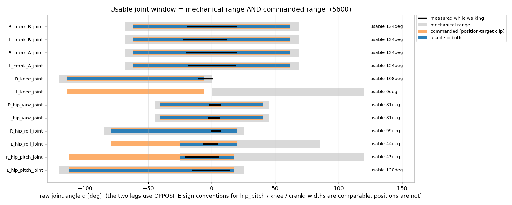
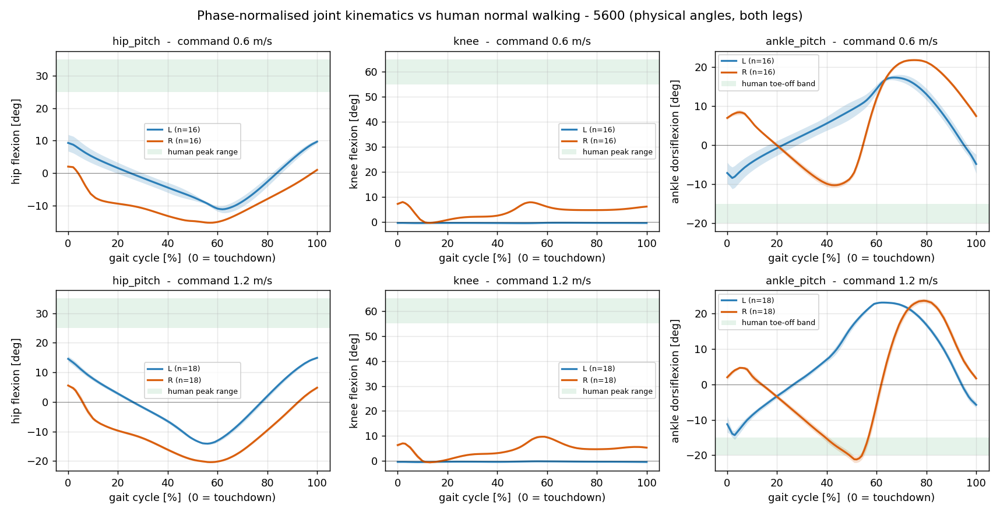
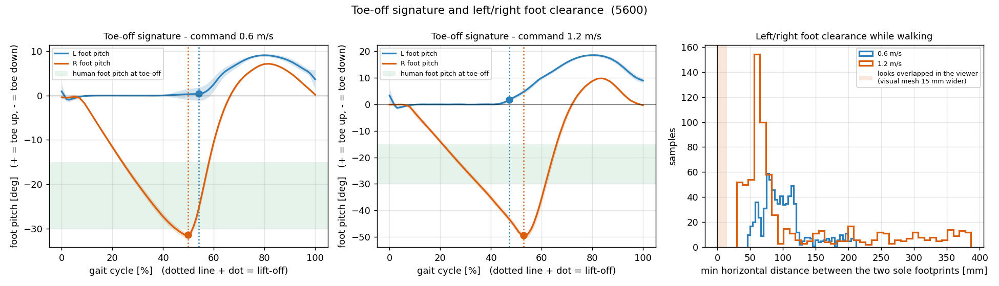
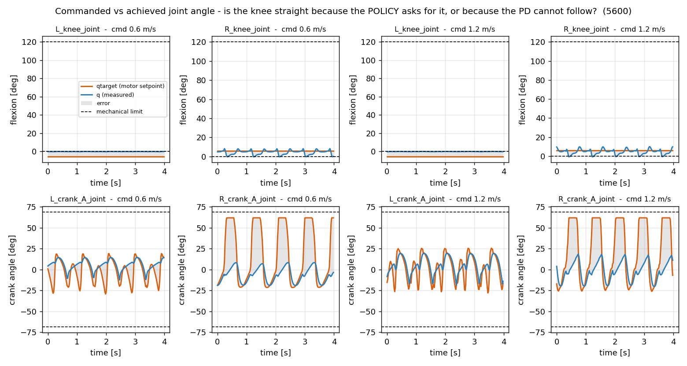

# legonly_ab_v1 보행 운동학 정량 측정 — 무릎·발목·toe-off (iter 5600, 진행 중 진단)

> *한 줄*: 사용자가 화면에서 관찰한 "무릎을 안 쓴다 · AB 발목을 안 쓴다 · toe-off가 없다"를
> 숫자로 확정/반박한다. **결과: 무릎은 확정(양다리 모두 안 씀, 그러나 원인은 리워드가 아니라
> 모델/설정 좌우 부호 불일치), 발목은 반박(양다리 발목 관절 자체는 28~49° 씀), toe-off는
> 반쪽 확정(왼발은 완전 평발 이지, 오른발은 오히려 과도한 −49° 발끝 처짐).**

> ⚠️ **이 체크포인트는 중간 산출물이다** — `model_5600` / 계획 총 ~18,500 iteration의 약 30 %.
> 진단용이며 정책 성능의 최종 판정이 아니다. 다만 §2에서 확인한 모델/설정 불일치는 iteration이
> 늘어도 사라지지 않는 구조적 문제라서, 그 부분은 지금 판정해도 무방하다.

| | |
|---|---|
| 대상 런 | `logs/rsl_rl/pygmalion_velocity/2026-09-03_08-44-28_legonly_ab_v1_p2` → [[2026-09-03_legonly_ab_v1]] |
| 체크포인트 | `model_5600.pt` (측정 시작 시점 최신 정착본; 측정 중 5700 생성됨) |
| 로봇 | `LegOnly_prototype-tempmass-motormeasured-armfix_v30_proxyfix_loop.xml`, 23.630 kg (1 BW = 231.8 N) |
| 측정 도구 | `mujoco-sim/mjlab/analysis/gait_kinematics_probe.py` (신규, 재사용 가능) |
| 원자료 | `analysis/out/legonly_ab_5600_vx{0.6,1.2}.npz` · `..._meta.json` · `..._metrics.json` |
| 관련 | [[119_legonly_collision_review]] (발 충돌 지오메트리) · [[117_model_finalization_and_oneleg_training_plan]] (v30 모델 확정) · 커밋 `7cb25dc`(모델 생성기 ROM/축부호 수정) |

---

## 0. 결론 먼저

### 판정 1 — 무릎: **"안 쓴다"가 사실이다. 그리고 원인은 리워드가 아니다.**

| | 왼쪽 무릎 | 오른쪽 무릎 | 사람(정상보행) |
|---|---|---|---|
| swing 최대 굴곡 (0.6 / 1.2 m/s) | **−0.2° / −0.1°** | **8.0° / 9.8°** | 55~65° |
| loading response 굴곡 증가 | 0.02° / 0.02° | 0.85° / 0.94° | 15~20° |
| 보행 중 사용 ROM | 0.21° / 0.37° | 8.8° / 11.3° | ~65° |
| 기계적 가동범위(120°) 대비 | **0.2 % / 0.3 %** | 7.3 % / 9.4 % | — |

왼쪽 무릎은 **가동범위가 0°다**. 기계적 범위(q ∈ [0°, +120°])와 정책이 보낼 수 있는 목표각
범위(q ∈ [−114°, −6°])가 **교집합이 없다**(§2, 그림 3). 그래서 왼쪽 무릎 모터는 15초 내내
평균 **21.8 N·m을 하드스톱에 밀어넣고만 있다**(오차 5.67° × Kp 220). 오른쪽 무릎은 굽힐 수는
있는데(사용 가능 108°) 정책이 굽히라고 하지 않는다 — 목표각이 **측정 구간의 100 %에서
클립 경계 −6°에 붙어 있다**(§4).

### 판정 2 — 발목: **"AB 발목을 안 쓴다"는 반박된다. 다만 좌우가 전혀 다르다.**

발목 피치 관절은 기계 범위 80° 중 **28~49°(35~61 %)를 실제로 쓴다**. 크랭크 모터 토크
RMS는 왼쪽 4.1~6.0 N·m, **오른쪽 13.2~14.2 N·m** (60 N·m 정격의 7~24 %). 즉 발목은
움직이고 있고, 오른쪽 발목은 상당히 열심히 일한다. 다만 **크랭크가 명령을 절반밖에 못
따라간다**: 명령 진폭 48~88°에 대해 실제 진폭 24~40°, 추종오차 RMS 11~38°. 이건 토크 포화가
아니라 **의도적으로 낮은 크랭크 Kp(22.3 N·m/rad)** 때문이다(§4).

### 판정 3 — toe-off: **왼발은 없다(완전 평발 이지), 오른발은 과도하다.**

| 이지(lift-off) 순간 | 왼발 | 오른발 | 사람 |
|---|---|---|---|
| 발 피치각 (0.6 / 1.2 m/s) | **−0.1° / +0.9°** | **−31.5° / −49.1°** | −15 ~ −30° |
| stance 중 뒤꿈치가 발끝보다 올라간 최대 높이 | **5.6 / 6.8 mm** | 136 / 197 mm | (heel-off 뚜렷) |
| 이지 순간 발목 저측굴곡 | −10.2° / −11.7° (오히려 배측굴곡) | +8.9° / **+21.5°** | 15~20° |

왼발은 뒤꿈치가 발끝보다 6 mm 올라가는 게 전부다 — 260 mm 발바닥에서 1.3° 기울기,
사실상 **발바닥 전체가 동시에 떨어진다**. 오른발은 반대로 1.2 m/s에서 −49°까지 발끝을
떨구는데, 이건 사람의 밀기(push-off)라기보다 **발끝을 끌며 빠지는 자세**에 가깝다.

### 부수 발견 (이 측정에서 드러난 가장 중요한 것)

**지금 돌고 있는 학습은 좌우가 물리적으로 다른 로봇을 학습하고 있다.** v30 모델은 왼다리와
오른다리의 관절 부호 규칙이 서로 반대인데(§2), mjlab 설정층(기본자세·목표각 클립)은 양다리에
같은 숫자를 그대로 적용한다. 결과:

| 관절 | 기계 범위 | 명령 가능 범위 | **실제 쓸 수 있는 폭** |
|---|---|---|---|
| L_knee | 120° | 108° | **0°** ← 겹치지 않음 |
| R_knee | 120° | 108° | 108° |
| L_hip_pitch | 145° | 130.5° | 130° |
| R_hip_pitch | 145° | 130.5° | **43°** |
| L_hip_roll | 110° | 99° | **44°** |
| R_hip_roll | 110° | 99° | 99° |
| crank A/B (4개) | 137.6° | 123.8° | 123.8° (정상) |

브리핑에 `model-mirror-bug`로 등록했다(막힌 일). **이 노트는 모델도 설정도 고치지 않았다** —
지금 이 XML을 물고 학습이 돌고 있어서 건드리면 재현성이 깨진다.

---

## 1. 측정 조건 (재현)

```bash
cd mujoco-sim/mjlab
CUDA_VISIBLE_DEVICES="" \
PYG_ANKLE_MODE=AB PYG_ARM_ABD_DEG=15 PYG_CMD_VY_STAGES=1 PYG_CRITIC_DR_OBS=1 \
PYG_DR_START_ITER=4500 PYG_DR_END_ITER=14500 PYG_GATED_CURRICULUM=1 \
PYG_GATE_ERR_RATIO=1.1 PYG_GATE_FELL_MAX=0.005 PYG_GATE_MAX_DWELL=0 PYG_GATE_MIN_DWELL=0 \
PYG_GATE_MIN_EPISODES=64 PYG_GATE_WINDOW=100 PYG_INERTIAL_DR=1 \
PYG_INIT_BENT=1 PYG_INIT_MID=1 PYG_KNEE_EXT=1 PYG_KNEE_EXT_DEG=25 PYG_KNEE_EXT_W=2.0 \
PYG_MASS_DR_JSON=<...>/mass_dr_legonly_fastener50_prototype-tempmass.json \
PYG_MODEL_TAG=LegOnly_prototype-tempmass-motormeasured-armfix_v30_proxyfix \
PYG_MOTOR_MEAS=1 PYG_SAFE_TARGET_CLIP=1 PYG_SOFT_LANDING=1 PYG_SOFT_LANDING_MODE=half \
PYG_STUDENT_TEACHER=1 PYG_TN=1 PYG_V2=1 \
.venv/bin/python3 analysis/gait_kinematics_probe.py \
  --run-dir logs/rsl_rl/pygmalion_velocity/2026-09-03_08-44-28_legonly_ab_v1_p2 \
  --checkpoint .../model_5600.pt --tag legonly_ab_5600 --vx 0.6 1.2

.venv/bin/python3 analysis/gait_kinematics_probe.py --analyze \
  --tag legonly_ab_5600 --vx 0.6 1.2 --plot-dir ../../docs/img --label 5600
```

- 환경변수는 학습 프로세스의 `repro/launch_manifest.json`에서 그대로 복제(위 목록이 전부).
- **노미널 로봇**: DR 이벤트 6종을 제거(`push_robot`, `foot_friction`, `encoder_bias`,
  `base_com`, `inertial_dr_*`) — 프로젝트 측정 관례(PROBE_NODR)와 동일.
- 명령 vx = 0.6 / 1.2 m/s, vy = wz = 0. **블록당 17 s 기록 + 앞 2 s 과도구간 제외 = 분석 15 s**
  (15 s dwell 표준 충족). 기록 50 Hz(제어 주기와 동일), num_envs = 1, CPU(`--device cpu`
  상당) — GPU 본학습과 병행 안전.
- 커맨드 커리큘럼은 이미 **stage 4(최종)**, lin_vel_x 범위 [−2.0, +2.5] m/s → 0.6·1.2 둘 다
  분포 안(in-distribution).
- 속도 추종: 0.6 명령 → 실측 **0.613 ± 0.095 m/s**, 1.2 명령 → **1.116 ± 0.137 m/s**(−7 %).
- 접촉력 검증: 두 발 센서 합 = **1.02 BW**, 독립 재계산 합 = **1.00 BW** (두 채널 상관 0.91~0.95,
  교차항 −0.77~−0.87 → 센서 채널 순서가 [L, R]임이 확정됨).

### 부호 규약 (이 노트의 모든 각도)

v30 MJCF는 좌우 다리의 관절 축이 다르다(`hip_pitch`/`knee`/`crank`/`hip_roll`은 좌우 반대,
`ankle_pitch`는 좌우 동일). 그래서 원시 q는 좌우 비교가 불가능하다. 이 노트는 모델에 실제로
컴파일된 축에서 유도한 **물리 각도**로 보고한다(모든 body quat이 단위 사원수임을 확인):

```
theta = q * axis_y          (월드 +Y 축 회전)
고관절 굴곡  = -theta        무릎 굴곡 = +theta        발목 배측굴곡 = -theta
```

---

## 2. 모델·설정 대조표 (원인 규명의 핵심)

기본자세(= `default_joint_pos` = pose 리워드의 목표이자 action offset), 액션 스케일,
목표각 클립을 물리 각도로 환산한 것:

| 항목 | 값 |
|---|---|
| 기본 무릎각 (q) | **−0.35 rad = −20.05°, 좌우 동일** → 물리적으로 L은 **−20.05°(과신전, 범위 밖)**, R은 **+20.05° 굴곡(정상)** |
| 기본 고관절 피치 (q) | −0.175 rad = −10.03°, 좌우 동일 → L 굴곡 +10.03°, R **신전 −10.03°** (좌우 반대 자세) |
| 액션 스케일 | 12개 모터 전부 0.25 rad/unit |
| 목표각 클립 (`PYG_SAFE_TARGET_CLIP=1`) | knee (−114°, −6°) · hip_pitch (−112.75°, +17.75°) · hip_roll (−79.5°, +19.5°) · hip_yaw (±40.5°) · crank (±61.88°) — **전부 좌우 동일하게 적용** |
| 무릎 기계 범위 | L q ∈ [0°, +120°], R q ∈ [−120°, 0°] — 물리적으로는 둘 다 "굴곡 0~120°"로 동일 |

→ 즉 **기본 무릎각은 0°(직선)가 아니라 20° 굽힘이다.** 뻣뻣한 보행의 원인은 "기본자세가
직선이라서"가 아니라, 왼쪽에서는 그 20° 굽힘이 **도달 불가능한 부호**이고 오른쪽에서는
정책이 스스로 클립 끝까지 펴버리기 때문이다.



*그림 3 — 회색 = 기계 범위, 주황 = 정책이 보낼 수 있는 목표각, 파랑 = 둘의 교집합(= 실제로 쓸
수 있는 창), 검정 = 15 s 보행 중 실측 사용 구간. `L_knee_joint` 행에서 주황과 회색이 전혀
겹치지 않는다 → usable 0°.*

---

## 3. 파생 지표 (속도별·다리별)

### 3a. 관절 각도 (물리 각도, 15 s 평균)

| 지표 | 0.6 m/s L | 0.6 m/s R | 1.2 m/s L | 1.2 m/s R | 사람 |
|---|---|---|---|---|---|
| 무릎 swing 최대 굴곡 [°] | −0.24 | 8.01 | −0.14 | 9.76 | 55~65 |
| 무릎 접지 시 굴곡 [°] | −0.32 | 7.30 | −0.37 | 6.36 | ~5 |
| 무릎 loading(접지 후 15 %) 최대 [°] | −0.30 | 8.15 | −0.35 | 7.30 | 15~20 |
| 무릎 loading 증가분 [°] | 0.02 | 0.85 | 0.02 | 0.94 | 10~15 |
| 무릎 stance 평균 굴곡 [°] | −0.36 | 2.80 | −0.35 | 2.94 | 15~20 |
| 무릎 사용 ROM [°] (기계 120° 대비) | 0.21 (0.2 %) | 8.77 (7.3 %) | 0.37 (0.3 %) | 11.29 (9.4 %) | ~65 |
| 고관절 피치 ROM [°] | 22.26 | 17.85 | 29.74 | 26.65 | 40~50 |
| 발목 피치 ROM [°] (기계 80° 대비) | 28.14 (35 %) | 33.21 (42 %) | 39.95 (50 %) | 48.83 (61 %) | 25~35 |
| 발목 롤 ROM [°] (기계 40° 대비) | 11.90 (30 %) | 3.34 (8 %) | 20.44 (51 %) | 7.38 (18 %) | ~10 |

### 3b. 걸음 파라미터 · toe-off · 모터

| 지표 | 0.6 m/s L | 0.6 m/s R | 1.2 m/s L | 1.2 m/s R | 사람 |
|---|---|---|---|---|---|
| 검출된 보행 사이클 수 | 16 | 16 | 18 | 18 | — |
| 사이클 주기 [s] | 0.894 | 0.910 | 0.796 | 0.799 | ~1.0 |
| 케이던스 [steps/min] | 134 | 132 | 151 | 150 | ~110 † |
| 보폭(stride) [m] | 0.549 | 0.559 | 0.888 | 0.892 | ~1.3 † |
| **duty factor** | 0.542 | 0.499 | **0.472** | 0.529 | 0.58~0.65 |
| 이지 순간 발 피치 [°] | −0.07 | −31.47 | +0.91 | −49.11 | −15 ~ −30 |
| stance 중 뒤꿈치−발끝 최대 높이차 [mm] | 5.6 | 135.7 | 6.8 | 196.5 | 크다 |
| heel-off 선행 비율 [% of stance] | 66.8 | 85.6 | 62.8 | 81.8 | ~65 |
| 이지 순간 발목 저측굴곡 [°] | −10.15 | +8.92 | −11.74 | **+21.50** | 15~20 |
| 크랭크 A 토크 RMS [N·m] (정격 60) | 5.27 | 14.17 | 4.05 | 13.33 | — |
| 크랭크 B 토크 RMS [N·m] | 5.99 | 14.06 | 4.84 | 13.18 | — |
| 무릎 토크 RMS / p95 [N·m] (정격 120) | 21.79 / 22.16 | 12.25 / 24.76 | 21.87 / 22.49 | 13.13 / 26.60 | — |
| 기저 높이 [m] | 0.905 | — | 0.912 | — | — |

† 케이던스·보폭의 사람 값은 **자유보행(≈1.3 m/s)** 기준이라 0.6 m/s 열과는 직접 비교할 수
없다. 속도가 비슷한 1.2 m/s 열에서만 의미가 있고, 거기서 로봇은 사람보다 **보폭이 32 % 짧고
케이던스가 36 % 높다** — 짧고 빠른 스텝.

**heel-off 선행 비율은 왼발에서 해석에 주의**: 임계값 5 mm는 260 mm 발바닥에서 1.1°에
불과해서, 평발로 떨어지는 발도 stance 후반에 이 문턱을 넘는다. 왼발의 진짜 숫자는
"뒤꿈치가 6 mm 올라간다"이지 "62.8 %부터 heel-off"가 아니다.



*그림 1 — 접지(0 %)부터 다음 접지(100 %)까지. 무릎 패널에서 파랑(왼쪽)은 0°에 붙은 직선,
주황(오른쪽)도 10° 미만이고, 사람 밴드(55~65°)는 화면 위쪽에 따로 떠 있다. 발목 패널에서는
오른쪽이 사이클 52 %에서 −21°까지 저측굴곡해 사람 toe-off 밴드에 들어간다.*



*그림 4 — 좌: 왼발(파랑)은 사이클 내내 0° 근처에 붙어 있다가 그대로 떨어진다(점 = 이지 순간).
오른발(주황)은 −31°/−49°까지 발끝을 떨군다. 우: 좌우 발 간격 히스토그램(§6).*

---

## 4. §q vs qtarget 판별 — "정책이 안 시키는가, PD가 못 따라가는가"

이 측정의 핵심 판별. `qtarget` = `robot.data.joint_pos_target` = 액션 스케일·기본자세 오프셋·
클립까지 전부 적용된 **실제 모터 지령각**. 토크는 `tau ≈ Kp·e − Kd·qdot` 최소자승 적합으로
P/D 분해했다.

| 관절 (0.6 / 1.2 m/s) | q 진폭 [°] | qtarget 진폭 [°] | 목표각이 클립에 붙은 비율 | 오차 RMS [°] | τ RMS [N·m] | τ p95 | 적합 Kp | R² |
|---|---|---|---|---|---|---|---|---|
| L_knee | 0.21 / 0.37 | **0.00 / 0.00** | **100 % / 100 %** (상한 −6°) | 5.67 / 5.69 | 21.79 / 21.87 | 22.2 / 22.5 | 220 / 220 | 0.98 / 0.99 |
| R_knee | 8.77 / 11.29 | **0.00 / 0.00** | **100 % / 100 %** (상한 −6°) | 2.92 / 3.06 | 12.25 / 13.13 | 24.8 / 26.6 | 226 / 229 | 0.99 / 0.99 |
| L_hip_pitch | 22.3 / 29.7 | 19.6 / 21.1 | 0 % | 3.21 / 5.77 | 8.66 / 14.63 | 14.9 / 28.9 | 151 / 153 | 1.00 |
| R_hip_pitch | 17.9 / 26.7 | 23.4 / 26.7 | 0 % | 3.72 / 6.36 | 8.74 / 14.60 | 14.7 / 29.2 | 148 / 151 | 1.00 |
| L_crank_A | 27.2 / 38.3 | 48.6 / 55.8 | 0 % | 12.7 / 11.4 | 5.27 / 4.05 | 12.2 / 10.2 | 22 | 0.98 / 0.94 |
| R_crank_A | 27.5 / 40.2 | **83.7 / 88.3** | **28.5 % / 33.9 %** (상한 +61.9°) | 38.2 / 37.3 | 14.17 / 13.33 | 24.6 / 23.0 | 22 | 1.00 / 0.99 |
| R_crank_B | 28.1 / 40.0 | **81.8 / 85.9** | **33.5 % / 37.9 %** (하한 −61.9°) | 37.9 / 36.5 | 14.06 / 13.18 | 23.4 / 22.0 | 22 | 0.99 |

### 판별 결과

1. **무릎 = 정책 문제다. PD 문제가 전혀 아니다.**
   목표각 진폭이 **정확히 0.00°** — 15 초 내내 상수다. 그것도 클립 상한(−6°, 가장 편 자세)에
   100 % 붙어 있다. 정책은 "무릎을 최대한 펴라"를 한 순간도 쉬지 않고 명령한다. PD는 이걸
   충실히 따르고 있다(적합 Kp 220~229 = 설정값 220, R² 0.98~0.99). 토크 p95는 22~27 N·m로
   정격 120 N·m의 **18~22 %**여서 포화도 아니다.
   → *"무릎이 안 굽는 것은 정책이 굽히라고 안 해서다."* 그리고 정책이 그걸 명령할 수 있는
   범위 자체가 왼쪽에서는 −114°~−6°(전부 도달 불가)로 잘못 잡혀 있다.

2. **왼쪽 무릎은 그 위에 "상시 하드스톱 밀기"가 겹친다.**
   목표 −6°, 도달 가능 최소 0° → 상시 오차 5.67° × Kp 220 = **21.8 N·m를 항상 한 방향으로**
   내보낸다(τ RMS 21.79, p95 22.16, max 22.31 — 거의 상수). D 성분은 0.10 N·m로 사실상 0.
   기계적으로는 무릎 스토퍼에 걸리는 **정적 하중**이고, 열적으로는 아무 일도 안 하면서 계속
   소모되는 전류다.

3. **발목(크랭크) = 절반은 PD 문제다.**
   정책은 크랭크에 48~88°의 큰 진폭을 명령하는데 실제로는 24~40°만 움직인다. 오른쪽은
   목표각이 클립(±61.9°)에 **28~38 %의 시간 동안 붙어** 있다 — 정책이 "더 주고 싶은데 못
   주는" 상태. 원인은 토크 포화가 아니다(τ p95 22~25 N·m, 정격 60의 37~41 %). 원인은
   **크랭크 Kp가 22.3 N·m/rad로 매우 낮다**는 것: 정상상태 오차 ≈ τ/Kp = 14/22.3 rad ≈ 36°로,
   실측 오차 RMS 37~38°와 정확히 맞는다.
   → 발목은 "정책이 안 쓴다"가 아니라 **"명령은 크게 하는데 관절이 부드러워서 반만 따라간다"**.



*그림 2 — 위: 무릎. 주황(목표)이 완전한 수평선이고 파랑(실측)이 거기 붙어 있다. 왼쪽 무릎은
목표선이 기계 한계선(점선 0°) **아래**에 있어서 실측이 한계선에 눌려 있다. 아래: 크랭크 A.
오른쪽은 목표가 ±62° 클립에 평평하게 잘려 있고 실측은 ±20°에 머문다(회색 = 오차).*

---

## 5. toe-off 시그니처 상세

- **왼발**: 이지 순간 발 피치 −0.07°(0.6) / +0.91°(1.2). 발바닥이 지면과 평행한 채로 통째로
  떨어진다. stance 전체에서 뒤꿈치가 발끝보다 올라간 최대치가 5.6 / 6.8 mm — 260 mm 발바닥
  기준 1.2~1.5°. **heel-off도 toe-off도 없다.** 이지 순간 발목은 오히려 10~12° *배측*굴곡
  상태(발끝이 위로 들려 있음)다.
- **오른발**: 이지 순간 발 피치 −31.5° / −49.1°, 뒤꿈치가 발끝보다 136 / 197 mm 위. heel-off는
  stance의 82~86 % 구간에 걸쳐 진행된다. 이지 순간 발목 저측굴곡 +8.9° / **+21.5°**로
  1.2 m/s에서는 사람 밴드(15~20°) 상단을 넘는다.
- 즉 **toe-off의 유무가 좌우로 갈린다.** 왼쪽 다리는 무릎이 굳어 있어 스윙 중 다리를 짧게
  만들 수 없고(§0), 그래서 평발로 떼서 통째로 앞으로 보내는 전략을 쓰는 것으로 보인다.
  실제로 기저 높이가 0.905~0.912 m로 **초기 자세 목표(0.87 m)보다 3.5~4.2 cm 높다** — 굳은
  다리를 지면에서 띄우려면 골반을 올리는 수밖에 없다는 가설과 부합한다(가설, §7).

---

## 6. 좌우 발 간격 (추가 요청 — [[119_legonly_collision_review]] 후속)

발 visual 메시(115 mm)가 충돌 박스(100 mm)보다 한쪽당 7.5 mm 넓으므로, **충돌 기준 간격이
15 mm 미만이면 화면에서는 이미 겹쳐 보인다.** 두 발 밑창 박스(각 3개, 총 24개 꼭짓점)의
수평 투영 볼록껍질 사이 **정확한 최소거리**를 매 스텝 계산했다.

| 지표 | 0.6 m/s | 1.2 m/s |
|---|---|---|
| 최소 간격 | **45.5 mm** | **29.1 mm** |
| p5 / p50 / p95 | 56.2 / 94.7 / 189.8 mm | 36.6 / 69.6 / 354.6 mm |
| 충돌 기준 겹침(<0 mm) 프레임 비율 | **0 %** | **0 %** |
| 시각 기준 겹침(<15 mm) 프레임 비율 | **0 %** | **0 %** |
| 참고: 발 body y-간격 최솟값 | 1.8 mm | 0.3 mm |

**판정**: 직진 보행(0.6·1.2 m/s)에서는 두 발이 **최소 29 mm까지만 가까워지고, 시각 겹침
문턱(15 mm)에 한 프레임도 닿지 않는다.** 따라서 viser에서 관찰된 겹침은 이 두 조건의
직진 보행으로는 설명되지 않는다 — 측면 이동·회전·외란 회복 등 **다른 명령 조건에서
발생한다고 보아야 한다**(이번 측정 범위 밖, §8).

주의할 함정 하나: 발 body 원점의 **y 간격만** 보면 최솟값이 0.3~1.8 mm여서 "발이 겹친다"는
잘못된 결론이 나온다. 실제로는 그 순간 두 발이 **앞뒤(x)로 벌어져 있어서** 진짜 간격은
29~46 mm다. 좌우 간격은 반드시 2D 발자국 형상 거리로 재야 한다.

---

## 7. 리워드 개선 후보 신호 (측정에서 드러난 것만)

> ⚠️ 여기 적은 것은 **신호**이지 처방이 아니다. 리워드 변경은 `docs/reward_research/`에
> 근본원인 연구 노트를 먼저 쓴 뒤에 진행한다(프로젝트 하드룰). 그리고 **§0 부수 발견(좌우
> 부호 불일치)을 먼저 정리하지 않으면 어떤 리워드 실험도 좌우 비대칭에 오염된다.**

1. **선결 조건 — 리워드가 아니라 설정/모델을 먼저 정합시켜야 한다.** 왼쪽 무릎의 사용 가능
   폭이 0°인 한, 무릎 관련 리워드를 어떻게 바꿔도 왼쪽 무릎은 반응할 수 없다. 지금 측정된
   "무릎 미사용"의 최소 절반은 리워드로 설명되지 않는다.
2. **`stance_knee_extension`(w −2.0, target 25°)의 과잉 달성.** 학습 로그
   `Metrics/stance_knee_deg`는 iter 5671에서 **2.52°** — 목표 25°를 훨씬 넘겨 편 상태다. 이 항은
   25°를 *넘는* 굴곡만 벌하므로 2.5°까지 펴게 만든 직접 원인은 아니지만, 굴곡 방향으로
   되돌리는 힘이 계통 어디에도 없다는 뜻이기도 하다. **하한(굴곡 부족) 쪽 항이 없다**는 것이
   구조적 공백이다.
3. **swing 무릎에 대한 요구가 아예 없다.** `stance_knee_extension`은 접촉 게이트라 스윙을
   건드리지 않는데(설계 의도), 실측 스윙 최대 굴곡이 8~10°다. 스윙 굴곡을 요구하는 항
   (또는 발 클리어런스를 무릎으로 벌게 만드는 항)이 없으면 정책은 계속 다리를 통째로 든다.
4. **크랭크 Kp 22.3의 재검토 신호.** 정책이 목표각을 클립 끝(±61.9°)에 28~38 %의 시간 붙여
   두고도 실제 발목각의 절반밖에 못 받는다. 이건 리워드가 아니라 게인/전달비 문제이며,
   "발목을 더 쓰게 하려면 리워드를 더 준다"는 처방이 듣지 않을 구간이다.
5. **duty factor 0.472(1.2 m/s 왼발)** — 사람 보행 0.58~0.65보다 훨씬 낮아 이미 달리기에
   가깝다. 케이던스도 150 steps/min로 높고 보폭은 0.89 m로 짧다. "짧고 빠른 스텝 + 굳은 무릎"
   조합은 착지 충격을 무릎이 아니라 구조로 받게 만든다 — 하중 측정 결과 해석 시 유의.

---

## 8. 이 측정이 답하지 않는 것 (한계)

- 체크포인트가 **5600 / 약 18500**이다. 정책은 아직 수렴 전이며, 무릎 전략은 학습이 진행되며
  바뀔 수 있다. 다만 §2의 사용 가능 폭 0°는 iteration과 무관하다.
- 명령이 **직진 2종(0.6·1.2 m/s)뿐**이다. 측면·회전·후진·외란 회복은 측정하지 않았다.
  §6의 발 간격 결론은 이 두 조건에만 유효하다.
- **1 롤아웃 × 조건**이다(사이클 16~18개). 프로젝트 판정 규칙(평가기 32-ep 통계 또는 200 Hz
  멀티환경 프로브)에 미달하므로 **정책 성능 판정에는 쓰지 말 것.** 시드가 고정돼 있어
  두 번 실행한 롤아웃은 0.5° 이내로 동일했지만, 이는 **코드 수정 후 회귀 확인이지 독립
  재현이 아니다**(다른 시드·다른 초기 요각에서의 산포는 측정하지 않았다).
- DR을 끈 **노미널** 로봇이다. 질량·마찰 산포 하에서의 거동은 별도 측정 대상.
