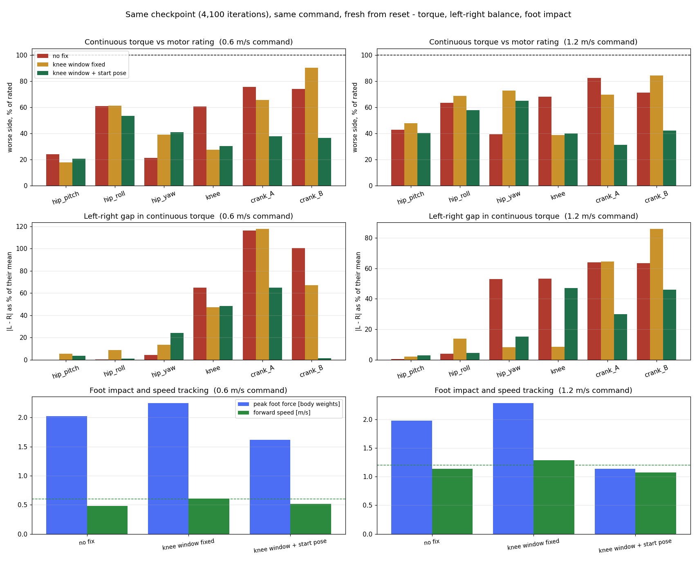

# legonly_ab_v3_keyfix — 시작 자세 결함을 고친 하체 걷기 재학습 (2026-09-05 발사)

> 이름 풀어쓰기: `legonly`(하체만) · `ab`(발목이 두 크랭크로 도는 폐루프 방식) · `v3`(이 계열 세 번째 본학습) · `keyfix`(유일 변인 = 시작 자세 수정).
> 약어를 쓰지 않는다. 처음 보는 사람도 읽을 수 있게 쓴다.

## §0 왜 이 학습을 하는가

직전 런 [[2026-09-03_legonly_ab_v2]](18,099회 완주)의 완주 측정에서 무릎은 살아났지만(좌 63.5° / 우 49.5°, 사람 55~65°) **좌우가 14° 다르고**, 발목 크랭크
토크가 오른쪽에서 1.4~1.5배였다. 뿌리를 파고든 리서치 노트 [[2026-09-05_legonly_v2_gait_defects_root_cause]]가 **데이터로 확인**한 원인:

- 로봇의 **시작 자세(웅크림 키프레임)** 에서 발목 크랭크 각도가 이전 세대 모델(v3)의 값을 그대로 물려받았는데, 이 모델(v30)은 크랭크 축이 좌우 미러라
  **왼쪽 크랭크 A와 오른쪽 크랭크 B의 기본값 부호가 틀렸다**(−17.12° vs 올바른 +17.03° / +17.26°).
- 정책은 관측(각도 − 기본값)과 행동(기본값 + 0.25 × 출력)을 이 틀린 기본값 기준으로 학습했고, 실제로 그 두 크랭크에만 **약 31°의 상수 편향 행동**을 내며 걷고 있었다
  (실측: 평균 각도가 기본값에서 +31.5° / +30.6° 이탈, 나머지 두 크랭크는 +3~4°). 좌우가 **다른 모터**에 걸리는 편향 → 비대칭.
- 같은 키프레임에서 발바닥이 바닥 아래 31 mm에 있어 매 에피소드 첫 0.1초에 접촉 충격이 들어갔다(좌우 대칭이라 비대칭 원인은 아님).

두 결함은 2026-09-05에 수정·검증됐다(시작 자세: 발바닥 **+5.0 mm**, 폐루프 찢김 **0.00 mm**, base z 0.868 → **0.904 m**; [[106_session_backlog]]).
크랭크 기본값이 바뀌면 옛 정책의 행동 계약과 어긋나므로 **이어 학습이 불가능**하고, 새 기준선이 필요하다. 이 런이 그 기준선이다.

**이 런의 질문 하나**: 시작 자세 결함을 고치면 **좌우 비대칭(무릎 14°, 크랭크 토크 1.4~1.5배)이 줄어드는가?** (가설 H1의 최종 판정)

## §1 설계 — v2와 유일 변인만 다르다

| 항목 | v2 | **이 런** |
|---|---|---|
| 시작 자세 파일 | `pygmalion_v3_printed_loop_bent.json`(v3 모델에서 푼 값) | `LegOnly_..._v30_proxyfix_loop_bent.json`(v30에서 새로 푼 값, 폐루프 0.000 mm) |
| 시작 높이 | 0.868 m(발바닥 −31 mm) | **0.904 m**(발바닥 +5 mm) |
| 크랭크 기본값 | 네 개 모두 −17.12° | L_A **+17.03**, L_B −17.26, R_A −17.03, R_B **+17.26** |
| 보상·게인·한계·커리큘럼·설정 33개 | — | **전부 동일** |

보상 변경 0. 저속 정체·짧은 지지에 대한 변경(리서치 노트 §7의 A1~A3)은 **이 런 위에서 각각 단일 변인으로** 이어 학습해 비교한다.

## §1a 실행 명령 (v2와 같은 런처·같은 인자, 이름만 변경)

```
cd mujoco-sim/mjlab
bash analysis/run_v2_scratch.sh --run legonly_ab_v3_keyfix --ankle AB --seed 42 --num-envs 16384 \
  --p1-max-iters 16000 --ramp-iters 10000 --digest-iters 4000 --settle-hold 10 --n-stages 5 \
  --gate-min-dwell 800 --gate-max-dwell 3000 --gate-window 100 --gate-err-ratio 1.1 --gate-fell-max 0.005 --gate-min-episodes 64 \
  --entropy-start 0.01 --entropy-end 0.002 --video-interval 8000 --video-length 500 --logger wandb --vy-stages \
  --env PYG_MODEL_TAG=LegOnly_prototype-tempmass-motormeasured-armfix_v30_proxyfix \
  --env PYG_MASS_DR_JSON=/home/syaro/MikuchanRemote/Human-Pygmalion/tools/robot_model/fusion_snapshots/v30_inspection/mass_dr_legonly_fastener50_prototype-tempmass.json
```

런처가 자동으로: 액션 창 사전 점검 → 1단계(커리큘럼 게이트) → 2단계(도메인 무작위화 램프) → 매시 게이트 스냅샷(§2c) → 스펙 표 삽입(§1b~) → 누적 영상.
`PYG_BENT_KEYFRAME_LEGACY`는 **설정하지 않는다**(설정하면 옛 시작 자세로 돌아가 이 런의 변인이 사라진다).

## §1a-1 발사 기록
- **2026-09-05 16:42:46** 1단계 발사(처음부터, 16,000회 상한, 16,384 환경). 트레이너 pid 725064, 로그 `logs/legonly_ab_v3_keyfix_p1.log`, 런 디렉터리 `logs/rsl_rl/pygmalion_velocity/2026-09-05_16-42-56_legonly_ab_v3_keyfix_p1`(재현 스냅샷 `repro/` 포함).
- 사전 점검 통과: 액션 창 12관절 전부 ok — **크랭크 기본값이 새 값(L_A +17.03 / L_B −17.26 / R_A −17.03 / R_B +17.26)으로 잡힌 것을 로그에서 확인**. 자원: RAM 17.1 GB 여유, GPU 15.3 GB 여유.
- 감시: 매시 게이트 스냅샷(review_loop), 워치독(pid 727345, 120초 주기 자동 재개·RAM 보호), 게이트 알림(1,000회/60분).

## §1c 완주 판정 기준 (v2 측정과 같은 조건으로 비교)

| 지표 | v2 | 목표 | 판정 |
|---|---|---|---|
| 무릎 스윙 최대 굴곡 좌−우 (0.6 / 1.2 m/s) | 13.9° / 16.1° | **절반 이하** | H1 확인 |
| 발목 크랭크 토크 실효값 우/좌 | 1.4~1.5 | **1.2 이하** | H1 확인 |
| 무릎 스윙 최대 굴곡 (좌·우 모두) | 63.5 / 49.5° | 사람 대역 55~65° 안 | 유지 |
| 보상·낙상·추종 | 50평균 114.3, 낙상 0 | 동급 | 회귀 없음 |

측정은 v2와 동일: 보행 운동학(0.6 / 1.2 m/s, 각 17초, 초기 자세 흔든 반복 3회) + 전체 명령 범위(121개 × 15초, 외란 없음·외란 주입) + 모터 활용도 + 추종표.
**주의**: 이 런의 체크포인트는 새 시작 자세로 측정한다(옛 정책만 `PYG_BENT_KEYFRAME_LEGACY=1`).

<!-- SPEC-TABLES:BEGIN -->
(런처가 §1b~§1b-4 보상·게인·액추에이터·가동범위 표를 자동 삽입한다)
<!-- SPEC-TABLES:END -->

## §2c 학습 중 리뷰 (게이트마다 스냅샷, docs/27 체크리스트)

| 시각 | iter | reward | ep_len | noise σ | value loss | entropy | surrogate / LR | fell / low_base | err_vxy / err_wz | DR / vx_max | thermal | 판정 |
|---|---|---|---|---|---|---|---|---|---|---|---|---|
| 09-05 17:42 | 724 | 108.8 (50avg 108.6) | 1000 | 0.193 | 0.0205 | -6.74 | -0.0004 / 1.3e-04 | 0.000 / 0.042 | 0.470 / 0.495 | 0.00 / 0.8 | 1.24 | **계속** — 게이트 1(17:45, 60분 심박): iter 724, reward 108.8 (50avg 108.6), ep_len 1000, 낙상 0.000 / 0.042, 추종오차 0.470 / 0.495, 단계 0(vx≤0.8), thermal 1.24. **v2 같은 시점(iter 685: 110.5 / ep_len 1000 / 낙상 0 / 오차 0.586)과 동급** — 오차는 0.470으로 오히려 낮음. 시작 자세 수정이 초기 학습을 해치지 않음. 중단 사유 없음 |
| 09-05 18:42 | 1479 | 109.5 (50avg 108.5) | 1000 | 0.210 | 0.0281 | -5.56 | -0.0015 / 1.1e-04 | 0.000 / 0.125 | 0.581 / 0.553 | 0.00 / 1.2 | 1.49 | **계속** — 게이트 2(18:46): iter 1479, reward 109.5 (50avg 108.5), ep_len 1000, 낙상 0.000 / 0.125, 추종오차 0.581 / 0.553, **커리큘럼 단계 1 진입(vx≤1.2)**, thermal 1.49. v2 같은 시점(iter 1321: 111.4 / 오차 0.586 / 낙상 0 / thermal 1.53)과 동급. 중단 사유 없음 |
| 09-05 19:42 | 2233 | 105.8 (50avg 105.7) | 993 | 0.231 | 0.039 | -4.17 | 0.0008 / 7.6e-05 | 0.000 / 0.083 | 0.724 / 0.640 | 0.00 / 1.6 | 1.71 | **계속** — 게이트 3(19:48): iter 2233, reward 105.8 (50avg 105.7), ep_len 993, 낙상 0.000 / 0.083, 추종오차 0.724 / 0.640, **단계 2 진입(vx≤1.6)**, thermal 1.71. 보상 소폭 하락은 명령 범위 확대에 따른 정상 패턴(v2도 iter 1957에서 107.8 / 오차 0.751 / thermal 1.75) — 동급. 중단 사유 없음 |
| 09-05 20:42 | 2988 | 102.5 (50avg 102.5) | 993 | 0.247 | 0.0487 | -3.11 | 0.0002 / 1.1e-04 | 0.000 / 0.167 | 0.882 / 0.712 | 0.00 / 2.0 | 1.86 | **계속** — 게이트 4(20:49): iter 2988, reward 102.5 (50avg 102.5), ep_len 993, 낙상 0.000 / 0.167, 추종오차 0.882 / 0.712, **단계 3 진입(vx≤2.0)**, thermal 1.86. 보상은 명령 범위가 넓어질수록 내려가는 v2와 같은 궤적(v2 iter 3228, 단계 4: 102.1 / 오차 1.017 / thermal 2.17). 낙상 0 유지, thermal 감시선 3.0 아래. 중단 사유 없음 |
| 09-05 21:42 | 3748 | 101.0 (50avg 100.3) | 1000 | 0.255 | 0.0508 | -2.71 | -0.0020 / 1.7e-04 | 0.000 / 0.125 | 1.059 / 0.736 | 0.00 / 2.5 | 2.08 | **계속** — 게이트 5(21:51): iter 3748, reward 101.0 (50avg 100.3), ep_len 1000, 낙상 0.000 / 0.125, 추종오차 1.059 / 0.736, **마지막 4단계 진입(vx≤2.5, 전체 명령 범위)**, thermal 2.08. v2 같은 시점(iter 3867: 99.3 / 오차 0.957 / thermal 2.49)과 동급, 열 지표는 오히려 낮음. 1단계 졸업 게이트(최소 체류 800회 후 오차 비율 1.1 이하)는 v2에서 iter 4100에 통과했으니 이 런은 4,500~4,800회 근방에 예상. 중단 사유 없음 |
| 09-05 22:42 | 4513 | 100.3 (50avg 101.5) | 988 | 0.258 | 0.0536 | -2.49 | -0.0009 / 1.1e-04 | 0.000 / 0.417 | 1.008 / 0.735 | 0.00 / 2.5 | 2.15 | **계속** — 게이트 6(22:52): iter 4513, reward 100.3 (50avg 101.5), ep_len 988, 낙상 0.000 / 0.417, 추종오차 1.008 / 0.735, 단계 4 유지, thermal 2.15. v2 같은 시점(iter 4101: 102.1 / 오차 0.977 / thermal 2.52)과 동급. **1단계 졸업 게이트 아직 미통과**: 정착 오차 0.2614 vs 기준 0.2293 = 비율 1.14(기준 1.1 이하 필요, v2는 iter 4100에 1.056으로 통과). 최대 체류 3,000회 규칙으로 늦어도 6,700회 근방에는 2단계로 넘어감. 낮은 몸통 높이 종료 비율 0.417은 v2(0.08~0.17)보다 높아 **감시 항목**(다음 게이트에서 추세 확인). 중단 사유 없음 |
| 09-05 23:43 | 5274 | 102.9 (50avg 102.1) | 997 | 0.265 | 0.0527 | -2.14 | -0.0003 / 7.6e-05 | 0.000 / 0.125 | 0.963 / 0.754 | 0.00 / 2.5 | 2.25 | **계속** — 게이트 7(23:54): iter 5274, reward 102.9 (50avg 102.1)(직전 100.3에서 회복), ep_len 997, 낙상 0.000 / 0.125, 추종오차 0.963 / 0.754, 단계 4 유지, thermal 2.25. 감시 항목이던 낮은 몸통 높이 종료 비율은 0.417 → 0.125로 내려와 **해소**. 1단계 졸업 비율은 0.2674 / 0.2293 = 1.17로 여전히 1.1 초과 — 정착 오차가 더 내려가지 않아 **최대 체류 3,000회 규칙(약 6,700회)으로 2단계 진입할 가능성이 큼**. v2는 1.056으로 조기 졸업했으므로 이 차이(전체 명령 범위에서의 정착 오차 +16 %)는 완주 측정 때 추종표에서 다시 본다. 중단 사유 없음 |
| 09-06 00:43 | 6039 | 101.2 (50avg 102.1) | 1000 | 0.271 | 0.0577 | -1.72 | -0.0018 / 1.7e-04 | 0.000 / 0.167 | 0.947 / 0.772 | 0.00 / 2.5 | 2.30 | **계속** — 게이트 8(00:55): iter 6039, reward 101.2 (50avg 102.1), ep_len 1000, 낙상 0.000 / 0.167, 추종오차 0.947 / 0.772, 단계 4 유지, thermal 2.30. 졸업 비율 0.2686 / 0.2293 = 1.17로 정체(세 게이트 연속 1.14~1.17) — 런처 기록 '체류 2,950 / 3,000회'이므로 **약 6,200회에 최대 체류 규칙으로 1단계 종료 → 2단계(도메인 무작위화 램프 10,000회) 자동 진입 직전**. 낮은 몸통 높이 종료 비율 0.083으로 정상. 중단 사유 없음. 다음 게이트에서 2단계 발사(새 로그·재현 스냅샷·33개 설정)를 확인한다 |
| 09-06 01:43 | 6808 | 102.1 (50avg 101.8) | 1000 | 0.280 | 0.0619 | -1.25 | 0.0009 / 1.1e-04 | 0.000 / 0.042 | 0.909 / 0.815 | 0.00 / 2.5 | 2.45 | **계속(단서 있음)** — 게이트 9(01:57): iter 6808, reward 102.1 (50avg 101.8), ep_len 1000, 낙상 0.000 / 0.042, 추종오차 0.909 / 0.815, 단계 4 유지, thermal 2.45. 학습 자체는 건강함. **그러나 1단계 졸업이 정체**: 게이트 8에서 '최대 체류 3,000회로 자동 졸업'이라 적은 것은 **오독** — 런처 코드(settle_check)를 읽으니 마지막 단계에는 체류 한도 탈출이 없고, 정착 오차 ≤ 기준×1.1(0.2293×1.1=0.252)을 10회 연속 만족해야만 2단계로 넘어감. 현재 0.267~0.269로 4시간째 평평(비율 1.17). 이대로면 1단계 상한 16,000회(약 12시간 뒤)까지 가서야 2단계로 넘어가 총 30,000회가 됨(v2는 4,100회에 졸업, 총 18,099회). 원인·대응은 §2c-1에 정리 |
| 09-06 02:43 | 7578 | 100.8 (50avg 101.4) | 994 | 0.285 | 0.0657 | -1.02 | -0.0011 / 1.7e-04 | 0.000 / 0.042 | 0.884 / 0.817 | 0.00 / 2.5 | 2.55 | **계속** — 게이트 10(03:19): iter 7578, reward 100.8 (50avg 101.4), ep_len 994, 낙상 0.000 / 0.042, 추종오차 0.884 / 0.817, thermal 2.55. 이 시각 4,100회 체크포인트로 세 세대 비교 영상을 찍었고(§3) **좌우 차 4.0~4.5도로 v2의 절반 이하** — 이 런의 목적이 중간 지점에서 확인됨. 학습 계속 |
| 09-06 03:43 | 8330 | 101.5 (50avg 101.1) | 1000 | 0.292 | 0.063 | -0.57 | -0.0022 / 1.1e-04 | 0.000 / 0.042 | 0.854 / 0.839 | 0.00 / 2.5 | 2.63 | **계속** — 게이트 11(04:23): iter 8330, reward 101.5 (50avg 101.1), ep_len 1000, 낙상 0.000 / 0.042, 추종오차 0.854 / 0.839, thermal 2.63. 같은 시각 §4 하중 비교 완료: 착지 충격 v2 대비 −28~−50 %, 발목 크랭크 정격 대비 90 %→37 %. 학습 계속 |
| 09-06 04:43 | 9087 | 100.1 (50avg 101.5) | 987 | 0.294 | 0.0685 | -0.54 | -0.0019 / 2.6e-04 | 0.000 / 0.083 | 0.831 / 0.830 | 0.00 / 2.5 | 2.77 | **계속** — 게이트 12(05:26): iter 9087, reward 100.1 (50avg 101.5), ep_len 987, 낙상 0.000 / 0.083, 추종오차 0.831 / 0.830, thermal 2.77(감시선 3.0 접근 중, 다음 게이트에서 재확인). 졸업 정착 오차는 0.2603으로 6시간째 문턱 0.2522 위에서 미세 하강 중 — 1단계 상한 16,000회까지 갈 전망(§2c-1의 선택지 A). 중단 사유 없음 |

## §2c-1 1단계 졸업 정체 — 원인과 선택지 (2026-09-06 02:00 기록)

**무슨 일인가.** 1단계(속도 범위를 5단계로 넓히는 커리큘럼)는 마지막 5번째 단계(전후 −2.0~2.5 m/s, 좌우 ±1.0, 회전 ±1.0)에 21:00에 들어갔다(3,200회).
그 뒤 3,700회 넘게 머무르며 넘어짐 0, 보상 100~103으로 안정적이지만 **2단계(질량·마찰 등을 무작위로 흔드는 도메인 무작위화)로 넘어가지 못하고 있다.**

**왜 넘어가지 못하나.** 런처 코드(`analysis/run_v2_scratch.py`의 `settle_check`)를 다시 읽어 확인한 규칙:
- 마지막 단계에서는 "체류 한도(3,000회)로 자동 승격"이 **없다**(그 규칙은 중간 단계에만 적용). 게이트 8의 "약 6,700회에 자동 진입" 기록은 오독이었다.
- 넘어가는 조건은 하나: **정착 추종 오차 ≤ 직전 단계 통과 시 오차(기준값) × 1.1** 을 10회 연속 만족. 기준값 0.2293 → 문턱 0.2522.
- 이 조건을 못 채우면 1단계 상한 **16,000회**까지 돈 뒤 2단계로 넘어간다(코드가 이 경로를 정상 경로로 처리: `end_reason = "hard iteration cap"`, 마지막 단계 도달 여부만 확인).

**오차 추이(런처 기록, 마지막 단계 진입 후).** 0.2307(진입 직후) → 0.2519(체류 790회, 문턱 0.2522 **바로 아래**) → 0.2582(1,150회) → 0.2686(3,000회) → 0.2674~0.2686 평평.
즉 최소 체류 800회가 차는 순간 오차가 문턱을 약 0.001 넘어서며 놓쳤고, 그 뒤 오차가 더 올라 평평해졌다. 오차가 체류 중 오르는 것은 v2에서도 같았다
(v2: 0.2380 → 0.2478, 문턱 0.2570을 여유 있게 통과). 차이는 v3의 기준값이 더 낮았고(0.2293 vs 0.2336 — 4단계에서 더 잘 걸었다는 뜻) 마지막 단계 오차는 더 높다(0.268 vs 0.248).
다섯 단계 승격은 v2와 똑같이 전부 게이트 통과(강제 승격 0회)였다.

**이것이 정책의 문제인가.** 아니다. 매시 리뷰의 추종 오차(err_vxy)는 v3 0.909가 v2 0.977보다 **낮고**, 보상·넘어짐·열 지표 모두 동급이다. 게이트가 재는 "정착 오차"(에피소드 후반부의 평균 오차)만
v2보다 8 % 높다. 이 차이는 완주 측정의 추종표에서 다시 본다.

**선택지 (사용자 결정 필요 — 결정 전까지는 A로 진행).**

| | A. 그대로 둔다 | B. 지금 수동 졸업시켜 2단계로 넘긴다 |
|---|---|---|
| 하는 일 | 없음. 1단계가 16,000회에 끝나고 런처가 2단계를 자동 발사 | 런처·트레이너 정지 → 상태 파일의 1단계를 '완료'로 표시(마지막 체크포인트) → 런처 재시작(`--force-p2` 불필요, 마지막 단계 도달 True) |
| 1단계 길이 | 16,000회 (v2는 4,100회) | 약 7,000회 |
| 예상 완주 | 1단계 끝 09-06 14:00 → 2단계 14,000회 → **09-07 08:30** | **09-06 20:30** |
| 비교 가능성 | v2와 1단계 길이가 4배 달라 "시작 자세 수정만 다른 A/B"에서 멀어짐 | 1.7배 차이. v2에 더 가깝고 12시간 빠름 |
| 단점 | 12시간 더 걸리고 무작위화 없는 학습을 9,000회 더 함 | 게이트(정착 요건)를 사람이 덮어씀 — 기록에 남겨야 함 |

**권고: B.** 3,700회 넘게 넘어짐 0으로 마지막 단계에 머물렀고 문턱을 0.001 차로 놓친 뒤 평평해진 상태이므로 "정착"의 실질은 충족했다. 다만 게이트를 덮어쓰는 결정이라 사용자 확인 뒤 실행한다.
결정이 없으면 A로 진행되며(런처 기본 동작), 아침에 B를 택해도 그 시점 체크포인트에서 바로 넘길 수 있다.

## §3 세 세대 나란히 비교 영상 (2026-09-06 03:20, 학습 중 중간 점검)

**무엇을 비교했나.** 세 번의 학습이 모두 가진 **같은 지점(4,100회 반복)** 의 정책을, **같은 명령**(앞으로 0.6 m/s 15초, 그다음 1.2 m/s 15초)으로,
**로봇 몸통 기준 같은 각도**에서 나란히 찍었다. 학습량·명령·시점·시선이 모두 같으므로 화면에서 다른 것은 걷는 방식뿐이다.

| 칸 | 학습 | 고친 것 |
|---|---|---|
| 왼쪽 | legonly_ab_v1 | 없음(수정 전) |
| 가운데 | legonly_ab_v2 | 무릎 명령 창(왼쪽 무릎이 어떤 명령도 따를 수 없던 문제) |
| 오른쪽 | legonly_ab_v3_keyfix | 무릎 명령 창 **+ 시작 자세**(이 런) |

**결과 — 무릎 최대 굴곡(도), 사람 기준 55~65도**

| 학습 | 0.6 m/s 왼쪽 / 오른쪽 | 좌우 차 | 1.2 m/s 왼쪽 / 오른쪽 | 좌우 차 | 전진 속도(0.6 / 1.2 명령) |
|---|---|---|---|---|---|
| v1 수정 전 | 0.4 / 8.9 | **8.5** | 0.6 / 10.0 | **9.4** | 0.48 / 1.14 m/s |
| v2 무릎 창만 | 52.2 / 44.5 | **7.7** | 73.3 / 54.8 | **18.4** | 0.61 / 1.29 m/s |
| v3 무릎 창 + 시작 자세 | 57.4 / 53.3 | **4.0** | 58.8 / 54.3 | **4.5** | 0.52 / 1.07 m/s |

읽는 법 세 가지.
1. **v1은 왼쪽 무릎이 사실상 0도**(0.4~0.6도)로 굳어 있다. 오른쪽만 10도 남짓 굽히며 발을 끄는 걸음이다.
2. **v2는 무릎이 살아났지만 좌우가 어긋난다.** 특히 빠른 명령에서 왼쪽 73.3도 대 오른쪽 54.8도로 18.4도 차이가 나고, 왼쪽은 사람 대역(55~65도)을 넘어 과굴곡이다.
3. **v3는 양쪽 모두 사람 대역 안이고 좌우 차가 4~4.5도**로, 같은 학습량에서 v2의 절반 이하다. 이 런의 완주 판정 기준(§1c)에 걸어 둔 "좌우 차 절반 이하"를 **중간 지점에서 이미 만족**한다.
참고로 v2의 **완주본**(18,099회) 측정은 좌우 차 13.9도(0.6 m/s) / 16.1도(1.2 m/s)였다. v3는 4,100회 시점에 이미 그보다 작다. 다만 학습량이 다르므로 최종 판정은 v3 완주 후 같은 조건 측정으로 한다.

**v1을 당시 조건으로 되돌린 방법(중요).** v1은 좌우 축을 구분하지 않던 시절의 코드로 학습했다. 오늘 코드로 그냥 재생하면 그 정책이 겪어보지 못한 관절 한계가 적용되어
**존재한 적 없는 로봇**을 보여주게 된다(실제로 오늘 코드로 재생하면 왼쪽 무릎이 120도까지 흔들린다). 그래서 새 도구에 `--legacy-v1` 경로를 두어, 수정 커밋이 지운 값 두 가지를
그대로 되돌리고 화면에 찍어 확인한다: 명령 창은 양쪽 무릎 모두 −114도~−6도(왼쪽 무릎의 실제 가동범위 0~+120도와 **겹치는 구간이 없다** = 재현된 결함), 기본 자세는 양쪽 무릎 −20.05도.
시작 자세 파일도 그 세대 것(`PYG_BENT_KEYFRAME_LEGACY=1`)을 쓴다.

**방법상 발견 — 구간을 이어 붙이면 결론이 바뀐다.** 처음에는 0.6 → 1.2를 한 번에 이어서 측정했는데, 그때 v2는 1.2 m/s에서 **제자리에 서서 전진 0.00 m/s**, 무릎 6~7도였다.
순서를 뒤집어 리셋 직후 1.2 m/s를 주자 같은 정책이 **1.29 m/s로 잘 걸었다**(무릎 73.3 / 54.8도). 즉 그 정지는 정책의 성질이 아니라 **앞 구간이 남긴 상태** 때문이다.
그래서 표와 영상의 모든 구간은 **리셋 직후 첫 구간**만 쓴다(전환 3초 버리고 12초 사용). 이후 비교 측정도 이 규칙을 따른다.

**한계.** 구간당 1회 시행이고 재생은 결정론적이라(리셋 흔들기 없음) 시행 간 편차를 담지 못한다. 완주 후 정식 측정은 초기 자세를 흔든 3회 반복으로 한다(§1c).

**산출물.** 영상 `docs/mujoco/assets/trio_keyfix_4100.mp4`(24초, 실시간, 8.7 MB — 영상은 저장소에 커밋하지 않는다: 대용량 파일 보관 방식 결정 대기).
궤적 `mujoco-sim/mjlab/analysis/out/trio_v{1,2,3}_4100{,_rev}.npz`. 도구 `analysis/trio_video_rollout.py`, `analysis/trio_sidebyside.py`(mjlab `bd7ab5b0`).

## §4 같은 조건에서의 토크·하중·속도 정량 비교 (2026-09-06 04:30)

§3의 같은 여섯 구간(같은 4,100회 지점, 같은 명령, 리셋 직후 12초)에서 **관절별·좌우별로** 모터 부하와 착지 충격을 뽑았다.
토크에는 시뮬레이션→실물 보정 1.15배를 곱했고, 연속 토크는 제곱평균제곱근, 정격/피크는 각 관절 모터의 사양(엉덩이 앞뒤·좌우·무릎 RS04 40/120 N·m, 엉덩이 회전·발목 크랭크 RS03 20/60 N·m)이다.
그림:  · 전체 표: `docs/img/trio_keyfix_4100_loads.md`

### 4a 발이 땅을 때리는 힘 (몸무게 배수, 최댓값) — v3가 가장 부드럽다

| 명령 | v1 수정 전 | v2 무릎 창 | **v3 무릎 창 + 시작 자세** |
|---|---|---|---|
| 0.6 m/s | 2.03 | 2.25 | **1.62** (v2 대비 −28 %) |
| 1.2 m/s | 1.98 | 2.28 | **1.14** (v2 대비 −50 %) |

하드웨어 설계에 가장 직접 걸리는 숫자다. 무릎 창만 고친 v2는 무릎이 살아나면서 오히려 더 세게 착지했는데, 시작 자세까지 고치니 절반으로 내려갔다.
발바닥이 바닥 아래 31 mm에 박힌 채 시작하던 결함이 사라져 매 에피소드 첫 순간의 충격이 없어진 것과 방향이 일치한다.

### 4b 연속 토크, 나쁜 쪽 다리 기준 정격 대비 (%) — 발목이 크게 내려갔다

| 관절 | 0.6 m/s v1 / v2 / **v3** | 1.2 m/s v1 / v2 / **v3** |
|---|---|---|
| 엉덩이 앞뒤 | 24 / 18 / **20** | 43 / 48 / **40** |
| 엉덩이 좌우 | 61 / 61 / **53** | 63 / 69 / **58** |
| 엉덩이 회전 | 21 / 39 / **41** | 39 / 73 / **65** |
| 무릎 | 61 / 28 / **30** | 68 / 39 / **40** |
| 발목 크랭크 A | 76 / 66 / **38** | 82 / 70 / **31** |
| 발목 크랭크 B | 74 / **90** / **37** | 71 / **84** / **42** |

**발목 크랭크가 결정적이다.** v2에서 90 %까지 올라가 정격에 가장 근접했던 크랭크 B가 v3에서 37 %로 떨어졌다. 크랭크 기본값 부호가 틀려 상시 31도 치우친 지령을 내던 것이 없어진 결과로 읽힌다.
**엉덩이 회전만 v3가 v2보다 높거나 비슷하다**(0.6에서 41 % 대 39 %). 절대값은 안전권이지만 추세로 기록해 둔다.
v1의 무릎 61 %는 걷는 힘이 아니라 **멈춤턱을 계속 미는 낭비**다(같은 구간 왼쪽 무릎 가동 범위 0.2도).

### 4c 좌우 격차 (연속 토크, 두 다리 평균 대비 %) — 대부분 개선, 무릎만 예외

| 관절 | 0.6 m/s v1 / v2 / **v3** | 1.2 m/s v1 / v2 / **v3** |
|---|---|---|
| 발목 크랭크 A | 116 / 118 / **65** | 64 / 65 / **30** |
| 발목 크랭크 B | 100 / 67 / **1** | 63 / 86 / **46** |
| 무릎 | 65 / 47 / **48** | 53 / **9** / **47** |
| 엉덩이 회전 | 4 / 14 / **24** | 53 / 8 / **15** |
| 엉덩이 앞뒤·좌우 | 0~4 / 2~14 / **1~4** | 0~4 / 2~14 / **3~4** |

발목은 크게 좋아졌다(느린 걸음의 크랭크 B는 100 % → 1 %). **무릎만 남았다**: 빠른 걸음에서 v2는 좌우 격차 9 %였는데 v3는 47 %다.
§3의 각도 결과(무릎 굽힘 좌우 차 v3가 더 작음)와 방향이 반대여서, **각도는 대칭에 가까워졌는데 토크는 한쪽에 몰린다**는 뜻이다. 원인 규명은 §5.

### 4d 속도 추종 — v3가 명령보다 조금 느리다

| 명령 | v1 | v2 | **v3** |
|---|---|---|---|
| 0.6 m/s | 0.48 | 0.61 | **0.52** |
| 1.2 m/s | 1.14 | 1.29 | **1.07** |

v2가 더 잘 따라간다(1.2 명령에 1.29). 1단계 졸업 심판이 보는 정착 오차가 v3에서 8 % 높은 것(§2c-1)과 같은 방향의 신호다.
느린 쪽이 반드시 나쁜 것은 아니다(충격도 절반이다). 다만 **추종을 희생해 부드러워진 것인지**는 완주 후 전체 명령 범위 측정에서 다시 본다.

### 4e 한계
구간당 1회 시행, 결정론적 리셋, 직진 두 속도만. 하중 사이징 데이터가 아니라 **세대 비교용**이다. 사이징은 완주 후 전체 명령 범위(121개 명령 × 15초) 측정으로 한다.

### 4f 정정 — 반복 측정으로 뒤집힌 결론 두 개 (2026-09-06 05:30 추가)

§3·§4의 숫자는 **구간당 1회 시행**이다. 그 뒤 초기 자세를 ±2.9도 흔들어 각 세대 4회씩 다시 재니 두 결론이 무너졌다. 원 기록은 지우지 않고 여기에 정정한다.
근거와 원인 분석은 [[2026-09-06_v3_knee_symmetry_stance_duty]].

| 앞에서 쓴 것 | 4회 반복 후 | 판정 |
|---|---|---|
| "오른쪽 무릎 54.3도로 사람 대역(55~65) 아래" | 평균 **56.6도**(54.3~60.6) → **대역 안** | 철회. 54.3은 4회 중 최저치였다 |
| "무릎 토크 좌우 격차 v2 9 % 대 v3 47 %" | v2 17 %(3~49), v3 25 %(8~47) → 범위가 겹침 | 철회. **구분 불가** |
| "착지 충격 v2 대비 절반" | v3 1.5(1.1~2.1) 대 v2 2.6(2.3~3.5) 몸무게배수 | **유지**(범위가 겹치지 않음) |
| "무릎 각도 좌우 차 v3가 더 작음" | v3 6.7도(2.5~13.2) 대 v2 15.0도(6.2~18.9) | **유지** |

**반복 후 새로 드러난 진짜 신호**: v3는 4회 모두 **왼발이 오른발보다 오래 땅을 딛는다**(왼 69.9 % 대 오른 59.8 %, 차이 4.3~17.3 %포인트). v2는 4회 모두 균형이었다(−7.3~0.0).
같은 방향으로, 무릎을 펴짐 한계까지 밀어붙이는 시간도 왼쪽에 몰린다(왼 33.1 % 대 오른 21.4 %). 굽힘 한계에 붙은 시간은 양쪽 0 %라서, **무릎이 덜 굽는 것은 한계에 막혀서가 아니라 정책이 그만큼만 요구해서**다.
곡선 보행 탓이라는 설명은 기각됐다(방향 변화량과 디딤 차의 상관 −0.44, 방향 변화 0도인 시행에서 오히려 차이가 가장 컸다).

**작업 규칙 추가**: 세대 비교는 초기 자세를 흔든 3~4회 반복으로 하고, 범위가 겹치면 "구분 불가"로 적는다.

## §R 참조
- 직전 런: [[2026-09-03_legonly_ab_v2]] · 뿌리 원인: [[2026-09-05_legonly_v2_gait_defects_root_cause]] · 시작 자세 수정 기록: [[106_session_backlog]] 09-05 항목
- 시작 자세 풀이 도구: `tools/robot_model/loop_bent_keyframe.py` · 설정 선택 코드: `pygmalion_constants._bent_json_path()` (mjlab `568a4372`)
