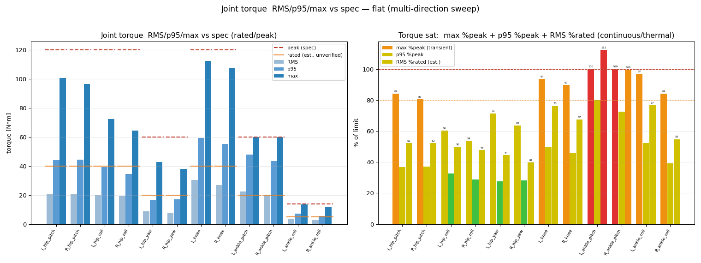
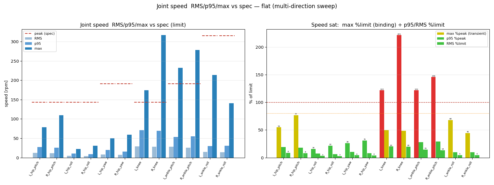
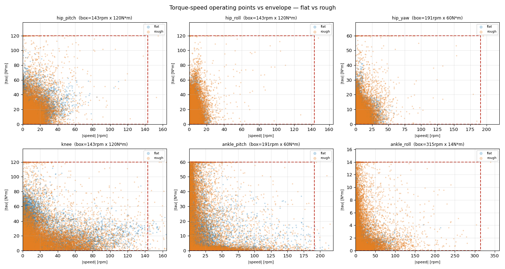
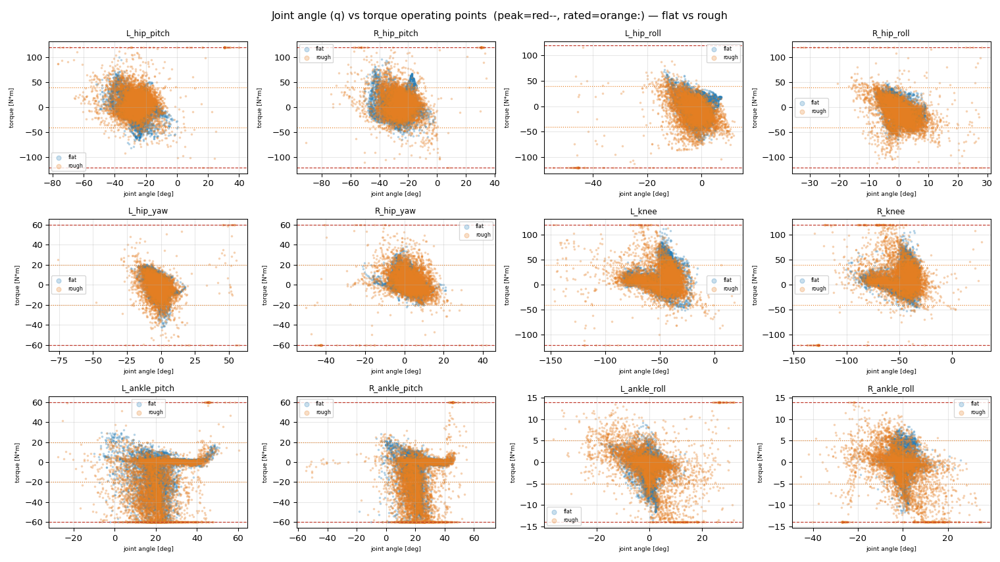
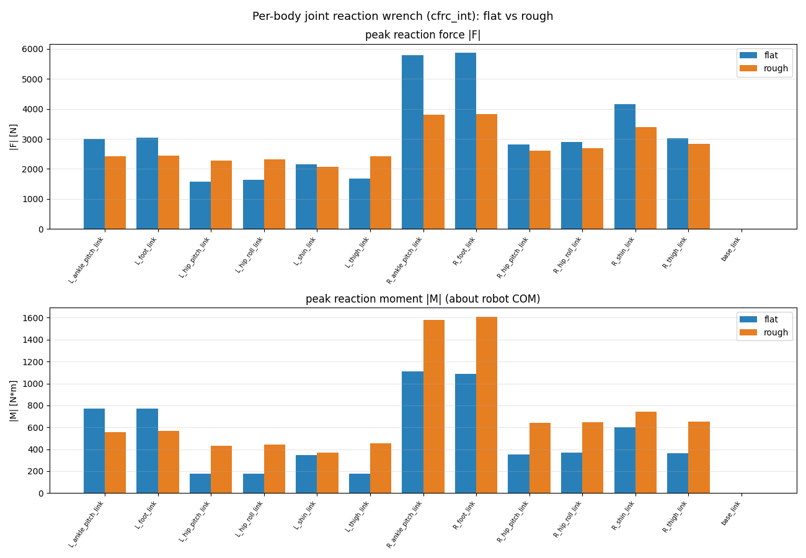
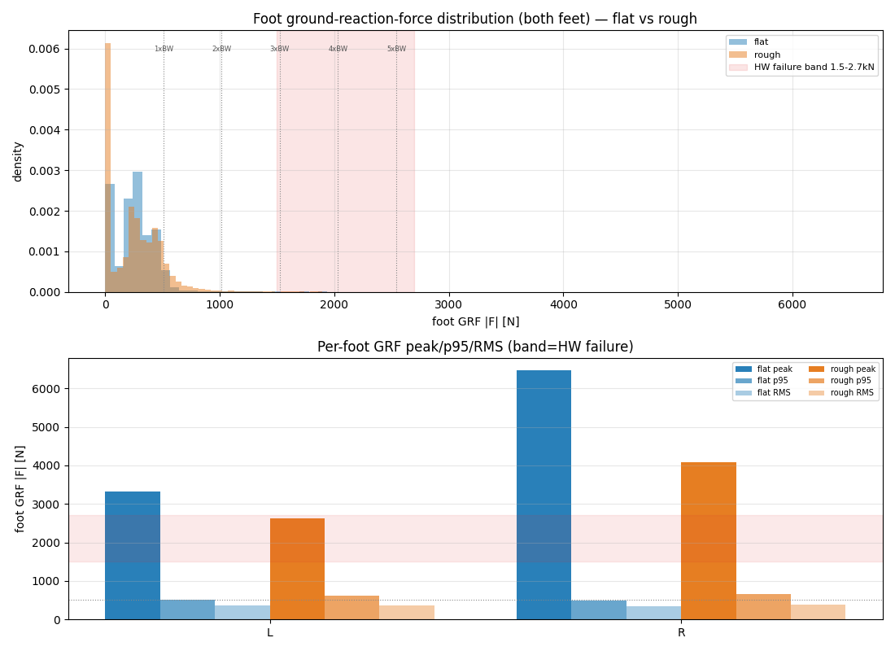
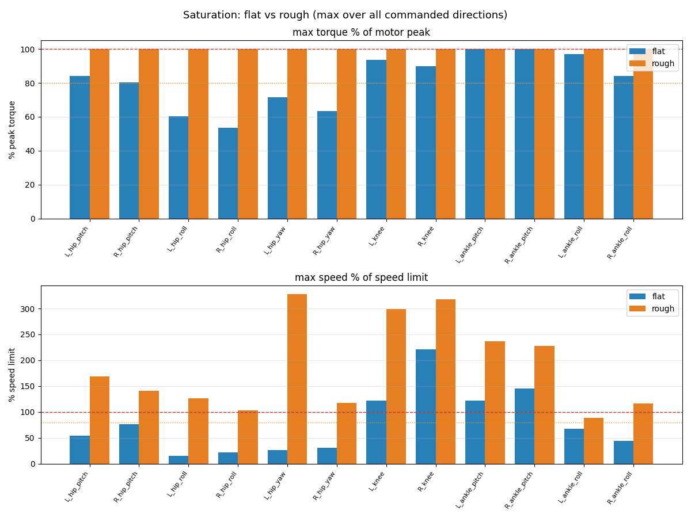
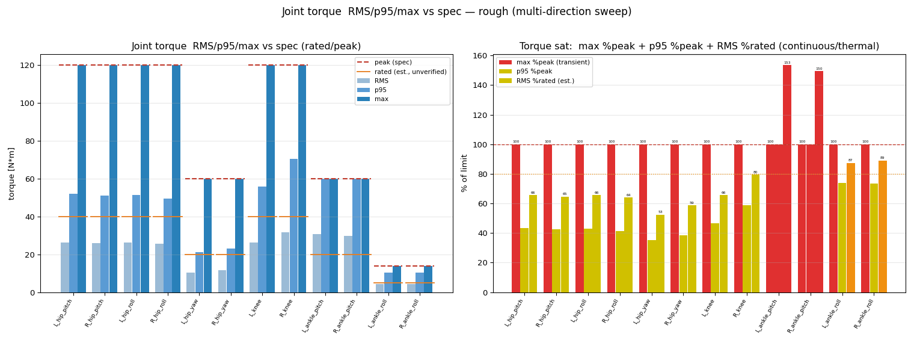
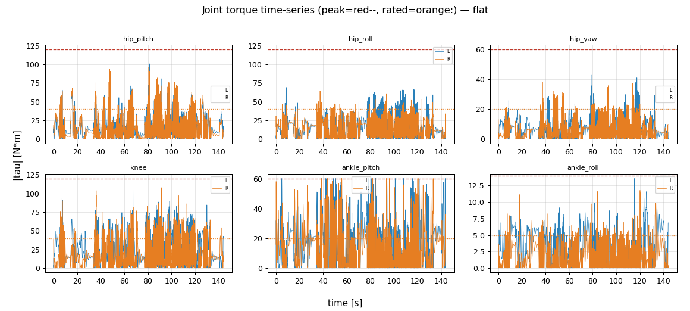
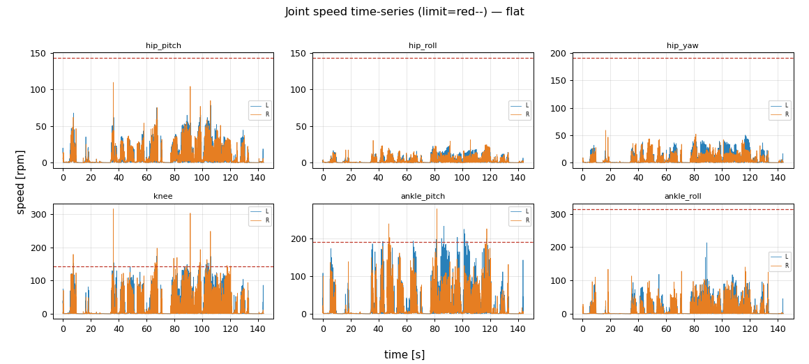

# mjlab Pygmalion 부하 분석 — flat run `2026-06-30_20-12-31` (+ rough 배포)

| 항목 | 값 |
|---|---|
| 프레임워크 | **mjlab** (MuJoCo-Warp) — IsaacLab 계통과 별개 |
| Task / run | `Mjlab-Velocity-Flat-Pygmalion` / `2026-06-30_20-12-31` |
| 학습 명령 | `uv run train Mjlab-Velocity-Flat-Pygmalion --env.scene.num-envs 8192 --video True --video-length 400 --video-interval 128` |
| Checkpoint | 측정 시점 최신 settled `model_*.pt` (iter ~14k / 30001 — **학습 진행 중 중간본**) |
| 측정 방식 | **CPU 분리 rollout** (`CUDA_VISIBLE_DEVICES=""`) → 학습 GPU 무중단 (측정 중 GPU 메모리 불변, ckpt 계속 증가 확인) |
| 측정량 | 관절 토크/속도(RMS·p95·max·포화%), 토크-RPM scatter, 6-DoF 반력 wrench(`cfrc_int`) |
| 모델 | base + 12 구동관절(L/R × hip_pitch/roll/yaw, knee, ankle_pitch/roll), **toe 없음(강체 발)** |
| 측정일 | 2026-07-01 · 방법/도구: [README](README.md) |

---

## ★ 요구사항 대조표 (누락 점검)

| # | 요구 | 산출물 | 상태 |
|---|---|---|---|
| 1 | 관절별 토크/속도 RMS·P95·Peak | §1 표 + `flat/rough_torque.png`·`_speed.png` | ✅ |
| 2 | 토크-속도 산점도 | §2 `cmp_torque_speed_scatter.png` (RPM) | ✅ |
| 3 | 관절위치별 6-DoF Wrench(F+M) | §3 6성분 표 + `wrench_6dof.csv` + `cmp_link_force.png` | ✅ |
| 1' | Flat+Rough, 색구분 | 전 비교플롯 flat(파랑)/rough(주황), §4 | ✅ |
| 2' | 관절별 토크-RPM scatter | §2 (rad/s→rpm 변환, 설계 표준) | ✅ |
| 3' | 관절별 q(관절각)-토크 scatter | §2b `cmp_q_torque_scatter.png` | ✅ |
| 4' | DR 조건 + 취득 방법 | §0b (학습 DR) + §0 (측정 스윕) + §7 (취득법) | ✅ |
| 5' | flat/rough 취득 영상 | §5b `flat/rough_loadviz.mp4` | ✅ |
| 6' | 관절 색: >Nominal노랑/>70%peak주황/>100%빨강 | §5b 구 indicator 색칠 | ✅ |
| 7' | 더 넓은 DR·장시간 (§2·3 재수집) | §0 `--wide-dr` 7200step vx[-2,3]·vy±1·yaw±0.7 | ✅ |
| 8' | 지면반력 별도 그래프 | §3c `cmp_grf.png` (분포+peak/p95/RMS+HW band) | ✅ |
| 9' | 좌-영상/우-Plot(RPM·토크 히스토그램+limit) 영상 루틴 | §5c `flat/rough_dashboard.mp4` (`make_dashboard_video.py`) | ✅ |
| 10' | 측정값(힘·토크·속도·관절) 정확성 검토 | §7b adversarial audit 6항 | ✅ |

## 0. 주행 조건 — "어떻게 / 어떤 조건으로 달렸나" (★ 넓은 DR · 장시간)

★ **현재 데이터 = `--wide-dr` 모드(7200 step)**: 학습 DR **전 범위를 랜덤 샘플** —
vx∈[−2,3], vy∈[−1,1], yaw∈[−0.7,0.7](커리큘럼 상한 포함) + 극단값(전·후·측·회전·대각) 시드,
각 명령 120 step 유지. 장시간(≈144s) 수집 → 히스토그램/scatter/wrench 통계가 풍부.
(아래 18-명령 고정 스케줄은 초기 다방향 버전; 현재는 더 넓은 랜덤 DR로 대체.)

이전 forward-only(vx=0.5) 측정은 **측방·회전·후진 하중을 누락**했음. 초기 다방향 버전(참고): 학습 DR
(lin_vel_x/y ±1.0, yaw ±0.5~0.7)을 커버하는 **명령 스케줄 스윕** — 각 명령을 150 step(≈3s) 유지, 18개:

| 구간 | (vx, vy, yaw) |
|---|---|
| 전진 | (0.5,0,0) (1.0,0,0) (1.5,0,0) |
| 후진 | (-0.5,0,0) (-1.0,0,0) |
| 측방 L/R | (0,±0.5,0) (0,±1.0,0) |
| 회전 | (0,0,±0.5) (0,0,0.7) |
| 대각 | (0.8,±0.5,0) |
| 곡선(전진+회전) | (0.8,0,±0.5) |
| 정지 | (0,0,0) |

→ **각 관절의 RMS/p95/max는 이 전 방향에 걸친 worst-case 엔벨로프**. (flat 정책이 iter~12k
중간본이라 일부 공격적 명령은 추종 불완전 — 그 transient도 하중에 포함, HW에 보수적.)

## 0b. 학습 DR 조건 + 취득 방법

**학습 시 도메인 랜덤화 (정책이 겪은 randomization, `velocity_env_cfg.py`):**

| 항목 | 범위 | 모드 |
|---|---|---|
| command `twist` | vx ±1.0, vy ±1.0, yaw ±0.5 rad/s, heading ±π; resample 3–8s | (커리큘럼: vx 후반 ±2.0~3.0) |
| command 분포 | standing 10% · heading 30% · forward-only 20% | per-env |
| reset_base pose | x/y ±0.5 m, z 0.01–0.05, yaw ±π | reset |
| **push_robot** | 선속 x/y ±0.5, z ±0.4 m/s · 각속 roll/pitch ±0.52, yaw ±0.78 rad/s, 매 1–3s | interval |
| **foot_friction** | μ 0.3–1.2 (양발 공유) | startup |
| encoder_bias | 관절 ±0.015 rad | startup |
| base_com offset | x/y ±0.025, z ±0.03 m | startup |
| obs corruption | Unoise 각 항 ±0.01~±1.5 (joint/gravity/vel 등) | step |

**측정(취득) 방법:** CPU 1-env rollout(`CUDA_VISIBLE_DEVICES=""`로 학습 GPU 격리 = 무중단).
위 DR 범위를 커버하는 **18-명령 다방향 스케줄**(§0)로 구동하며, 매 control step `sim.data`에서
취득: 토크=`qfrc_actuator`[관절], 속도=`qvel`[관절], 6-DoF 반력=`cfrc_int`[바디], GRF=`cfrc_ext`[발],
power=τ·ω, 관절각=`qpos`. 저장 npz는 IsaacLab measure 포맷과 동일 키 → 동일 양식 플롯.

## 1. 관절별 토크 / 속도 (RMS·p95·max + 포화%)




**Flat** (다방향 스윕, L/R). %pk=max토크/peak · %rt=RMS토크/rated(연속/열) · %spd=max속도/한계.

| Joint | peak/rated/spd(rpm) | τmax %peak | τRMS %rated | 속도 %limit |
|---|---|--:|--:|--:|
| L/R_hip_pitch | 120/40/143 | 66/62 | 38/39 | 38/29 |
| L/R_hip_roll | 120/40/143 | 63/55 | 43/42 | 14/12 |
| L/R_hip_yaw | 60/20/191 | 52/57 | 36/33 | 22/27 |
| L/R_knee | 120/40/143 | 72/63 | 65/60 | 98/**113** |
| **L/R_ankle_pitch** | 60/20/191 | **100/100** | **105/107** | **107/110** |
| L/R_ankle_roll | 14/5/315 | 94/74 | 61/40 | 47/69 |

**판정 (max%peak=순시 · RMS%rated=연속/열 · 속도%limit):**
- ★ **`ankle_pitch`(RS03, 60 N·m)가 최악** — 토크 **100% clipping**(양발) + RMS **105-107% rated**(열 초과) + **속도 107-110% 한계 초과**. 토크·열·속도 3중 포화. **HW 상향 0순위.**
- ★ **`knee`(RS04, 120 N·m)는 속도 bound** — R 113% / L 98% of 143rpm(속도 초과). 토크는 여유(63-72%).
- **`ankle_roll`(RS00, 14 N·m)**: 순시 토크 94/74%(착지 굴림 충격), RMS 40-61%로 여유. peak-bound.
- **hip 전부 여유**(토크 ≤66%, 속도 ≤38%). (rough에선 hip_pitch도 100% — §4.)

## 2. 토크-RPM 작동점 scatter (설계용, flat vs rough)



관절족별 (|speed| rpm, |torque| N·m) 운용점. 빨강 점선 = (속도한계 × peak토크) box = 모터
T-N 엔벨로프 근사. **box 밖(우/상)의 점 = 실제 모터가 못 내는 영역**.
- `ankle_pitch`·`knee`: 점들이 box **우측 경계 밖으로 spill**(속도 초과) — 실제 T-N 곡선이라면 잘림.
- `ankle_roll`: 상단(토크) 경계에 붙음.
- rough(주황)가 flat(파랑)보다 일부 족에서 더 퍼짐(거친지형 외란).

## 2b. 관절각(q) - 토크 scatter (작동 영역, flat vs rough)



관절족별 (관절각 deg, 토크 N·m) 운용점. 빨강 점선=±peak, 주황 점선=±rated.
- `ankle_pitch`: 점들이 **±60(peak)선에 수평 clustering = 토크 포화**가 특정 각도대(주로 dorsiflex 쪽)에서 발생.
- 어느 ROM 구간에서 고토크가 걸리는지 → 액추에이터/감속비·링크 강성 설계에 직접 활용.

## 3. 관절 위치별 6-DoF 반력 Wrench (구조설계, flat vs rough)



**6-DoF 성분별 peak [N, N·m]** (다리 주요 바디, flat / rough). 전체(L/R 전 바디·peak+RMS)는
[wrench_6dof.csv](assets/wrench_6dof.csv).

| Body | Fx | Fy | Fz | Mx | My | Mz | terrain |
|---|--:|--:|--:|--:|--:|--:|---|
| hip_pitch_link | 344 | 182 | 1207 | 88 | 88 | 28 | flat |
| thigh_link | 343 | 157 | 1307 | 98 | 87 | 27 | flat |
| shin_link | 391 | 152 | 1690 | 146 | 172 | 32 | flat |
| ankle_pitch_link | 809 | 231 | **2047** | 194 | 445 | 87 | flat |
| foot_link | 810 | 234 | **2069** | 202 | 449 | 89 | flat |
| **foot_link** | **1145** | **1092** | **2546** | **491** | 321 | 113 | **rough** |
| **shin_link** | 328 | 472 | **1651** | 238 | 272 | 67 | **rough** |

각 바디가 부모로부터 받는 `cfrc_int`=[moment;force] (전역·바디 CoM 기준). rough(균일)에선 굴곡 충격·
측방 보정으로 **Fx·Fy·Mx가 급증**(foot Fx 810→1145, Fy 234→1092 N, Mx 202→491 N·m).
- **발/발목이 최대** 전달력(foot Fz peak flat **2.07 kN**, rough **2.55 kN**). **GRF peak: flat L2331/R2224 N(~4.5×BW)** / **rough L3799/R2740 N(최대 7.5×BW)**.
- ★ **GRF가 HW 파손역(1.5–2.7 kN) 진입(flat)·크게 초과(rough 3.8 kN)** — 측방·회전·정지 천이 + 굴곡 충격. 충격 저감(soft landing/속도 제한)이 HW 안전에 직결.
- ⚠️ frame caveat (★정정): 모멘트는 **로봇 전체 COM** 기준(바디 CoM 아님). 관절 앵커 모멘트는 `M_robotCOM+(r_robotCOM−r_anchor)×F`로 변환(§3b). 힘 |F|는 좌표 무관.

## 3b. ★ Wrench → 구조해석(FEA) 사용법 (설계용)

**Q. Wrench = 그 조인트에 걸리는 하중·모먼트가 맞나?** → **네.** `cfrc_int[body]` = 그 바디가
**부모로부터 받는 6-DoF spatial force** `[moment(3); force(3)]` = 그 바디–부모를 잇는 **조인트의 반력**.

**부호 (Newton 3법칙) — 링크 A–B–C, 조인트 X(A-B)·Y(B-C):**
- 조인트 X에서 **B가 받는 하중 = `+cfrc_int[B]`** (부모 A→B).
- 조인트 Y는 B가 C에 가하는 힘이므로, **B가 Y에서 받는 반작용 = `−cfrc_int[C]`** (=C가 B에 주는 힘).
- ⇒ **링크 B의 외부하중 = X에서 `+cfrc_int[B]`, Y에서 `−cfrc_int[C]`, + 자중/관성.**
- (RNE 정의상 이 둘 + 자중/관성은 자동으로 평형: `cfrc_int[B] − cfrc_int[C] + mg + ma = 0`.)

**프레임 변환 (★ 정정 — audit):** `cfrc_int`는 **전역좌표**이며 모멘트의 기준점은 **바디 CoM이 아니라
로봇 전체 COM**(floating-base의 subtree-COM, 모든 바디 공통). FEA엔 각 조인트의 **로컬 좌표 + 앵커
위치**로 변환하고, 모먼트를 앵커로 이동: **`M_anchor = M_robotCOM + (r_robotCOM − r_anchor) × F`**.
힘 `F`는 좌표 무관(그대로 사용). (이전 노트의 "about body CoM"은 오류였음 — wrench_6dof.csv의 힘 값은
유효, 모멘트는 로봇COM 기준이라 앵커 변환 시 위 식 사용.)

**링크 B 강도 해석 — 2가지 셋업:**

| 방법 | 구속 | 하중 | 비고 |
|---|---|---|---|
| **① 고정+하중** (간단·보수적) | 한쪽 조인트 인터페이스(예 X 마운트면)를 **6-DoF encastre** | 반대쪽 Y에 `−cfrc_int[C]` wrench를 **distributed coupling/RBE2**로 베어링·볼트면에 분배 | 어느 쪽 고정하냐로 결과 ↕ → **양쪽 다 케이스**. 자중은 보통 종속(필요시 g 적용) |
| **② 관성 릴리프** (정확·자기평형) | 고정 없음 | **양 조인트에 실제 wrench**(X:`+cfrc_int[B]`, Y:`−cfrc_int[C]`) + 자중/관성 동시 | 솔버가 d'Alembert 관성력으로 평형 → 실제 보행중 부유체와 일치 |

**경계조건/하중 케이스:**
- 적용점 = 실제 **베어링/볼트 인터페이스 면**(점하중 X → coupling으로 분배, 응력집중 회피).
- **단일 peak 금지** — `Fz_peak`·`Mx_peak`·`|F|_peak`가 **서로 다른 시점**에 발생. → [wrench_6dof.csv](assets/wrench_6dof.csv)에서 **각 축 최대 시점의 전체 6-성분 벡터**를 각각 load case로(+ flat·rough·전방향 = 포락).
- **정적 강도**: peak 6-성분 × 안전계수(SF 1.5–2.0) → von Mises < 항복.
- **피로**: RMS 6-성분(`wrench_6dof.csv`의 `_rms`) + 보행 사이클 수 → S-N/Goodman.

**요약 절차:** wrench_6dof.csv에서 링크 B 양끝 조인트(B행=X, C행=Y)의 6-성분 추출 → 부호(+B, −C) →
앵커 좌표로 변환(M+r×F) → ②관성릴리프(또는 ①한쪽 고정) + coupling 적용 → 축별 peak 케이스 × SF → von Mises.

## 3c. 지면반력(GRF) 분석 (별도)



발 GRF |F|의 **분포(상)** + 발별 peak/p95/RMS(하), HW 파손역(1.5–2.7 kN)·BW배수 표시. (넓은 DR
7200-step 데이터, audit에서 cfrc_ext가 접촉 포함·정확 확인: live footFz warp 401 ~ CPU 401 N.)
- ★ **분포의 대부분은 <1×BW**(swing/경접지), **p95 ≈ 0.5–0.64 kN(~1×BW)** = 평상시 정상.
- ★ **peak는 희소한 충격 스파이크**: flat 최대 **6465 N(12.7×BW)**, rough 4089 N(8×BW) — vx=3.0 등
  공격적 명령의 착지/천이 충격. **파손역(1.5–2.7 kN)을 순시 초과** → HW 위험은 *peak 충격*이 지배.
- → 설계: 평균(RMS)이 아니라 **순시 peak 억제**(soft-landing·속도 제한·충격 reward)가 GRF 안전의 핵심.

## 4. Flat vs Rough 비교 (rough = flat 정책 blind 배포, 균일 거친지형)




rough는 **rough-학습 정책이 없어** flat 정책을 height_scan 없이 **균일 거친지형**(random_rough
0.03–0.08 + wave + 박스, flat 타일 無; `--rough-terrain`)에 올린 **blind 강건성 배포**(정식 rough
gait 아님). base z **0.71–0.91**(0.2m 출렁)=실제 굴곡 위 보행.

| 지표 (L/R) | flat | rough(균일) | 변화 |
|---|--:|--:|---|
| **knee 속도 %limit** | 98/113 | **211/163** | ↑↑ 심한 과속(굴곡 보정) |
| ankle_pitch RMS %rated | 105/107 | **157/129** | ↑↑ 열부하 심각 |
| ankle_pitch 속도 %limit | 107/110 | **135/168** | ↑ |
| ankle_roll τ %peak / RMS%rt | 94/61 | **100/111** | ↑ 열까지 초과 |
| knee τ %peak | 72/63 | **100/100** | ↑ clipping |
| **GRF peak (max)** | 2331 N | **3799 N (7.5×BW)** | ↑63% 파손역 크게 초과 |

→ **거친지형(blind)은 거의 전 관절을 한계로 몰아붙임** — **knee 속도 211%(심한 과속)**, ankle_pitch
**열 157%**, knee·ankle peak **clipping**, GRF **3.8 kN(파손역 1.5–2.7 kN 크게 초과)**. 발이 안
보이는 굴곡을 큰 속도·토크로 보정하기 때문. **rough 정책을 height_scan으로 학습하면 예견 보행 →
부하·충격 대폭↓ 기대**(현재는 blind worst-case 상한).

## 5. 시계열 (명령 변화에 따른 토크/속도 사용)




명령 스케줄(전진→후진→측방→회전→대각→정지)에 따른 L/R 토크·속도 추이. ankle_pitch가 구간
전반에서 peak선(빨강)에 반복적으로 닿음 = 상시 포화.

## 5b. 부하-색 영상 (관절 saturation 시각화)

데이터 취득 rollout을 재생하며 **각 관절 anchor에 색구(sphere) indicator**를 띄움 — 관절마다
1개라 ankle **roll/pitch**, hip **yaw/roll/pitch**, **knee**를 개별 구분(링크 색칠은 불가했음).
ankle_pitch 구는 roll과 안 겹치게 **종아리쪽으로 올림**(복사뼈 위). 로봇은 **측정 당시 실제
terrain**(`<tag>_model.mjb`) 위에 렌더 → 발이 지면에 맞음(rough heightfield 표시).

| 구 색 | 조건 | 의미 |
|---|---|---|
| 회색 | \|τ\| < rated | 연속정격 이내 (정상) |
| 🟡 노랑 | \|τ\| ≥ rated(nominal) | 연속정격 초과 (열 누적) |
| 🟠 주황 | \|τ\| ≥ 70% peak | peak의 70%+ 사용 |
| 🔴 빨강 | \|τ\| ≥ peak (100%) | peak 도달/초과 (clipping) |

※ **몸통(등) 중앙의 빨간 구 = base_link CoM 마커**(로봇 모델 고유, 관절 indicator 아님). terrain은
색 충돌 방지로 흙색 중립화(굴곡은 음영으로 표시), 로봇은 원본 유지.

- flat: [assets/flat_loadviz.mp4](assets/flat_loadviz.mp4)
- rough: [assets/rough_loadviz.mp4](assets/rough_loadviz.mp4) (실제 균일 거친지형 위, base z 0.71–0.91 출렁)

→ 영상에서 **ankle_pitch 구가 보행 내내 주황~빨강**으로 점등 = 상시 포화가 한눈에. base 추적
카메라 + 명령/범례 오버레이. (생성: `render_loads.py`, 헤드리스 EGL, full qpos 재생.)

**★ Play(인터랙티브)에서도 동일 관절별 색구** — `play_loadviz.py`가 robot spec에 관절 구 geom을
주입하고 geom_rgba per-world로 매 step 색 갱신(native·viser 매 프레임 동기화). 검증: `--selftest 200`
→ grey/yellow/orange/red 전 레벨 + end-to-end 렌더에서 발목 구 점등 확인.
```bash
uv run python analysis/play_loadviz.py --run-dir logs/rsl_rl/pygmalion_velocity/2026-06-30_20-12-31
#  (DISPLAY 없으면 viser 웹뷰어 URL; rough는 --task Mjlab-Velocity-Rough-Pygmalion --blind --rough-terrain)
```

## 5c. Side-by-side 대시보드 영상 (좌 로봇 / 우 히스토그램)

좌측 = 부하-색 로봇, 우측 = **관절족별 토크·RPM 히스토그램**(전 rollout 분포) + peak/rated/속도한계
선 + **현재값 마커**(L 파랑/R 주황). 영상이 진행되며 마커가 분포 위에서 움직여 *지금 어느 관절이
한계의 어디서 작동 중인지* 한눈에. 생성: `make_dashboard_video.py`(재사용 루틴).

- flat: [assets/flat_dashboard.mp4](assets/flat_dashboard.mp4)
- rough: [assets/rough_dashboard.mp4](assets/rough_dashboard.mp4)

★ **이 루틴은 계속 이어집니다**: 새 체크포인트/데이터마다 `measure_loads.py --wide-dr` →
`plot_loads.py` → `render_loads.py` + `make_dashboard_video.py` 재실행으로 자동 갱신(=[README](README.md)).

## 6. 핵심 결론 (HW 사이징)

1. ★ **ankle_pitch(RS03 60 N·m)가 설계 병목** — flat서도 토크 100%(clipping)+열 105-107%+속도 107-110% 3중 초과. **고토크/고속 모터 상향 또는 감속비 재설계 1순위.**
2. **knee(RS04)는 속도 bound** — flat R 113%, **rough 211%(심한 과속)**. 감속비↑로 속도 완화 가능하나 보폭/토크 trade-off 확인.
3. **GRF flat ~2.3 kN(파손역 진입)·rough 3.8 kN(파손역 크게 초과, 7.5×BW)** — 충격 저감 reward(soft-landing)·명령 천이 평활화·rough 예견보행이 HW 안전에 직결.
4. **ankle_roll(RS00)** peak 94→100%(rough)+RMS 111%(열 초과) — 착지 굴림. peak·열 모두 관리 필요.
5. **rough(균일·blind)는 거의 전 관절을 한계로** (knee·ankle peak clipping, knee 속도 211%, ankle_pitch 열 157%) → **rough 전용 정책(height_scan) 학습 후 재측정**.
6. **이 정책은 iter~14k 중간본** — 30k 수렴 후 재측정으로 갱신 필요(측정마다 reset/terrain 랜덤이라 수치 ±변동).

## 7. 방법 / 수정내역 / 재현 (왜·어디·어떻게)

| 무엇 | 어디 | 왜 | 어떻게 |
|---|---|---|---|
| 측정 스크립트 | `mjlab/analysis/measure_loads.py` | 3 산출물 학습 무중단 추출 | CPU 1-env rollout + 다방향 명령 스케줄 + IsaacLab 포맷 npz |
| `--blind` 옵션 | 동 스크립트 | flat 정책(obs45)을 rough(obs232)에 배포 | height_scan obs 제거로 차원 일치 |
| 플롯 스크립트 | `mjlab/analysis/plot_loads.py` | IsaacLab §7 양식 + mjlab 스펙 + flat/rough 색 | analyze_motor_timeseries/_speed 양식 복제, SPEC만 mjlab |
| GPU 격리 런처 | `mjlab/analysis/measure_loads.sh` | 측정이 학습 GPU 미점유 | `CUDA_VISIBLE_DEVICES=""` |
| `ls_parallel` 가드(기존) | `mjlab/src/mjlab/sim/sim.py:231` | mujoco_warp 3.10이 제거 → init crash | `hasattr` 가드 (사용자 적용). line 262(variant) 미가드 잔존 |

재현:
```bash
cd ~/MikuchanRemote/Human-Pygmalion/mujoco-sim/mjlab
bash analysis/measure_loads.sh logs/rsl_rl/pygmalion_velocity/2026-06-30_20-12-31 Mjlab-Velocity-Flat-Pygmalion flat
CUDA_VISIBLE_DEVICES="" uv run python analysis/measure_loads.py --run-dir <run> --task Mjlab-Velocity-Rough-Pygmalion --tag rough --blind
CUDA_VISIBLE_DEVICES="" uv run python analysis/plot_loads.py --flat analysis/out/flat.npz --rough analysis/out/rough.npz --out ../../docs/mujoco/assets
# 학습 이어가기: uv run train Mjlab-Velocity-Flat-Pygmalion --env.scene.num-envs 8192 --video True --video-length 400 --video-interval 128 --agent.resume True --agent.load-run 2026-06-30_20-12-31
```

## 7b. 측정값 정확성 audit (★ adversarial 검증 6항)

`measure_loads.py`가 **올바른 물리량**을 얻는지 6개 quantity를 독립 agent로 adversarial 검증
(워크플로 `mjlab-measure-correctness-audit`, 7 agent).

| 측정량 | 판정 | 핵심 |
|---|---|---|
| **토크** `qfrc_actuator` | ✅ 정확 | gear=1.0(JOINT 전동) → 관절 출력토크 N·m 그대로. effort_limit ±14/60/120 clipping 물리적 실재. dof/post-step 타이밍 정확 |
| **속도** `qvel`→rpm | ✅ 정확 | dof 매핑·free-joint 오프셋·rad/s·RAD2RPM·속도한계 매핑 무오류 |
| **GRF** `cfrc_ext`[발] | ✅ 정확 | 접촉력 포함 확인(rne_postconstraint 발화) — 3-way 교차검증 + live footFz **warp 401 ≈ CPU 401 N** |
| **단위/파생** RAD2RPM·Pmech·% | ✅ 정확 | 공식·단위 무오류 |
| **wrench** `cfrc_int` | ⚠️→정정 | 양·층·프레임·접촉포함 정확. 단 모멘트 기준점이 **로봇 COM**(바디 CoM 아님) → §3/§3b 라벨·변환식 정정 완료 |
| **specs** rated 40/20/5 | ⚠️→정정 | peak/속도는 config 일치. rated(연속)는 **config에 없는 추정** → 플롯/노트에서 "rated (est., unverified)"로 명시 |
| robustness | — | `measure_loads.py`에 **접촉포함 live 교차검증** 추가(warp vs CPU footFz, 누락 시 CPU 강제) |

→ **종합: 힘·토크·속도·관절각·GRF 값은 정확**. wrench 힘도 정확, 모멘트는 로봇COM 기준(변환식 제공).
유일한 미검증 = 연속(rated) 토크 추정치(열 판정용) → 추정으로 표기.

## 8. Caveats
- **모터 rated(연속) 40/20/5 N·m**는 ROBSTRIDE nominal **추정**(config엔 peak effort_limit만) → "%rated"는 추정 기준. peak·속도한계는 config값(검증됨).
- **rough = 균일 거친지형 blind 배포**(rough 학습 정책 아님) → 충격 과대평가 가능. 정식 비교는 rough 학습 후.
- **iter~14k+ 중간 체크포인트**(60000까지 학습 중) → 수렴 후 재측정 필요.
- `cfrc_int` 모멘트는 **로봇 COM 기준**(관절 앵커 변환은 §3b 식).
- **GRF peak는 단일-step 충격 transient**(12.7×BW): 물리적이나 contact-solver 강성 의존 → p95/RMS와 함께 해석.
