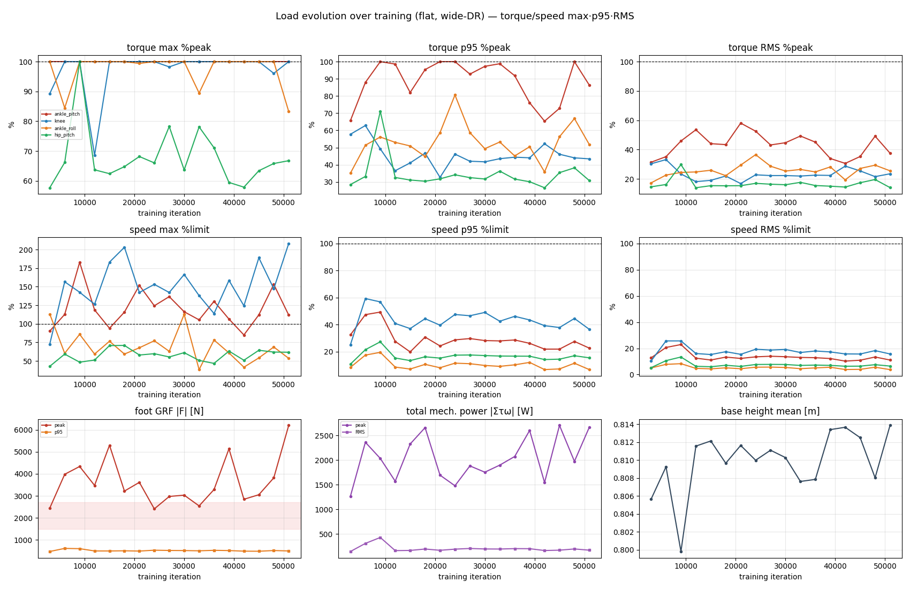
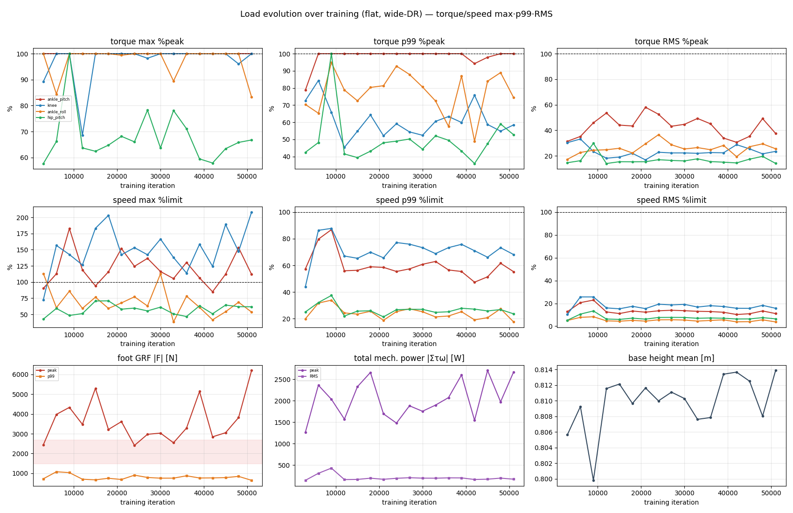

# 학습 진행에 따른 부하 변화 (progression) — flat

> 3000 iter마다 체크포인트를 flat wide-DR로 검증해, 앞서 분석한 값들이 학습에 따라 어떻게 변하는지 추적.
> 도구: `analysis/progression.sh`(측정) + `analysis/progression_analyze.py`(추세/노트). 재실행 시 새 체크포인트 자동 추가.
> 커버 iter: [3000, 6000, 9000, 12000, 15000, 18000, 21000, 24000, 27000, 30000, 33000, 36000, 39000, 42000, 45000, 48000, 51000]  ·  각 2400 step wide-DR (vx[-2,3]·vy±1·yaw±0.7).

> 위=p95판, 아래=**p99판**(상위 1%, max에 더 근접·스파이크에 민감하나 단일 max보다 robust).

## 지표 추세 (iter별)
| iter | ankle pitch tq pk | ankle pitch tq p95 | ankle pitch tq rms | ankle pitch sp pk | ankle pitch sp p95 | ankle pitch sp rms | knee sp pk | knee sp p95 | knee sp rms | GRF peak | GRF p95 | power peak | power rms | base mean |
|---|---|---|---|---|---|---|---|---|---|---|---|---|---|---|
| 3000 | 100 | 66 | 31 | 90 | 32 | 13 | 73 | 25 | 10 | 2445 | 476 | 1264 | 142 | 0.806 |
| 6000 | 100 | 88 | 35 | 113 | 47 | 21 | 157 | 59 | 26 | 3980 | 616 | 2360 | 306 | 0.809 |
| 9000 | 100 | 100 | 46 | 183 | 49 | 23 | 143 | 57 | 26 | 4335 | 604 | 2032 | 427 | 0.800 |
| 12000 | 100 | 99 | 54 | 119 | 28 | 13 | 126 | 41 | 16 | 3476 | 500 | 1569 | 160 | 0.812 |
| 15000 | 100 | 82 | 44 | 94 | 20 | 11 | 183 | 37 | 15 | 5299 | 499 | 2325 | 164 | 0.812 |
| 18000 | 100 | 95 | 43 | 116 | 31 | 13 | 203 | 44 | 17 | 3218 | 507 | 2657 | 192 | 0.810 |
| 21000 | 100 | 100 | 58 | 152 | 24 | 12 | 142 | 40 | 15 | 3615 | 495 | 1692 | 167 | 0.812 |
| 24000 | 100 | 100 | 53 | 124 | 29 | 14 | 153 | 47 | 19 | 2410 | 534 | 1477 | 190 | 0.810 |
| 27000 | 100 | 93 | 43 | 137 | 30 | 14 | 142 | 47 | 19 | 2973 | 522 | 1880 | 204 | 0.811 |
| 30000 | 100 | 97 | 45 | 116 | 28 | 14 | 167 | 49 | 19 | 3034 | 518 | 1752 | 194 | 0.810 |
| 33000 | 100 | 99 | 49 | 105 | 28 | 13 | 138 | 42 | 17 | 2545 | 507 | 1896 | 192 | 0.808 |
| 36000 | 100 | 92 | 45 | 130 | 29 | 13 | 114 | 46 | 18 | 3289 | 528 | 2071 | 200 | 0.808 |
| 39000 | 100 | 76 | 34 | 106 | 26 | 12 | 159 | 43 | 17 | 5139 | 517 | 2599 | 199 | 0.813 |
| 42000 | 100 | 65 | 31 | 85 | 22 | 10 | 124 | 39 | 16 | 2846 | 491 | 1542 | 162 | 0.814 |
| 45000 | 100 | 73 | 35 | 112 | 22 | 11 | 189 | 38 | 16 | 3053 | 487 | 2702 | 169 | 0.813 |
| 48000 | 100 | 100 | 49 | 153 | 28 | 13 | 147 | 45 | 18 | 3818 | 519 | 1972 | 194 | 0.808 |
| 51000 | 100 | 86 | 38 | 112 | 23 | 11 | 208 | 36 | 16 | 6201 | 501 | 2667 | 169 | 0.814 |

- `tq_*` = 토크 %peak, `sp_*` = 속도 %limit, 각 max/p95/rms. GRF [N], power [W], base [m]. (전부 flat wide-DR)
- ★ 관절별 **토크·속도 max/p95/RMS 6패널**은 위 플롯 참조 (표는 병목 2관절만).

## 자동 요약 (첫→끝 iter 3000→51000, max/p95/rms)
- ankle_pitch 토크 %peak: 100→100 / 66→86 / 31→38
- ankle_pitch 속도 %limit: 90→112 / 32→23 / 13→11
- knee 속도 %limit: 73→208 / 25→36 / 10→16
- GRF [N] peak/p95: 2445→6201 / 476→501
- power [W] peak/RMS: 1264→2667 / 142→169 · base: 0.806→0.814

## 해석 (iter 3000→39000, ★3000 간격 13점 · 토크·속도 max/p95/RMS)

명령 시퀀스는 seed 고정으로 **모든 체크포인트 동일**(공정 비교) → 지표 변동 = 순수 정책차 + 단일-충격 분산.

0. ★★ **토크/속도에 p95·RMS를 추가하니 "지속 포화 vs 순시 스파이크"가 갈림** (가장 중요):
   - **ankle_pitch 토크 = 진짜 지속 포화**: max 100% + **p95 ~90–100%** + RMS ~40–58% → 상위 5% 시간도
     거의 peak. 단발 스파이크가 아니라 **상시 한계 작동** = 실질 병목. **HW 상향 최우선.**
   - **knee·ankle 속도 초과는 순시(transient)**: max 100–203%지만 **p95 ~28–49%, RMS <27%** → 한계
     초과는 드문 순간(빠른 스텝 전환)뿐, 평상 속도는 여유. = 속도는 **peak 마진만** 관리(지속 문제 아님).
   - **knee·ankle_roll 토크**: max 100%지만 p95/RMS는 ankle_pitch보다 낮음 → ankle_pitch만큼 지속적이진 않음.
1. **토크 max 100% peak(clipping)** = ankle_pitch·knee·ankle_roll, iter **3000부터** — 학습해도 그대로.
   = HW 스펙 부족(ankle_pitch RS03 60N·m). 단 위 0번대로 **지속성은 ankle_pitch가 압도적**.
2. ★ **peak 지표(GRF/footF/관절속도/power_peak)는 노이즈가 큼** — 동일 명령인데도 GRF peak가
   **2.4~5.3 kN 지그재그**(15000서 5299N 스파이크). 단일 최악충격은 정책 미세차에 크게 흔들림 →
   **peak는 worst-case 상한이지 "학습 추세"가 아님**. (★ 6000 간격서 보였던 "GRF 단조 감소"는
   sparse-sampling 착시 — 3000 세분화로 드러남. 해상도가 결론을 바꿈.)
3. ★ **안정 지표(p95/RMS)는 학습으로 개선·수렴**: GRF **p95 ~500 N(~1×BW) 안정**, 총 기계일률
   **RMS = 초기 스파이크(6000·9000: 306·427 W) → ~180 W로 하락·수렴**. = 평상시 하중·효율은 학습으로 개선.
   → **추세 판단은 peak 아닌 p95/RMS로 해야 함.**
4. **iter 9000 = 거친 과도기**: hip_pitch 100%·ankle_pitch 속도 183%·power RMS 427·base 0.800 —
   정책이 일시적으로 공격적/불안정 → 12000+에서 안정화(base 0.81 회복). RL 초기 탐색 흔적.
5. **knee 속도**: 3000서 **73%**(초기 느림) → 6000+ **130~200%**로 급증·유지 = 빠른 무릎 굴신을 초기에 학습.
6. **base height 0.806~0.812 안정**(9000만 0.80 dip) = 까치발/붕괴 없이 자세 유지.

**종합**: (a) ankle_pitch/knee/ankle_roll **토크 포화는 HW 한계 상수** → HW 상향. (b) **peak 충격은
고분산이라 p95/RMS로 판단**해야 하며, 그 기준으로 학습은 **평상 하중(p95)·효율(RMS)을 개선·수렴**시킴.
(c) 초기(~9000) 거친 과도기 후 안정화. → 6000→3000 세분화의 최대 교훈 = **peak 기반 "추세" 해석은 착시,
p95/RMS가 신뢰 지표.**

**주의**: 각 2400-step wide-DR. peak는 단일 이벤트라 고분산 — 신뢰 추세는 p95/RMS.
60000까지 확장 시 p95/RMS 수렴이 더 뚜렷해질 것.

## 영상 — 체크포인트별 로봇 움직임 (montage)

[assets/progression_montage.mp4](assets/progression_montage.mp4) — 이 값들이 나온 **각 체크포인트
로봇이 실제로 걷는 영상**. 6개 체크포인트(3000~39000 균등)를 격자로, **동일 명령(seed 고정)으로 동기화**
재생 + 부하-색 관절 구(회색<rated·노랑≥nominal·주황≥70%peak·빨강≥peak). 같은 t에 다른 gait =
학습에 따른 보행/부하 진화를 직접 비교. (생성: `progression_montage.py`; 재실행 시 새 체크포인트 반영.)
- 개별 체크포인트 영상이 필요하면: `render_loads.py --npz analysis/out/prog/prog_<iter>.npz --tag prog_<iter>`.

## 상태
- 학습 60000까지 진행 중. **`progression_watch.sh`(detached)가 새 3000-배수 체크포인트를 자동 측정·
  노트 갱신**(위 해석 섹션은 보존). 60000 커버 시 자동 종료. 현재 33000까지 분석 완료(11점).
