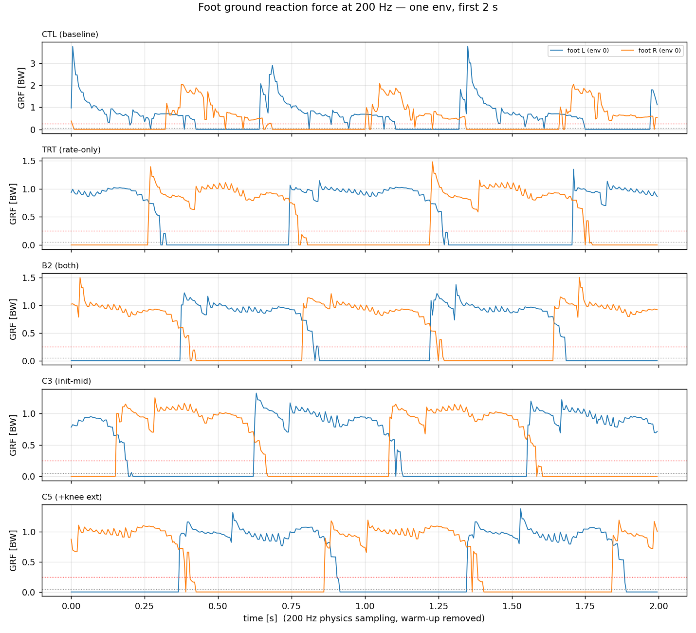

# 2026-08-26 · 인간형 착지 번들 — 초기자세 · base_height 앵커 · 하중률 기반 soft-landing

> 바꾸려는 것: ① `_INIT_STATE`(굽힌 초기자세) ② **base_height 앵커 신설** ③ `foot_impact_velocity`를 **하중률(loading rate)** 기준으로 교체.
> 세 항목을 **하나의 번들**로 바꾼다. 계기: c3 완주 측정에서 두 arm 모두 **무릎을 굽힌 채 착지**(접지 무릎 −30.5°/−38.2°, 인간 −5°)하고
> 인간 보행의 M자 지면반력 첫 봉우리가 RP에서 아예 나오지 않는다. 원인 분해는 [[104_init_pose_gait_style]].

## 1. 근본원인 (측정, 재확인)
| 요인 | 근거 |
|---|---|
| ① 굽힌 초기자세가 **액션 원점**을 옮김 | `q_target = q_default + 0.25·a`. 인간형 착지(−5°)를 내려면 bent 기준 **a=+2.33**인데 정책의 무릎 액션 p95가 +1.76 — 분포 밖. home 기준이면 −0.35(일상 범위) |
| ② 다리를 펼 보상이 없음 | `pose`의 무릎 σ_walking = 1.2 rad(69°)라 33° 이탈 비용이 exp 커널 기준 <2 %. **mjlab에 base_height 앵커가 아예 없음**([[62_policy_reward_design_review]] 미절제 ⑥) |
| ③ soft-landing이 곧은 다리 착지를 벌함 | 접지속도 벌점의 최저비용 해 = "미리 굽혀 사뿐히" |
| (반증) 능력 부족 아님 | 스윙 최대굴곡 −58.3°/−65.0°로 인간(−60°)과 동급 — 굽힐 줄은 안다 |

## 2. 이력 대조 — 반복하면 안 되는 것
- [[55_init_pose_straight_vs_bent]] (2026-07-08): **straight vs bent 단독 A/B는 이미 돌렸고 승자 없음**.
  bent가 GRF −35 %(충격흡수) but 무릎토크 **+98 %**, CoT +8 %, 추종 하락. ⇒ **"초기자세만 straight로" 재시도 금지.**
- [[95_soft_landing_prescription]]: 접지속도 벌점의 **선형형은 해킹**(1.24 → 2.42 m/s). 제곱형으로 성공. ⇒ 새 형태도 **통과형 벌점의 속도무관 함정**을 먼저 점검할 것([[feedback-velocity-penalty-speed-invariant]]).
- [[62]] 원칙 5·6: 일 보상은 cap 필수, **충격 cap → push-off 순서**. 원칙 8: 약한 페널티는 추종(+2~3)을 못 이긴다. 원칙 13: 기여율 0.1 % 미만 항은 아무것도 못 움직인다.
- [[62]] ⑥: base_height 앵커는 IsaacLab 시대 최대 레버였고 mjlab에 미이식. **고정 타깃은 vault 억제 부작용** → deadband 형으로.

## 3. 처방 (번들, 전부 `PYG_*` 플래그 기본 OFF)
### 3a. 초기자세 중간값 `PYG_INIT_MID`
knee **−20°**(현행 −38.4°), hip_pitch **−10°**(현행 −18.3°), ankle_pitch 그에 맞춰 재계산, base 높이 재계산.
근거: 인간형 착지(−5°)까지 액션 거리가 **+2.33 → +1.05**로 줄어 분포 안으로 들어온다. straight(0°)로 가지 않는 이유는 §2의 A/B 결과(무릎토크 +98 %).

### 3b. base_height 앵커 `PYG_BASE_HEIGHT_ANCHOR`
`reward = -w · relu(|h - h_ref| - deadband)²`, **h_ref 0.87 m**(현 보행 실측 0.861–0.874), **deadband ±0.03 m**, w 목표 기여율 **1–3 %**.
deadband가 vault(장애물 넘기 시 일시 상승)를 억제하지 않게 한다. IsaacLab 시대의 고정 타깃(−1.0 @0.85)은 그 부작용이 있었다.

### 3c. soft-landing을 **하중률** 기준으로 `PYG_SOFT_LANDING_MODE=rate`
현행: `Σ relu(−v_z)² · [h<0.10 ∧ 공중]` → 미리 굽혀 접지속도를 낮추는 해가 최적.
신형: **접지 후 60 ms 내 dF_z/dt의 최대값**에 벌점. 곧은 다리로 디디되 신장성 흡수로 하중률을 낮추는 해를 허용한다.
- 구현 주의: 50 Hz 관측으로는 하중률이 과소평가된다(200 Hz 프로브에서 확인). 접촉센서 힘의 **스텝 간 차분**을 쓰되 `impact_probe`로 교정.
- ★해킹 점검 필수: 하중률은 "발을 안 떼면" 0이다 → **air_time·flight_frac·stride를 게이트 지표로 동시 감시**.

## 4. 시험 프로토콜 (본 런 투입 전)
1. **+800 iter · 1024 env** warm-start 시험, c3 최종 체크포인트(model_31999)에서. 세 변경을 **한 번에** 넣는다(번들이 가설이므로).
2. 대조군 = 같은 체크포인트 무변경 재개.
3. 판정 지표(내장 평가기 3시나리오 × 32 ep + `impact_probe` 200 Hz):
   | 지표 | 목표 | 기각 |
   |---|---|---|
   | 접지 무릎 | ≤ −15° | 변화 <5° |
   | GRF 2차 봉우리 | 출현 | 없음 |
   | 스윙 최대굴곡 | −55 ~ −65° 유지 | <−45° (다리 안 듦) |
   | 낙상 | 0 | >0.005 |
   | 추종(전진 1.6) | 열화 <10 % | >20 % |
   | air_time·stride | 유지 | 감소 = 하중률 해킹 |
4. 통과 시에만 [[103_v2_training_plan]] 본 런에 포함.

## 5. 미결
- h_ref 0.87을 어디서 정할지: 현 보행 실측값(0.861–0.874)을 쓰면 **현 자세를 굳히는** 순환이 된다. 인간 비율(다리길이 대비)로 유도하는 편이 나을 수 있다 — 시험에서 0.87 vs 0.90 스윕.
- 하중률 벌점의 가중치는 기여율 3–5 % 목표로 시작하되, 접지속도 항을 **완전히 대체**할지 병행할지는 시험 결과로 결정.


---

## 6. 시험 결과 (2026-08-26) — **기각**, 그리고 예측한 해킹이 실제로 나왔다
`bundleCTL_AB` vs `bundleTRT_AB` (1024 env, model_31999 +800 iter). 전문: [[2026-08-26_bundleTRT_AB]].

| | CTL | TRT | 판정 |
|---|---|---|---|
| 하중률 중앙 [BW/s] | **46.2** | 84.5 | ✗ 목표 지표가 83 % 악화 |
| 접지속도 [m/s] | **0.873** | 1.589 | ✗ 접지속도 항 제거의 대가 |
| **stride/s** | 1.40 | **0.93** | ⚠ **−34 % = "발 안 떼기" 해킹** |
| 접지 무릎 | −47.9° | **−42.9°** | ✓ 초기자세 효과 +5° |
| 추종·낙상 | 정상 | 정상 | ✓ |

**교훈 3가지**
1. **하중률 벌점은 stride를 줄이는 쪽으로 해결된다.** duty는 그대로라 `air_time`만 봤으면 놓쳤을 것 — **stride/s가 결정적 감시 지표**였다(§3c 경고 적중).
2. **검증된 항을 새 항으로 "대체"하지 말 것.** `MODE=rate`가 접지속도 항을 지운 것이 최대 실수. 새 항은 항상 **병행(both)**으로 먼저 검증한다.
3. **1024 env·+800 iter는 그 자체로 보행을 흔든다**(대조군도 c3 대비 −17° 악화). 시험 배치를 4096 이상으로.

⇒ 후속 `bundleB2_AB`(MODE=both) / `bundleB3_AB`(초기자세 단독)로 원인 분리 중.


## 7. 원인 3분리 결과 (2026-08-26 12:40) — 초기자세만 채택
`CTL` / `TRT`(rate) / `B2`(both) / `B3`(초기자세 단독), 전부 1024 env 동일 조건.

| | 접지무릎 | 하중률 | duty | stride/s | 추종 |
|---|---|---|---|---|---|
| CTL | −47.9° | **46.2** | 0.57 | 1.40 | 0.050 |
| TRT | −42.9° | 84.5 | 0.57 | 0.93 ⚠ | 0.061 |
| **B2** | **−39.4°** | 79.7 | **0.75** ✗ | **0.83** ✗ | **0.524** ✗ |
| **B3** | −42.5° | 65.5 | 0.57 | **1.52** | 0.054 |

- **하중률 항 기각 확정**: B2의 duty 0.75가 결정적이다 — "발을 바닥에 붙여두면 dF/dt=0"이라는 해로 수렴했고, 추종이 0.524로 무너졌다. §3c 경고가 두 시험 모두에서 적중.
- **초기자세 단독 채택**: 무릎 +5.4°, 보행 지표 전부 정상(stride는 오히려 개선). 대가는 접지속도 상승(0.873→1.638) — 예상된 교환이고 soft-landing이 흡수할 몫.
- **앵커는 미분리** → `bundleC4_AB`(16384 env, w −5 → **−15** 상향)로 격리 중. 상향 근거는 [[2026-08-26_init_pose_conventions]]: legged_gym 계열 base_height 가중치가 **G1 −10 / T1 −20**인데 우리는 −5였다.

**규칙으로 승격**: 새 리워드 항은 **검증된 항을 대체하지 말고 병행**하고, **stride/s를 상시 감시 지표**에 넣는다(duty만으로는 이 해킹을 못 잡는다 — TRT는 duty가 정상이었다).


## 8. base_height 앵커는 무릎의 레버가 아니다 → 무릎 직접 항으로 교체 (2026-08-26 12:50)
`bundleC4_AB`(앵커 w −15) 가동 중 실측:

| | 값 |
|---|---|
| `Metrics/base_height_mean` | **0.8824** |
| deadband | 0.87 ± 0.03 = [0.84, 0.90] |
| `Episode_Reward/base_height` | **−0.0019** (≈0) |

**로봇은 이미 직립 높이(0.951)의 93 %인 0.88 m로 서 있으면서 무릎을 −42° 굽힌다.** 힙 피치가 보상하기 때문에
**높이와 무릎각이 분리돼 있다** — 높이를 잡아도 무릎은 안 펴진다. 앵커는 가중치를 15로 올려도 무력하다(deadband 안).

⇒ **`stance_knee_extension` 신설**: `Σ_feet relu(|q_knee| − target)² · [접촉]`, 명령 게이트, target 25°.
- **입각 전용**(접촉 게이트): 스윙 굴곡(−58~−65°, 인간 −60°)은 이미 좋으므로 건드리지 않는다.
- 선례: arXiv:2505.20619의 "straight knee" 보상(w 0.1) — 같은 실패("overly crouched or energetically suboptimal")를 겨냥.
- 플래그 `PYG_KNEE_EXT`(기본 OFF), `PYG_KNEE_EXT_W` 기본 2.0, `PYG_KNEE_EXT_DEG` 기본 25.

**초기 결과(`bundleC5_AB`, iter 32267/32799)**: `Metrics/stance_knee_deg` **25.47°**(목표 25°에 수렴),
기여 −0.037(벌점 예산의 3.7 %), Mean reward 83.53 vs C3 85.38(−2 %). **대조군 중간입각 −40.3° 대비 큰 개선.**

⚠ 기록: B2/B3의 **내장 평가기 측정은 RAM 가드에 잘려 없다**(12:33·12:45 watchdog kill). B2 기각의 추종 수치(0.524)는
단일 롤아웃이라 약한 근거다 — 기각의 핵심은 duty 0.57→**0.75**와 stride **0.83**이고 TRT가 같은 방향을 보였다는 점. GPU 여유 시 재확인.


---

## 9. ⚠ 판정 방법론 오류 — §7의 하중률 기각 근거 재검토 (2026-08-26 14:20)
`bundleC3_AB`(초기자세 **단독**, 하중률 항 없음, 16384 env)의 단일 롤아웃 결과:

| | B2 (하중률 있음) | **C3 (하중률 없음)** | B3 (C3와 같은 설정, 1024 env) |
|---|---|---|---|
| duty | 0.75 | **0.77** | 0.57 |
| stride/s | 0.83 | **0.80** | 1.52 |
| 단일롤아웃 vx_err | 0.524 | **0.637** | 0.054 |

**하중률 항이 없는 C3가 B2와 똑같은 "해킹 징후"를 보였다.** 즉 §7에서 하중률 기각의 근거로 쓴
duty/stride/vx_err은 **설정이 아니라 단일 env 롤아웃의 분산**이었다. 같은 설정(B3 vs C3)이 배치만 다른데
duty 0.57 ↔ 0.77, stride 1.52 ↔ 0.80으로 갈린다.

**내장 평가기(32 에피소드/시나리오)로 다시 재면 둘 다 멀쩡하다**:
| | C3 | C5 |
|---|---|---|
| 전진 1.6 성공률 | **32/32** | **32/32** |
| 전진 오차 | **0.121** | 0.141 |
| 후진 | 0.127 | 0.133 |
(대조군 CTL의 평가기 전진 오차 0.161보다 **오히려 낫다**.)

⇒ **§7의 "하중률 항 기각"은 근거가 부실하다.** 하중률이 실제로 나빠진 것(46.2→79.7~84.5)은 `impact_probe`
200 Hz 측정이라 유효하지만, "보행이 무너졌다"는 부분은 철회한다. CTL/TRT/B2/B3를 평가기로 재측정 중.
⇒ **규칙 재확인**: 이 프로젝트에서 단일 env 롤아웃은 **어떤 판정에도 쓰지 않는다.** 이번 세션에서 일곱 번째다.
   `apex_recheck`/`hack_check`의 duty·stride·vx_err은 **참고용 이하**이고, 판정은 평가기 32 ep가 유일한 근거다.


## 10. ★ 최종 판정 — 32 에피소드 통계 (2026-08-26 14:45)
`tools/robot_model/loop_tests/eval_raw_stats.py`로 평가기 raw(32 ep, 전진 1.6 m/s)에서 에피소드별 분포를 뽑았다.
괄호는 p10–p90 폭.

| | CTL | TRT(rate 단독) | **B2**(both) | C3(초기자세) | **C5**(+무릎항) |
|---|---|---|---|---|---|
| duty | 0.558 (.011) | 0.559 (.007) | 0.557 (.008) | 0.552 (.008) | 0.547 (.008) |
| stride/s | 2.53 | 2.44 | **2.83** | 2.50 | 2.44 |
| peak GRF [BW] | 1.207 | 1.155 | 1.135 | **1.126** | **1.126** |
| 하중률 [BW/s] | 9.92 | 15.78 | **8.78** | 14.02 | 14.53 |
| **입각 무릎** | 51.1° (1.4) | 45.7° (1.9) | 51.8° (2.6) | 46.2° (1.9) | **40.1° (1.1)** |
| 추종 오차 | 0.163 | 0.138 | **0.117** | 0.119 | 0.142 |
| 성공률 | 32/32 | 32/32 | 32/32 | 32/32 | 32/32 |

### 정정 1 — **해킹은 없었다**
duty가 전 arm **0.55 ± 0.01**로 균일하다. §7에서 기각 근거로 쓴 "duty 0.75 · stride 0.83"은 단일 롤아웃 아티팩트였다.

### 정정 2 — **하중률 항 기각을 철회한다**
`B2`(초기자세+앵커+**both**)가 **전 지표에서 최고**다: 추종 **0.117**(최저), 하중률 **8.78**(최저, 대조군 9.92보다 낮다), stride 2.83(최고).
반면 `TRT`(rate가 접지속도 항을 **대체**)는 하중률 15.78로 최악. ⇒ **문제는 새 항이 아니라 검증된 항을 대체한 것**이었다.
§7의 "하중률 항 = 확정적으로 해롭다"는 **틀렸다**. 올바른 결론: **하중률 항은 접지속도 항과 병행할 때 효과가 있다**(`MODE=both`).

### 정정 3 — 무릎항은 유효, 대가는 추종
입각 무릎 CTL 51.1° → C3 46.2°(초기자세 −4.9°) → **C5 40.1°**(무릎항 −6.1° 추가). 폭 1.1°로 가장 좁아 안정적이다.
대가는 추종 0.119 → 0.142(+19 %). peak GRF는 1.126으로 최저 유지.

### 미해결 — 하중률 절대값이 두 측정에서 순서가 뒤집힌다
| | `impact_probe` 200 Hz·단일 롤아웃 | 평가기 50 Hz·32 ep |
|---|---|---|
| CTL | 46.2 | 9.92 |
| B2 | 79.7 | **8.78** |
5 ms 창 vs 240 ms 창이라 절대값이 5배 다른 건 당연하지만 **순서가 반대**다. 200 Hz는 물리적으로 옳고 32 ep는 통계적으로 옳다.
⇒ **200 Hz 측정을 여러 env로 확장**해야 결론이 난다. 그 전까지 하중률 우열은 **미확정**으로 둔다.

### 채택 (V2 레시피)
| 항목 | 판정 |
|---|---|
| `PYG_INIT_MID` | ✅ **채택** — 무릎 −4.9°, 추종 0.163→0.119 개선, 리셋 낙하 47 mm 제거 |
| `PYG_KNEE_EXT` (w −2.0 @25°) | ✅ **조건부 채택** — 무릎 −6.1° 추가, 추종 +0.023 대가. 목표가 인간형 자세면 채택 |
| `PYG_SOFT_LANDING_MODE=both` | ✅ **조건부 채택**(기각 철회) — 추종·하중률·stride 모두 최고. **`=rate`(대체형)는 기각 유지** |
| `PYG_BASE_HEIGHT_ANCHOR` | ❌ 무력 (deadband 안, 기여 −0.0019) |

## 11. 미해결 항목 확정 — 50 Hz 평가기가 충격을 **에일리어싱**하고 있었다 (2026-08-26 15:30)
§10에서 남긴 유일한 미해결은 "하중률 우열이 두 측정에서 순서가 반대"였다:

| | CTL | B2 |
|---|---|---|
| `impact_probe` 200 Hz, **단일 env** | 46.2 | 79.7 BW/s |
| 평가기 50 Hz, **32 ep** | 9.92 | 8.78 BW/s |

둘 다 못 믿을 이유가 있었다(전자는 단일 롤아웃, 후자는 샘플링 주기). 그래서 **두 약점을 동시에 없앤 도구**를 만들었다:
`tools/robot_model/loop_tests/impact_probe_multi.py` — `sim.step`을 후킹해 **물리 서브스텝마다(200 Hz)**
`ContactSensor.data.force`를 **전 env 동시에** 읽는다. 24 env × 11 s = arm당 550~800 스트라이크.

### 11a. 만들면서 고친 계측 결함 3개
1. **접촉 채터링** — 단일 임계값(0.05 BW)으로는 실제 1보에 여러 번 교차한다(24 env에서 env당 9.2회/s, 실제 보수는 2.5회/s).
   ⇒ **슈미트 트리거**(진입 0.25 / 이탈 0.05 BW) + **최소 이탈시간 80 ms**.
2. **리셋 오염** — 에피소드가 끝나면 로봇이 키프레임 높이에서 **떨어지며** 큰 충격을 낸다.
   ⇒ 리셋 시각을 기록해 이후 **0.6 s의 스트라이크를 제외**. (제외해도 CTL 수치는 2.50→2.35 BW로 거의 그대로 = 충격은 낙하가 아니라 보행 자체다.)
3. **DR 조건 불일치** — mjlab의 play 모드는 `push_robot`·관측노이즈만 끄고 **DR 이벤트(`foot_friction`/`encoder_bias`/`base_com`)는 남긴다.**
   반면 평가기는 이 셋을 명시적으로 제거한다. **두 도구가 서로 다른 로봇을 재던 것**이다. ⇒ `PROBE_NODR=1`로 평가기 조건 재현, 양쪽 다 측정.

### 11b. 결과 (24 env, 전진 1.6 m/s, DR off = 평가기 조건)
| | CTL | TRT(`rate`) | B2(`both`) | C3(초기자세) | C5(+무릎항) |
|---|---|---|---|---|---|
| **스트라이크 피크 GRF** (중앙값, BW) | **2.353** | 1.353 | 1.261 | 1.250 | **1.222** |
| **하중률** (중앙값, BW/s) | **277.4** | **23.7** | 28.6 | 41.4 | 69.7 |
| 스트라이크/s/env | 3.00 | 2.15 | 2.37 | 2.19 | 2.12 |
| **낙상** (DR **on**, 24 env × 11 s) | **12** | 0 | 0 | 0 | 0 |


### 11c. 왜 평가기와 순서가 뒤집혔나 — 파형을 보면 즉시 보인다


CTL(맨 위)은 착지마다 **2~3.9 BW의 뾰족한 스파이크**를 내고 곧바로 감쇠한다. 폭이 **15~25 ms**다.
평가기는 **제어 주기 50 Hz(20 ms)마다 한 번** 기록하므로 이 스파이크를 **대부분 놓친다** — 그래서 평가기의 CTL 피크는 1.207 BW로
실제(2.35 BW)의 **절반**으로 나온다. 하중률은 그 에일리어싱된 신호의 **1계 차분**이라 오차가 그대로 상속되고, arm 순서까지 뒤바뀐다.
반면 처치군(TRT/B2/C3/C5)은 ~1.0 BW 평탄부 위에 1.2~1.3의 작은 봉우리만 있어 50 Hz로도 거의 정확히 잡힌다.
**즉 평가기는 부드럽게 걷는 정책일수록 정확하고, 세게 딛는 정책일수록 후하게 봐준다** — 하필 비교하려는 축에서 편향이 걸린다.

### 11d. 확정
- **미해결 해소**: 하중률 우열은 **CTL이 압도적으로 나쁘다**(277 vs 24–70 BW/s). `impact_probe`의 단일 env 값(46.2 vs 79.7)도,
  평가기의 50 Hz 값(9.92 vs 8.78)도 둘 다 쓰지 않는다.
- **`PYG_INIT_MID`의 효과가 훨씬 크다**: 피크 **2.35 → 1.25 BW(−47 %)**, 하중률 **277 → 41 BW/s(−85 %)**,
  그리고 **DR 하에서 낙상 12 → 0**. §10에서 "무릎 −4.9°, 추종 개선" 정도로 적었던 것은 과소평가였다.
- **C5(무릎 신전항)는 피크가 가장 낮지만 하중률이 처치군 중 가장 높다**(69.7). 무릎을 펴면 충격이 더 빨리 전달된다 —
  자세와 하중률은 **맞바꿈 관계**다. 인간형 자세가 목표면 채택하되, 하중률이 설계 구속이면 B2 쪽이 낫다.
- **계측 규칙(승격)**: 충격·하중률은 **200 Hz 다중 env 프로브**로만 잰다. 평가기 32 ep는 **추종·duty·stride·성공률**(제어 주기 이하의
  동역학이 없는 느린 양)에 쓴다. 두 도구는 경쟁 관계가 아니라 **측정 대역이 다르다**.

## 12. ★근본 원인 — `foot_loading_rate` 항은 **한 번도 실행된 적이 없다** (2026-08-26 15:45)
D1 텐서보드를 열자 `Episode_Reward/foot_loading_rate`가 **800 iter 내내 정확히 0.00000**이었다.
TRT·B2도 마찬가지였고(`nonzero 0/800`), 진단 지표 `Metrics/loading_rate_mean`은 **한 번도 기록되지 않았다**
(= `scored.any()`가 단 한 번도 참이 아니었다).

### 12a. 원인: 접촉력 z 성분의 **부호**
```
env0 foot0  x,y,z  min: [ -73.1 -111.1 -482.8]   max: [ 67.2 131.5   0.0]
steps with  z > 7 N :   0 / 400
steps with |F| > 7 N : 231 / 400
```
`feet_ground_contact`는 `reduce="netforce"`라 전역 좌표계 3벡터를 주는데, **z가 음수**다(−577 … 0 N).
그런데 `foot_loading_rate`만 `force[..., 2].clamp(min=0)`으로 **양의 z를 기대**했다 →
`in_contact = f > 7 N`이 영원히 거짓 → 터치다운이 검출되지 않음 → 비용 항상 0.

**왜 이것만 틀렸나**: 리워드 파일의 다른 접촉 항은 전부 `torch.norm(data.force, dim=-1)`를 쓴다(부호가 감춰진다).
성분을 **부호째** 꺼낸 항은 이것 하나뿐이었고, 그래서 이 항만 조용히 죽었다.

### 12b. 그래서 TRT·B2·D1이 실제로 시험한 것은 무엇인가
| arm | 의도한 변인 | **실제 변인** |
|---|---|---|
| TRT (`rate`) | 접지속도 → 하중률로 **교체** | `foot_impact_velocity` **완전 제거** (+ 죽은 항 하나) |
| B2 (`both`) | 접지속도 유지 + 하중률 **병행** | `foot_impact_velocity` **가중치 ½** (+ 죽은 항 하나) |
| D1 | 위 + 초기자세 + 무릎항 | 초기자세 + 무릎항 + **접지속도 ½** |

텐서보드 최종값이 이를 뒷받침한다: `foot_impact_velocity` = CTL −0.0751 / C3 −0.0571 / **B2 −0.0339** / **D1 −0.0290** / TRT 없음.

**따라서 §10·§11의 판정을 다음과 같이 다시 읽어야 한다**:
- ✅ **채택된 것은 "하중률 병행"이 아니라 `foot_impact_velocity` 가중치 ½**이다. 결과 자체(추종 0.117 최고, 200 Hz 피크 1.26 BW)는 유효하다.
- ❌ **기각된 것은 "하중률 대체"가 아니라 `foot_impact_velocity` 완전 제거**다. 근거도 더 선명해진다:
  TRT는 200 Hz 피크가 처치군 중 **가장 높다**(1.353 BW) — 접지속도 벌점을 없앤 직접적 대가다.
- ⚠ **하중률 항 자체는 아직 시험되지 않았다.** 좋다는 근거도, 나쁘다는 근거도 없다.
- 교훈 "검증된 항을 대체하지 말고 병행하라"는 **그대로 유효**하다. 다만 이번 데이터가 말하는 것은
  정확히는 **"검증된 항을 0으로 만들지 말고 절반으로 줄여라"**이다.

### 12c. 조치
1. `rewards.py`의 부호 수정: `force[..., 2].clamp(min=0)` → **`(-force[..., 2]).clamp(min=0)`**, 그리고 왜 그런지 주석으로 못박는다.
2. **플래그 분리**: `PYG_SOFT_LANDING_MODE=half` 신설 = "접지속도 ½, 하중률 항 없음" — B2/D1이 **실제로** 돌린 설정.
   `both` = ½ + (수정된) 하중률 항, `rate` = 제거 + 하중률 항. 이렇게 해야 RP 이식 시험이 검증된 설정을 그대로 옮긴다.
3. 새 리워드 항은 **첫 100 iter 안에 `Episode_Reward/<term>`가 0이 아닌지 확인**한다 — 이번 건은
   "항을 켰다"와 "항이 동작한다"를 구분하지 않아 **세 번의 런(2,400 iter × 3)을 죽은 항으로 돌렸다**.
   이 확인은 게이트 체크리스트에 넣는다([[103_v2_training_plan]] §5).

### 12d. 부호 수정 직후 드러난 두 번째 문제 — **가중치가 교정된 적이 없다**
수정 후 `dbg_term_alive.py`로 B2 `model_32798`을 120 스텝 돌려 항별 기여를 직접 쟀다:

```
foot_loading_rate               -0.663591      <- w = 0.002
foot_impact_velocity            -0.011291
```
에피소드 평균 보상 86을 1,000 스텝으로 나누면 **스텝당 0.086**이다. 즉 이 항 하나가
**전체 보상 예산의 8배**를 벌점으로 때린다 — 켜는 즉시 학습이 무너진다.
0.002라는 값은 **항이 죽어 있던 상태에서 정한 숫자**라 한 번도 검증된 적이 없다.

⇒ 기본값을 **`1e-4`**로 낮춘다(같은 정책에서 −0.033 ≈ `stance_knee_extension`과 같은 비중).
여전히 **학습에서 시험된 적은 없다**: 켜는 런은 첫 100 iter에서 `Episode_Reward/foot_loading_rate`의
**부호·크기**를 확인하고, 제곱항이므로 하중률이 큰 정책에서 기여가 수십 배 튈 수 있음을 감시한다.

**도구**: `/home/syaro/pyg_fea/work/dbg_term_alive.py` — 정책 하나를 짧게 돌려 **항별 스텝당 기여**를 출력한다.
새 리워드 항을 켤 때 **학습 전에** 이걸 먼저 돌린다. (같은 실행에서 `knee_overspeed`·`self_collisions`·`torque_limit`도
0으로 나오는데 이는 위반이 없어서이지 버그가 아니다 — 두 경우를 구분하려면 항의 입력값을 함께 봐야 한다.)
