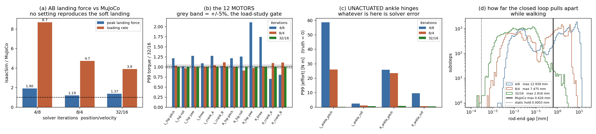

# AB(폐루프 발목) 동적 롤아웃과 솔버 반복수 — 관절 토크는 교차엔진으로 유효한가 (2026-08-27)

> *한 줄*: `bundleD1_AB`가 **IsaacSim에서 45 초 완주, 낙상 0**. 그러나 RP에서 확정한 권고 설정
> **4/8은 AB에서 최악**이다 — 폐루프 구속이 위치 반복수에 정면으로 의존해서, 4/8에서는 로드엔드가
> **12.9 mm** 벌어지고 모터가 없는 발목 힌지에 **58.6 N·m**의 가짜 토크가 잡힌다.
> 32/16이면 루프 벌어짐이 MuJoCo와 같은 자릿수(0.043 vs 0.055 mm 평균)로 돌아온다.
> **관절 토크는 반복수 설정에 따라 5 %를 훨씬 넘게 움직인다 → 하중 스터디 게이트에 걸린다.**

*그림: (a) 착지력 — 어느 설정도 MuJoCo의 부드러운 착지(하중률 21.0 BW/s)를 재현하지 못한다.
(b) 12개 **모터** 관절의 P99 토크 비(32/16 기준). 회색 띠가 하중 스터디 허용폭 ±5 %.
(c) **모터가 없는** 발목 힌지의 P99 실효토크 — 참값은 0이므로 여기 있는 값은 전부 솔버 오차다.
(d) 폐루프 로드엔드가 벌어진 거리의 분포(로그축). 세로 실선이 MuJoCo 자신의 최댓값 0.626 mm.*

## 0. 모델부터: v4가 아니라 **v3** 루프다

어제 저작한 루프 USD는 v4 URDF(31.316 kg)에서 나왔다. 그런데 `bundleD1_AB`가 학습한 모델은
`pygmalion_v3_printed_loop.xml`(**35.34745 kg**)이다 — `pygmalion_constants.py`의 루프 분기는
`PYG_MODEL_V4`가 켜져 있을 때만 v4를 고르고, 이 런은 켜지지 않았다. 4 kg 차이를 그냥 넘기면
RP 이식 때 "접촉 문제"로 오진했던 사고가 그대로 반복된다. 그래서 **v3 루프 URDF에서 USD를 새로
빌드하고, 앵커도 v3 루프 MJCF에서 읽었다**.

| | 값 | 검산 |
|---|---|---|
| v3 루프 URDF | 30 링크 / 29 회전관절 / **35.3515 kg** | mjlab 35.34745 + 더미 rod-U 링크 4개 × 1 g = **35.3515** ✅ |
| Isaac이 실제로 잰 총질량 | 35.35146 kg (mjlab 대비 **+4.01 g**) | 위와 동일 ✅ |
| 1 BW | 346.80 N (MuJoCo 346.76) | 차 0.01 % |

## 1. 이식 계약 — RP 계약을 이름만 바꿔 쓸 수 없는 이유

`tools/sim2sim/dump_contract_ab.py`로 학습 env에서 **한 번에** 덤프했다(RP 때 패스를 나눠 쓰다
필드가 조용히 사라진 사고 때문에 단일 패스가 규칙이다).

| 항목 | RP | **AB** |
|---|---|---|
| 액션 | 12 = 힙·무릎·발목 피치/롤 | 12 = 힙·무릎·**크랭크 A/B** (발목엔 모터가 없다) |
| 관측 관절 | 12 | **16** — 힙·무릎·크랭크 **+ 수동 발목 피치/롤** |
| obs 차원 | 45 | **53** = 3+3+16+16+12+3 |
| 모델 DOF | 12 | **24**(+ 상체 5 = USD 29) — rod U-조인트 8개가 루프를 만든다 |

★ 지시서의 "obs 45"는 RP 숫자였다. ONNX를 직접 열어 확인했다: 입력 `obs [1, 53]`, 출력
`actions [1, 12]`. 수동 발목이 관측에 남아 있는 것은 의도다 — 실기에서 크랭크 엔코더로 발목
각도를 역산할 수 있으므로 자세 보상이 모터가 아니라 발을 다듬게 하기 위한 설계다.

**리셋은 29개 관절을 한 번에 쓴다.** 구동 관절만 넣으면 폐쇄 구속이 자세와 싸워 로봇이 날아간다
(IsaacLab #1250). 계약이 24개의 루프 정합 자세를 싣고, 나머지 상체 5개는 mjlab이 바디 쿼터니언에
구워 넣는 **팔 15° 외전**을 재현하는 각도로 쓴다(shoulder_roll = −0.2618 rad, 축 부호가 URDF·MJCF
동일함을 확인). ⚠ **RP 이식은 이 5개를 0으로 잡았다** — 2.843 kg짜리 팔 두 개가 학습 모델보다
안쪽에 매달려 있었다는 뜻이고, 아직 재측정하지 않았다.

**스폰 높이**는 추측하지 않고 계산했다: 초기 자세에서 두 밑창 박스의 8꼭짓점 최저점을 MuJoCo에서
구해 **0.906589 m**. (RP에서 0.93으로 추측했다가 0.42 초 만에 넘어졌던 그 값이다.)

## 2. 계측 자체의 보증서 — 세 항등식 전부 통과

모든 실행에서: `dt` 규약 비 **200.0**(기대 200.0), 분석창 평균 지지력 **0.9996 ~ 1.0002 BW**(항등식),
접지 필터 대 순접촉력 편차 **0.0 N**. 정지 자세의 루프 벌어짐은 **0.0011 mm**로 정적 노트(0.0003 mm)와
같은 자릿수다. 즉 아래 표의 차이는 계측 결함이 아니다.

## 3. (A) AB 대조표 — IsaacSim vs MuJoCo

`bundleD1_AB`, 전진 1.6 m/s, 45 s, 1 env, DR 없음, v3 루프 USD, 검출기는 `impact_probe_multi.py`에서
그대로 옮긴 것. MuJoCo 열은 같은 코드로 24 env × 11 s 원자료를 재집계한 값이다.
**낙상 0 / 3설정 전부.**

| 지표 | 단위 | **4/8** | ×MJ | **8/4** | ×MJ | **32/16** | ×MJ | MuJoCo |
|---|---|---:|---:|---:|---:|---:|---:|---:|
| 최대 착지력 (중앙값) | BW | 2.324 | **1.90** | **1.456** | **1.19** | 1.677 | 1.37 | 1.224 |
| 최대 착지력 p90 | BW | 2.696 | 1.90 | 1.761 | 1.24 | 2.123 | 1.50 | 1.416 |
| 하중 상승률 (중앙값) | BW/s | 181.9 | **8.67** | 99.2 | 4.73 | **81.5** | **3.88** | 20.98 |
| 60 ms 충격량 | BW·s | 0.0682 | 1.08 | 0.0672 | 1.06 | 0.0659 | **1.04** | 0.0634 |
| 1 BW 초과 폭 | ms | 35 | 0.70 | 50 | **1.00** | 40 | 0.80 | 50 |
| 스트라이크 | 1/s/env | 2.381 | 1.09 | 2.286 | 1.04 | 2.190 | **1.00** | 2.193 |
| 접지율 duty | – | 0.606 | 1.10 | 0.549 | **1.00** | 0.529 | 0.96 | 0.550 |
| 전진 오차 `vx_err` | m/s | **0.108** | – | 0.182 | – | 0.186 | – | 0.055* |
| 루프 벌어짐 최대 | mm | 12.94 | 20.7 | 7.47 | 11.9 | **2.82** | **4.5** | 0.626 |

\* MuJoCo `vx_err`는 같은 정책·같은 명령으로 45 s 굴린 **평문 MuJoCo** 값(1.613 m/s 달성).
mjlab 평가기의 공표값 0.133은 명령 재샘플링과 3시나리오를 포함한 다른 조건이다.

**읽는 법**: 보폭수·접지율·충격량은 8/4와 32/16에서 ±6 % 안이다 — RP에서와 같이 **교차엔진 유효**.
최대 착지력은 8/4에서 ×1.19까지 좁혀지지만 RP의 ×1.10에는 못 미친다. **하중 상승률은 어느 설정에서도
못 닫힌다(최선 ×3.9)** — AB의 MuJoCo 값 21.0 BW/s 자체가 전 arm 최저(soft-landing 레시피의 성과)라
재현 난도가 RP(64.5)보다 높다. 미해결로 남긴다.

## 4. (B) ★ 관절 토크는 반복수에 따라 얼마나 움직이나 — **게이트 통과 실패**

측정: 매 물리 서브스텝의 `Articulation.get_measured_joint_efforts()`(PhysX가 실제로 푼 DOF 힘)와
이 스크립트가 명령한 실효토크를 **둘 다** 기록. 32/16을 고반복 기준으로 잡고 분포를 비교한다.
(설정이 바뀌면 궤적이 바뀌므로 시점별 차이는 무의미하다. 비교 가능한 것은 긴 정상구간의 분포다.)

| 대조 | 구동 12관절 RMS 변화 | 구동 12관절 P99 변화 | 5 % 초과 |
|---|---|---|---|
| **4/8** vs 32/16 | −31 % ~ **+90 %** | −30 % ~ **+111 %** | **11 / 12** |
| **8/4** vs 32/16 | −8 % ~ **+22 %** | −9 % ~ **+11 %** | 9 / 12 |

- 힙·무릎만 보면 8/4는 32/16과 **RMS ≤ 8 % / P99 ≤ 9 %** 로 붙는다.
- **크랭크(=발목 모터)는 8/4에서도 RMS +22 % / P99 +11 %** 로 벌어진다. 발목 모터 토크를 Isaac에서
  읽어 설계에 쓰는 것은 지금 상태로는 불가하다.
- 4/8에서는 `R_hip_yaw` P99가 +111 %, `R_knee` P99가 +75 %. **RP용 권고 설정이 AB 하중 스터디를
  망가뜨린다.**

### 4a. 결정적 증거 — 모터가 없는 관절에 잡히는 토크

발목 피치/롤은 AB 모델에서 **액추에이터도, 마찰도, 감쇠도 없다**(계약 `dof_props` 전부 0).
따라서 이 스크립트가 명령한 실효토크는 **정확히 0**이고, `get_measured_joint_efforts`가 0이 아니면
그 값은 전부 솔버 오차다.

| 반복수 | `L_ankle_pitch` 실측 RMS | P99 | 최대 |
|---|---:|---:|---:|
| 4/8 | 21.67 | **58.58** | 65.55 |
| 8/4 | 8.35 | 25.91 | 30.79 |
| **32/16** | 1.12 | **0.055** | 32.61 |

명령값은 세 경우 모두 0.000이다. 즉 **4/8은 존재하지 않는 발목 모터에 58 N·m를 만들어낸다.**
32/16에서 P99는 0.055 N·m로 사실상 사라지지만, **최댓값 32.6 N·m는 착지 순간에 남는다** —
반복수를 올려도 충격 순간의 폐쇄 구속 오차는 0이 되지 않는다.

### 4b. 계측기 자체는 일관적이다

명령 실효토크 대비 실측 실효토크(12개 모터, RMS 기준): 평균 **−0.7 / −1.2 / −1.3 %**,
최대 |차| **2.6 / 3.8 / 4.2 %** (4/8 · 8/4 · 32/16). 즉 한 실행 안에서 두 값은 서로 맞는다.
설정 간 토크 차이는 **계측 오차가 아니라 로봇이 실제로 다르게 걸었기 때문**이고, 다르게 걸은
이유는 아래 5절이다.

## 5. 인과 사슬 — 왜 위치 반복수가 AB에서만 지배적인가

폐쇄 조인트는 `excludeFromArticulation=true`로 **최대좌표 솔버**에 넘겨져 있고, 이쪽은 articulation
보다 **낮은 우선순위**로 풀린다. 위치 반복수를 32→4로 낮추면 그 오차가 그대로 벌어짐이 된다:

| | 평균 | p99 | 최대 | 착지창 최대 |
|---|---:|---:|---:|---:|
| **MuJoCo** (`solimp 0.999 0.9999 1e-4`, `solref 0.002`) | 0.0555 | 0.307 | **0.626** | – |
| Isaac **32/16** | **0.0434** | **0.293** | 2.816 | 1.498 |
| Isaac **8/4** | 0.900 | 4.181 | 7.475 | 6.769 |
| Isaac **4/8** | 2.565 | 10.652 | **12.939** | 12.939 |
| 정지 자세(양 엔진) | – | – | 0.0011 (스폰) / 0.0003 (정적 노트) | – |

★ **정적 0.0003 mm는 하중 케이스가 틀린 숫자였다.** MuJoCo 자신도 걷는 동안 최대 0.626 mm 벌어진다
(`connect`는 하드 구속이 아니라 `solref/solimp` 소프트 구속이다). 그러니 판정 기준은 0이 아니라
**MuJoCo의 0.63 mm**여야 하고, 그 기준으로 보면 Isaac **32/16은 평균·p99에서 MuJoCo와 동급**,
최댓값만 4.5배다. 8/4·4/8은 12~21배로 명백히 탈락이다.

그리고 이것이 4절의 토크 이동을 설명한다: 루프가 벌어진다 = 발목 기구가 **정책이 학습한 적 없는
탄성 관절**이 된다 → 걸음 자체가 달라지고(4/8은 vx 1.516·duty 0.606·스트라이크 2.381로 다른 보행),
착지가 딱딱해지며, 수동 힌지에 가짜 DOF 힘이 실린다.

## 6. 판정

| 양 | 교차엔진 상태 (AB) | 근거 |
|---|---|---|
| 평균 지지력 | ✅ 항등식 (0.9996~1.0002 BW) | 전 실행 |
| 보폭수·접지율·충격량 | ✅ 유효 (8/4·32/16에서 ±6 %) | §3 |
| 최대 착지력 | ⚠ 최선 ×1.19 (8/4) — RP의 ×1.10보다 못하다 | §3 |
| 하중 상승률 | ❌ **미해결** (최선 ×3.88) | §3 |
| 힙·무릎 토크 | ⚠ 8/4↔32/16 ≤ 9 %, **4/8은 최대 +111 % → 사용 금지** | §4 |
| 크랭크(발목 모터) 토크 | ❌ 8/4에서도 ±22 % — **설계에 쓸 수 없음** | §4 |
| 수동 발목 힌지 실효토크 | ❌ 32 반복 미만에서 전부 허구 | §4a |
| 루프 벌어짐 | ✅ 32/16에서 MuJoCo와 동급(평균 0.043 vs 0.055 mm) | §5 |

**권고 — AB 모델의 IsaacSim 표준 설정은 `solverPositionIterationCount=32`,
`solverVelocityIterationCount=16`.** RP에 대한 권고(4/8 또는 8/4)를 그대로 가져오면 안 된다.
두 모델의 최적 설정이 반대 방향인 것은 **폐루프가 최대좌표 솔버에 얹혀 있기 때문**이고,
이것은 자산의 성질이지 튜닝 취향이 아니다. 어느 숫자를 인용하든 반복수 쌍을 반드시 함께 적을 것.

**설계 하중 숫자는 여전히 MuJoCo 쪽을 쓴다.** Isaac은 교차검증 역할이고, 이번 측정이 확정한 것은
**AB에서 그 교차검증이 성립하는 조건과, 성립하지 않는 항목(상승률·크랭크 토크)** 이다.

## 7. 남은 것

1. **하중 상승률 갭 ×3.88 미해결.** RP는 4/8에서 ×1.14까지 닫혔는데 AB는 못 닫는다. 접촉
   컴플라이언스(`compliantContactStiffness`)와 반복수를 함께 쓸어야 하는데, RP 스윕에서 컴플라이언스는
   추종을 망가뜨렸다. AB에서는 루프가 이미 탄성이라 결합 효과가 다를 수 있다 — 미측정.
2. **크랭크 토크 ±22 %.** 반복수를 32 이상(64 등)으로 더 올리면 수렴하는지 미확인.
3. **RP 이식의 팔 자세 오류.** RP 롤아웃은 상체 5관절을 0으로 잡아 팔 외전 15°가 빠져 있다.
   질량 5.7 kg의 위치가 달라지므로 RP의 `vx_err` 0.087·GRF 수치는 이 항목에서 소폭 편향돼 있다.
   AB는 바로잡았고, RP는 재측정 대상이다.
4. **표본 구성 차이**는 그대로다: MuJoCo 24 env × 11 s vs Isaac 1 env × 42 s.
5. 폐쇄 조인트의 MuJoCo `solref`/`solimp`는 여전히 이식되지 않는다. 32/16이 우연히 비슷한 강성을
   내는 것이지, 같은 물건을 옮긴 것이 아니다.

도구: `tools/sim2sim/{dump_contract_ab,isaac_grf_rollout_ab,ab_iteration_report,mujoco_ab_loop_drift}.py` ·
드라이버 `tools/sim2sim/run_ab_rollout.sh`(공용 GPU 락)
산출물: `/home/syaro/pyg_fea/usd/pygmalion_v3_printed_loop.usd` ·
`/home/syaro/pyg_fea/work/ab_policy_contract.json` ·
`/home/syaro/pyg_fea/work/ab_rollout/{isaac_ab_i4x8,isaac_ab_i8x4,isaac_ab_i32x16,mujoco_ab_loop_drift,ab_iteration_verdict}.json`
선행: [[2026-08-27_ab_loop_usd]] (정적 검증) · [[2026-08-27_xengine_dynamic_rollout]] (RP·접촉 스윕)
