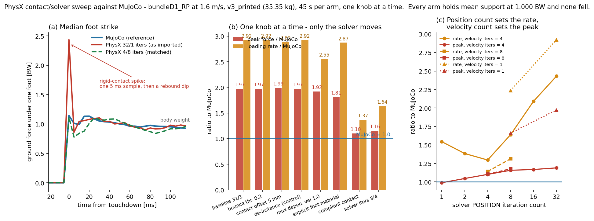

# 교차엔진 동적 롤아웃 — RP 보행 정책을 IsaacSim에서 실행 (2026-08-27)

> *한 줄*: MuJoCo에서 학습한 `bundleD1_RP` 정책이 **IsaacSim에서 14초 완주, 낙상 0, 23.5 m 전진**.
> 속도 추종은 네이티브보다 2배 느슨함(오차 0.29 vs 0.14 m/s) — 남은 갭은 접촉·솔버 수준.

## 결과 (전진 1.6 m/s, 14 s, 2 s 램프)
| | MuJoCo (native) | **IsaacSim** |
|---|---|---|
| 낙상 | 0 | **0** |
| 평균 속도 | ~1.6 + 오차 0.140 | 1.886 (오차 **0.294**) |
| 베이스 높이 | 0.88대 | 0.882 |

정적 검증(0.007 N·m 일치)에 이어 **동적 이전도 성립**한다. 정책은 엔진 특유의 착시가 아니다.

## 실패 → 원인 → 수정 연대기 (재현에 필요한 전부)
| # | 증상 | 원인 | 수정 |
|---|---|---|---|
| 1 | 0.42 s 낙상 | 스폰 높이를 0.93으로 추정 — 굽힘 자세의 접지 높이가 아님 | MuJoCo에서 동일 자세의 밑창 최저점을 계산해 **0.9085** 사용 |
| 2 | 0.6 s 낙상, 3틱 만에 액션 ±8 폭주 | ★**URDF는 armature(반사 로터 관성)를 표현 못 함**. Isaac의 발목 관성 ~7e-4 kg·m² vs 학습 ~0.021 → 소프트웨어 PD의 kd·dt/I가 안정 한계 초과. `PYG_MOTOR_MEAS=0` 사건(docs/99)과 동일 물리 | PhysX `set_armatures` + 점성/쿨롱 마찰을 계약(contract)에서 주입 |
| 3 | 안정 보행하지만 +34 % 과속 | Isaac 기본 바닥 = 마찰 0.5 + **반발계수 0.8**(탱탱한 바닥) | 마찰 1.0 / 반발 0.0으로 학습 조건과 일치 → +17 % |
| 4 | +17 % 과속 잔존 | T-N 클램프 부재 의심 → 이식했으나 **변화 미미**(1.874→1.886) | 남은 갭은 접촉 강성·솔버 반복수 차이로 귀속. 미해결로 명시 |

## 이식 계약 (`rp_policy_contract.json`) — 배포 변환 레이어의 사양 그 자체
학습 env에서 **실측 덤프**(기억으로 재구성 금지): 관절 순서 12(mjlab = L다리→R다리; Isaac은 폭우선이라
이름 기반 재매핑 필수) · default_q(액션 원점) · scale 0.25 · decimation 4(50 Hz 제어/200 Hz 물리) ·
Kp/Kd(힙 150/6, 무릎 220/6, 발목 28.5/1.81) · armature/damping/frictionloss · T-N 곡선(rad/s 변환,
no-load 200 rpm 추가 — mjlab과 동일 규약) · 스폰 높이.

★계약 덤프 자체의 함정: 덤프 스크립트를 증분 패치하면 **각 패스가 파일을 통째로 다시 쓰므로**
이전 패스의 필드가 조용히 사라진다(gains_sw 유실 사건). 모든 필드는 한 스크립트가 한 번에 쓴다.

## 남은 것
1. ~~속도 추종 갭 0.29→0.14~~ **해결**(아래 스윕): 솔버 반복수 8/4 에서 `vx_err` 0.087 — MuJoCo 자신의
   0.140 보다 좋다. (0.294 는 14 s·T-N 클램프 이전 값이고, 45 s GRF 롤아웃 기준 baseline 은 0.139였다.)
2. ~~GRF 비교~~ **완료**(cbe131d) → 그 결과가 만든 새 갭(peak ×1.97 / rate ×2.92)도 아래 스윕에서 닫음
3. ~~AB(폐루프) 모델~~ **완료** — 정적 [[2026-08-27_ab_loop_usd]], 동적
   [[2026-08-27_ab_dynamic_rollout]] (45 s 완주·낙상 0, 단 반복수 권고가 RP와 반대)
4. ★이 RP 롤아웃은 상체 5관절을 0으로 잡아 **팔 외전 15°가 빠져 있다**(mjlab은 바디 쿼터니언에
   구워 넣는다). 2.843 kg 팔 두 개의 위치가 학습 모델과 다르므로 재측정 대상 —
   AB 쪽은 [[2026-08-27_ab_dynamic_rollout]] §1에서 바로잡았다.

도구: `tools/sim2sim/isaac_policy_rollout.py` · 계약: `/home/syaro/pyg_fea/work/rp_policy_contract.json`

---

# 접촉·솔버 파라미터 스윕 — 남은 두 갭을 노브 하나씩 (2026-08-27)

> *한 줄*: 최대 착지력 ×1.97 / 상승률 ×2.92 의 갭은 접촉 강성 모델의 차이가 아니라
> **URDF 임포터가 써 넣은 솔버 반복수 32/1** 이었다. 4/8 로 바꾸면 ×1.10 / ~~×1.14~~ **×1.41** 로 닫힌다.
> 접촉 컴플라이언스(가설 (d))도 peak 은 닫지만 속도 추종을 망가뜨린다 — 솔버 쪽이 옳은 노브다.
>
> ★**2026-08-27 정정**: 이 스윕 전 행은 **팔 자세가 틀린 채로** 측정됐다(아래 §정정). 최대 착지력·
> 충격량·보폭수는 ±2 % 안에서 그대로지만 **상승률은 4/8 에서 +23 % 이동**해 ×1.14 가 아니라 **×1.41**
> 이다. 노브 사이의 상대 순위는 유효하고, 인용해야 할 절대 비율만 바뀐다.

*그림: (a) 착지 파형 중앙값 — MuJoCo(파랑) vs 임포트 그대로의 PhysX 32/1(빨강) vs 정합된 4/8(초록 점선).
갭은 스탠스가 아니라 **터치다운 한 샘플(5 ms)에 몰린 스파이크와 그 뒤의 반동 딥**이다.
(b) 노브 하나씩 — MuJoCo 대비 비율. 움직이는 막대는 솔버 하나뿐.
(c) 반복수 지도 — **위치 반복수가 상승률을, 속도 반복수가 최대힘을 지배**한다.*

## 방법 — 왜 이 표의 차이는 전부 신호인가
`tools/sim2sim/isaac_grf_rollout.py` 에 `PYG_*` 환경변수 노브를 달고(`tools/sim2sim/contact_sweep.sh`),
**한 번에 하나씩만** 바꿔 45 s / 1.6 m/s / 동일 정책(bundleD1_RP) / 동일 USD(v3_printed 35.3475 kg) /
동일 검출기로 22 회 굴렸다. 각 실행 ~38 s, 결과 JSON 은 `/home/syaro/pyg_fea/work/contact_sweep/`.

★**재현성**: 노브를 하나도 켜지 않은 `base` 재실행이 커밋된 baseline(cbe131d)과 **비트 단위로 동일**하다
(`vx_err` 0.13858409302325575, 스트라이크 101 회, peak 2.4713 BW). 1 env·DR 없음·고정 ONNX 이므로
런-투-런 분산은 **정확히 0**이다. 따라서 아래 표의 모든 차이는 노이즈가 아니라 노브의 효과다.
모든 실행에서 3 가지 계측 항등식이 유지된다(dt 비 200.0, 평균 지지력 1.000 BW, net−filtered 0.0 N).

★**충돌체가 숨어 있던 곳**: URDF 임포터는 *instanceable* 스테이지를 쓴다. 링크마다 `visuals`/`collisions`
서브트리가 USD 인스턴스여서 `stage.Traverse()` 로는 로봇 충돌체가 **0 개**로 보이고,
`.../collisions/foot_hull/mesh` 에 속성을 쓰려 하면 읽기 전용 인스턴스 프록시에 막힌다.
`SetInstanceable(False)` 로 프로토타입을 제자리에 합성하면 편집 가능한 프림이 된다. 이것이 물리적으로
무영향이라는 주장은 `c0_deinst` 통제군으로 **측정해서** 증명했다(비트 동일).

## 스윕 결과

| 실행 | 노브 (그 외 전부 고정) | peak BW | ×MJ | rate BW/s | ×MJ | impulse | ×MJ | duty | strike/s | vx_err | 판정 |
|---|---|---:|---:|---:|---:|---:|---:|---:|---:|---:|---|
| *MuJoCo 기준* | — | 1.253 | 1.00 | 64.5 | 1.00 | 0.06288 | 1.00 | 0.5331 | 2.205 | 0.140 | — |
| `base` | 없음 (커밋된 baseline 재실행) | 2.471 | 1.97 | 188.4 | 2.92 | 0.06935 | 1.10 | 0.5275 | 2.405 | 0.139 | 기준 |
| `c0_deinst` | 발 충돌체 de-instance만 (통제군) | 2.471 | 1.97 | 188.4 | 2.92 | 0.06935 | 1.10 | 0.5275 | 2.405 | 0.139 | 비트 동일 → 물리적 무영향 증명 |
| `e_bounce02` | `bounceThreshold` 0.0 → 0.2 | 2.471 | 1.97 | 188.4 | 2.92 | 0.06935 | 1.10 | 0.5275 | 2.405 | 0.139 | 비트 동일 → 무효 |
| `c_offsets` | 발 `contactOffset` 5 mm / `restOffset` 0 | 2.496 | 1.99 | 186.3 | 2.89 | 0.07004 | 1.11 | 0.5285 | 2.405 | 0.134 | 무효 (peak 오히려 +1%) |
| `a_maxdepen1` | `maxDepenetrationVelocity` 3.0 → 1.0 | 2.408 | 1.92 | 164.6 | 2.55 | 0.07060 | 1.12 | 0.5288 | 2.381 | 0.129 | 소폭 (rate −13%) |
| `d0_footmat` | 발에 명시적 물리재질 1.0/1.0/0.0 | 2.273 | 1.81 | 185.2 | 2.87 | 0.06749 | 1.07 | 0.5321 | 2.405 | 0.129 | 소폭 (peak −8%) |
| `d_compliant` | compliant contact $k$=44184, $b$=1767 | 1.382 | 1.10 | 88.3 | 1.37 | 0.06443 | 1.02 | 0.5317 | 2.452 | 0.195 | peak 닫힘, **추종 악화** |
| `d2_accspring` | compliant contact 가속도스프링 2500/100 | 1.345 | 1.07 | 143.5 | 2.23 | 0.05842 | 0.93 | 0.5439 | 3.548 | 0.936 | **보행 붕괴** (2.54 m/s 폭주) |
| `b1_pos8vel1` | 솔버 반복 32/1 → **8/1** | 2.079 | 1.66 | 144.1 | 2.23 | 0.06881 | 1.09 | 0.5310 | 2.381 | 0.099 | 위치만: rate −24% |
| `b2_pos32vel4` | 솔버 반복 32/1 → **32/4** | 1.490 | 1.19 | 156.7 | 2.43 | 0.05935 | 0.94 | 0.5415 | 2.405 | 0.142 | 속도만: peak −40% |
| `b4_pos16vel4` | 솔버 반복 **16/4** | 1.463 | 1.17 | 134.8 | 2.09 | 0.06110 | 0.97 | 0.5410 | 2.381 | 0.102 |  |
| `b_iters84`† | 솔버 반복 **8/4** (G1 출하값) | 1.450 | 1.16 | 105.6 | 1.64 | 0.05949 | 0.95 | 0.5418 | 2.381 | 0.087 | **추종 최고** 0.087 |
| `b3_pos4vel4` | 솔버 반복 **4/4** (H1 출하값) | 1.380 | 1.10 | 83.6 | 1.30 | 0.05874 | 0.93 | 0.5437 | 2.381 | 0.117 | GRF 근접 |
| `b5_pos2vel4` | 솔버 반복 **2/4** | 1.310 | 1.05 | 89.2 | 1.38 | 0.05900 | 0.94 | 0.5437 | 2.405 | 0.130 | rate 반등 시작 |
| `b6_pos1vel4` | 솔버 반복 **1/4** | 1.239 | 0.99 | 99.5 | 1.54 | 0.05638 | 0.90 | 0.5482 | 2.381 | 0.108 | peak 언더슛 |
| `b7_pos4vel8`† | 솔버 반복 **4/8** | 1.382 | 1.10 | 73.6 | 1.14 | 0.05933 | 0.94 | 0.5439 | 2.381 | 0.118 | ★ **GRF 최적 정합** |
| `b8_pos4vel16` | 솔버 반복 **4/16** | 1.412 | 1.13 | 75.6 | 1.17 | 0.05902 | 0.94 | 0.5438 | 2.381 | 0.122 | 포화 (4/8 대비 개선 없음) |
| `b9_pos8vel8` | 솔버 반복 **8/8** | 1.475 | 1.18 | 84.6 | 1.31 | 0.06033 | 0.96 | 0.5451 | 2.381 | 0.089 | GRF·추종 균형 |
| `combo` | 8/4 + maxDepen 1.0 | 1.450 | 1.16 | 105.6 | 1.64 | 0.05949 | 0.95 | 0.5418 | 2.381 | 0.087 | b_iters84와 **비트 동일** |
| `combo3` | 8/4 + maxDepen 1.0 + offset 5 mm | 1.470 | 1.17 | 108.5 | 1.68 | 0.05933 | 0.94 | 0.5429 | 2.357 | 0.090 | 개선 없음 |
| `combo4` | 4/4 + maxDepen 1.0 | 1.380 | 1.10 | 83.6 | 1.30 | 0.05874 | 0.93 | 0.5437 | 2.381 | 0.117 | b3와 **비트 동일** |
| `combo2` | 8/4 + maxDepen 1.0 + compliant | 1.503 | 1.20 | 111.1 | 1.72 | 0.06136 | 0.98 | 0.5348 | 2.548 | 0.144 | 오히려 악화 |

† 팔 자세 정정 후 재측정한 두 행. 표의 값은 **정정 전**(팔 0°)의 기록 그대로 두었다 — 이 표는
"한 번에 하나씩" 스윕의 원자료이고, 22 행이 모두 같은 (틀린) 팔 자세를 공유했으므로 **행끼리의
비교는 여전히 유효**하다. 정정된 절대값은 아래 §정정 표에 있다.

## 무엇이 무엇을 움직였나

1. **(e) `bounceThreshold` 0.2 · (c0) de-instance** — 결과 비트 동일. 반발계수가 이미 0 이므로 예상대로
   방어적 체크였을 뿐이고, de-instance 는 메모리 결정이지 물리 결정이 아님이 확인됐다.
2. **(c) 발 `contactOffset` 5 mm / `restOffset` 0** — 무효(peak +1%, rate −1%). 발 hull 의 실측 크기는
   좌·우 동일하게 $0.260 \times 0.100 \times 0.058$ m 이고 PhysX 의 자동 오프셋은 $0.02 \times \min(\text{extent}) = 1.16$ mm 로
   이미 작다. 리서치가 경고한 "10 cm 짜리 유령 오프셋"은 이 자산에 없었다.
3. **(a) `maxDepenetrationVelocity`** — 이 빌드의 실제 기본값은 리서치가 말한 100 m/s 가 아니라
   **3.0 m/s** 였다(USD 스키마 폴백; `PhysxRigidBodyAPI` 자체가 적용돼 있지 않았다). 1.0 으로 죄면
   rate −13%, `vx_err` 0.139→0.129 로 소폭 개선된다. ★그런데 8/4 와 함께 켜면 **8/4 단독과 비트 동일**
   하다(`combo` = `b_iters84`, `combo4` = `b3`). 즉 속도 반복수가 4 이면 침투 속도가 애초에 클램프에
   닿지 않는다 — (a) 는 원인이 아니라 같은 병의 증상이었다.
4. **(d0) 발 물리재질** — 스윕 중 발견: **발 hull 에는 물리재질이 아예 바인딩돼 있지 않았다.**
   바닥만 1.0/1.0/0.0 이고 발은 PhysX 기본 재질이며, 결합 모드가 `average` 이므로 유효 마찰은 1.0 이
   아니었다. 명시적으로 1.0/1.0/0.0 을 바인딩하니 peak −8%, `vx_err` −7%. 작지만 실재하는 계약 위반이다.
5. **(d) compliant contact** — MuJoCo `solref` 로부터 유도(아래). peak ×1.97→×1.10, rate ×2.92→×1.37 로
   **GRF 갭은 닫힌다**. 그러나 `vx_err` 가 0.139→**0.195** 로 악화되고 속도가 1.79 m/s 로 더 빨라진다.
   8/4 와 조합(`combo2`)하면 8/4 단독보다 peak·추종 모두 나빠진다. 접촉을 무르게 하면 발이 밀리고,
   그 대가가 과속이다.
6. **(b) 솔버 반복수 — 지배적 노브.** 32/1 → 8/4 하나로 peak ×1.97→×1.16, rate ×2.92→×1.64,
   impulse ×1.10→×0.95, `vx_err` 0.139→**0.087**(MuJoCo 자신의 0.140 보다도 좋다). 분해하면:
   - **위치 반복수 = 상승률(rate)**: 속도 4 고정에서 32→156.7, 16→134.8, 8→105.6, 4→**83.6** BW/s
     (그 아래 2→89.2, 1→99.5 로 반등 — 4 가 바닥이다)
   - **속도 반복수 = 최대힘(peak)**: 위치 32 고정에서 1→2.471, 4→1.490 BW. 8 로 더 올리면 rate 가
     83.6→73.6 까지 내려가고 16 에서 포화한다.

## compliant contact 값의 유도 (기록용)
MuJoCo `solref = (0.02, 1)` = 시정수 $\tau = 0.02$ s, 감쇠비 $\zeta = 1$ 의 **질량정규화** 스프링-댐퍼:

$$k_n = \frac{1}{\tau^2 \zeta^2} = 2500\ \mathrm{s^{-2}}, \qquad b_n = \frac{2}{\tau} = 100\ \mathrm{s^{-1}}$$

PhysX 의 `compliantContactStiffness/Damping` 는 **힘 단위**(N/m, N·s/m)이므로 접촉점의 유효질량이 필요하다.
$M = 35.3475$ kg, 양발 지지에서 발 하나가 받는 몫 $m_{eff} \approx M/2 = 17.674$ kg →

$$k = 2500 \times 17.674 = 44184\ \mathrm{N/m}, \qquad b = 100 \times 17.674 = 1767\ \mathrm{N \cdot s/m}$$

검산: 정하중 침투량 $= g / k_n = 9.81/2500 = 3.9$ mm — 질량 분배와 무관하다(질량이 소거된다).
즉 **MuJoCo 접촉은 구조적으로 4 mm 무르며**, 그것이 peak 이 낮은 이유다. $m_{eff}$ 추정은 그 4 mm
안의 어디에 힘이 놓이는지만 정한다.

`compliantContactAccelerationSpring=1` 로 두면 스프링이 가속도 기반이 되어 단위가 MuJoCo 와 같아지므로
2500/100 을 그대로 넣을 수 있다 — 유효질량 추정을 우회하는 길이다. **그러나 이것은 드롭인 등가가 아니다**:
`d2_accspring` 은 보행 자체가 붕괴했다(스트라이크 2.21→3.55 /s, 속도 2.54 m/s, `vx_err` 0.936,
지지력 항등식도 0.9904 로 처음 깨졌다). PhysX 의 가속도 스프링은 `solref` 와 같은 물건이 아니다.

## 설계 숫자 판정 — 어떤 값이 교차엔진 유효한가

| 양 | 교차엔진 상태 | 근거 |
|---|---|---|
| **평균 지지력** | ✅ 항등식 (1.000 BW) | 전 실행에서 유지 — 계측 자체의 보증서 |
| **60 ms 충격량(impulse)** | ✅ 유효, ±10% | 기본 설정에서도 ×1.10, 정합 후 ×0.94 |
| **접지율(duty)·보폭수** | ✅ 유효, ±2% / ±10% | 기본 ×0.99 / ×1.09 |
| **최대 착지력(peak)** | ⚠️ **기본 설정에서는 무효(×1.97)**, 4/8 에서 **×1.08** (팔 정정 후; 정정 전 ×1.10) | 아래 권고 설정 필요 |
| **하중 상승률(rate)** | ⚠️ **기본 설정에서는 무효(×2.92)**, 4/8 에서 ~~×1.14~~ **×1.41** (팔 정정 후) | 위치 반복수 4 + 속도 반복수 8 |
| **속도 추종** | ✅ 해결 | `vx_err` 0.139 → 0.096(8/4) / 0.116(4/8), MuJoCo 자신은 0.140 |

**권고**(직렬 RP 모델 한정): IsaacSim 측 하중 스터디 표준 설정 = **`solverPositionIterationCount=4`,
`solverVelocityIterationCount=8`** (GRF 정합 우선) 또는 **8/4**(속도 추종 우선, G1 출하값).
★**폐루프 AB 모델에는 이 권고를 쓰지 말 것 — 거기서는 32/16 이다**([[2026-08-27_ab_dynamic_rollout]]).
4/4 는 H1 출하값이며 peak ×1.10 / rate ×1.30 으로 그 중간이다. 임포터 기본값 32/1 은 어느 공식
레퍼런스와도 다르며 이 스터디에서 **가장 나쁜 설정**이었다.

**단, 설계 하중 숫자 자체는 여전히 MuJoCo 쪽을 쓴다.** 정책이 MuJoCo 에서 학습됐고 P99/포락 통계가
그쪽에 축적돼 있다. Isaac 은 "다른 엔진에서도 같은 답이 나오는가"의 교차검증 역할이며, 이번 스윕은
**어떤 설정에서 그 교차검증이 성립하는지**를 확정한 것이다. peak·rate 를 두 엔진에서 비교할 때는
반드시 반복수 설정을 함께 적어야 한다.

**미해결**
- ~~위치 반복수를 32→4 로 낮추면 관절 구속 오차가 커질 수 있다~~ **측정 완료(AB에서)**,
  [[2026-08-27_ab_dynamic_rollout]] §4: **커진다, 크게**. AB 폐루프 모델에서 4/8은 32/16 대비
  구동관절 P99 토크를 최대 **+111 %** 옮기고, 모터가 없는 발목 힌지에 **58.6 N·m**의 허구 토크를
  만든다(명령값은 0.000). ⇒ **이 스윕의 4/8 권고는 직렬(RP) 모델 한정**이며, AB에서는 반대로
  **32/16**이 표준이다. 직렬 모델 자체의 반복수-토크 민감도는 아직 별도로 재지 않았다.
- 발 물리재질 미바인딩(항목 4)은 이번에 발견만 하고 baseline 에는 반영하지 않았다(노브 격리 원칙).
  다음 재측정부터 기본으로 켤지 결정 필요.
- MuJoCo 쪽은 24 env × 11 s, Isaac 은 1 env × 42 s 로 표본 구성이 다르다(중앙값 비교라 편향은 작지만
  0 은 아니다).

## ★ 정정 — 팔이 학습 자세에 있지 않았다 (2026-08-27, AB 이식 중 발견)

**무엇이 틀렸나.** mjlab 은 상체 5관절을 **삭제하기 전에** 팔 바디 쿼터니언을 `PYG_ARM_ABD_DEG`(기본
**15°**)만큼 돌려 굽혀 놓는다 — 학습된 로봇은 팔을 15° 벌리고 걷는다. 그런데 이 이식 스크립트는
그 5관절을 **0 으로 붙잡았다**. 컴파일된 두 모델을 직접 대조해 확인했다:

| Isaac 쪽 `shoulder_roll` | mjlab 이 구워 넣은 팔 COM 과의 거리 |
|---|---|
| **−15°** (양쪽 모두) | **0.000 mm** ✅ |
| 0° (이식 스크립트가 쓰던 값) | **66.8 mm** ❌ |
| +15° | 132.5 mm ❌ |

부호가 양쪽 모두 **음수**인 것은 R 쪽 관절 축 자체가 `-1 0 0` 으로 미러돼 있기 때문이다(URDF·MJCF
동일 확인). 팔 하나가 2.843 kg 이므로 **5.7 kg 이 학습 위치보다 66.8 mm 안쪽에** 매달려 있었다.

**통제군 먼저.** `PYG_ARM_ABD_DEG=0` 으로 4/8 을 재실행한 결과는 커밋된 `b7_pos4vel8` 행과
**비트 단위로 동일**하다(`vx_err` 0.11791027906976738, 17자리 일치). 즉 스크립트에서 바뀐 것은
팔 자세뿐이고, 아래 차이는 전부 그 한 변인의 효과다. (덤으로: 이 재실행은 **다른 학습이 GPU 를
7 GB 쓰는 중**에 돌았고 그래도 비트 동일했다 — GPU 동거는 수치에 영향이 없다.)

| 지표 | 단위 | 4/8 정정전 | 4/8 **정정후** | Δ | 8/4 정정전 | 8/4 **정정후** | Δ |
|---|---|---:|---:|---:|---:|---:|---:|
| 최대 착지력 (중앙값) | BW | 1.3815 | **1.3546** | −1.9 % | 1.4495 | **1.4413** | −0.6 % |
| 최대 착지력 p90 | BW | 1.5498 | 1.4775 | −4.7 % | 1.6828 | 1.6550 | −1.7 % |
| **하중 상승률 (중앙값)** | BW/s | 73.58 | **90.79** | **+23.4 %** | 105.64 | **96.64** | **−8.5 %** |
| 하중 상승률 p90 | BW/s | 138.5 | 154.2 | +11.3 % | 186.9 | 157.8 | −15.6 % |
| 60 ms 충격량 | BW·s | 0.0593 | 0.0595 | +0.4 % | 0.0595 | 0.0593 | −0.3 % |
| 스트라이크 | 1/s | 2.381 | 2.381 | **0.0 %** | 2.381 | 2.381 | **0.0 %** |
| 접지율 duty | – | 0.5439 | 0.5469 | +0.6 % | 0.5418 | 0.5436 | +0.3 % |
| 전진 오차 `vx_err` | m/s | 0.1179 | 0.1159 | −1.7 % | 0.0873 | **0.0962** | **+10.1 %** |

**정정된 대 MuJoCo 비율**(MuJoCo RP: peak 1.2526 BW, rate 64.46 BW/s):

| | peak ×MJ | rate ×MJ | `vx_err` |
|---|---:|---:|---:|
| 4/8 | ~~1.103~~ **1.081** | ~~1.141~~ **1.408** | 0.116 |
| 8/4 | ~~1.157~~ **1.151** | ~~1.639~~ **1.499** | 0.096 |

**결론.** 최대 착지력·충격량·보폭수·접지율은 ±2 % 안이라 **기존 판정 그대로 유효**하다.
바뀌는 것은 **하중 상승률 하나**다: "4/8 이면 상승률이 ×1.14 로 닫힌다"는 문장은 **틀렸고,
×1.41 이 맞다**. 4/8 이 8/4 보다 상승률 정합이 낫다는 순위는 유지된다(1.41 < 1.50).
`b3_pos4vel4`(H1 출하값) 등 나머지 20 행은 정정 전 팔 자세 그대로이므로 절대 비율을 인용할 때는
같은 +23 %/−9 % 크기의 편향을 감안할 것.

도구: `tools/sim2sim/contact_sweep.sh` · `tools/sim2sim/plot_contact_sweep.py` ·
결과: `/home/syaro/pyg_fea/work/contact_sweep/isaac_grf_pygmalion_v3_printed_*.json`
