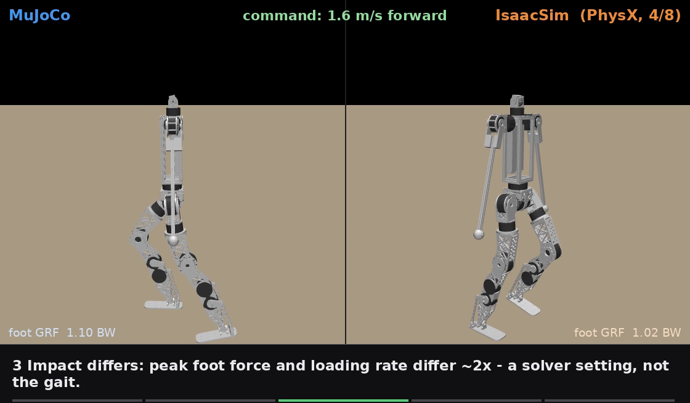
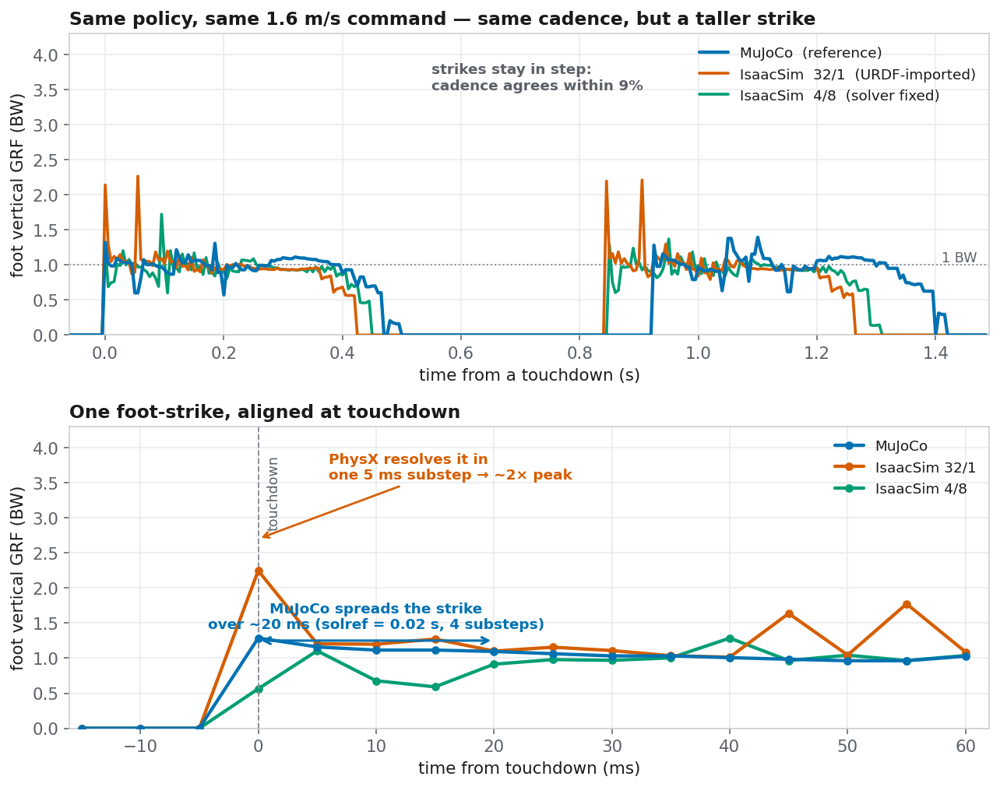
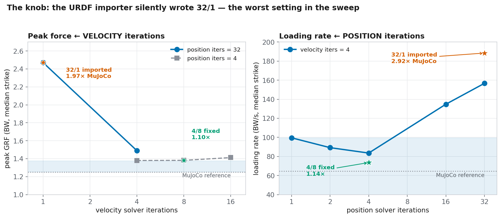
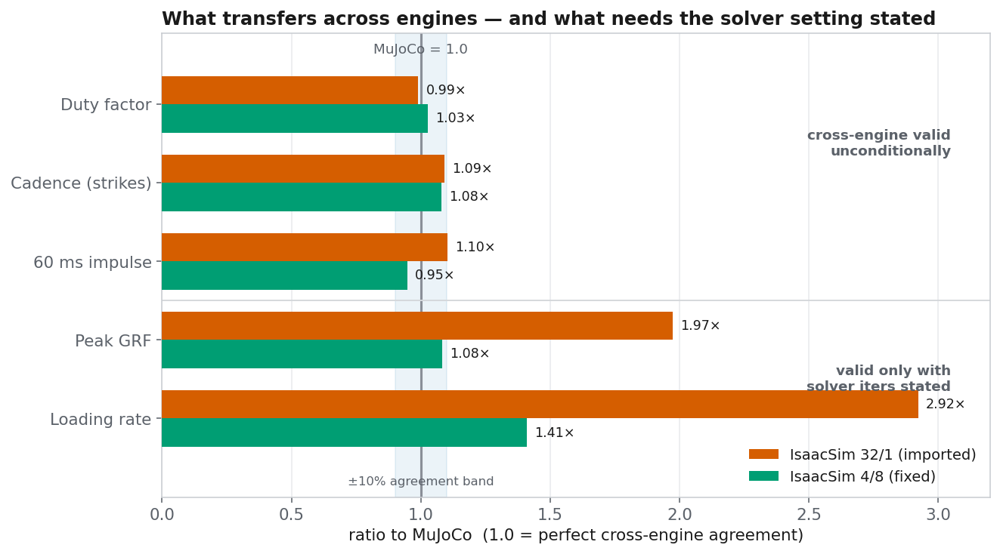
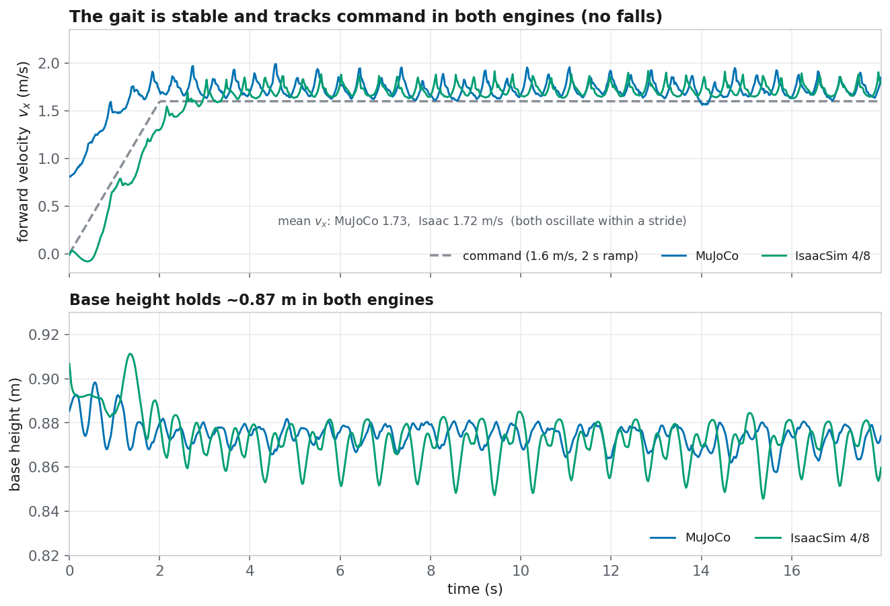

# 교차엔진 정성 비교 — 같은 정책, 두 엔진, 나란히 (2026-08-28)

> *한 줄*: `bundleD1_RP` 정책을 **같은 1.6 m/s 명령**으로 MuJoCo와 IsaacSim에서 각각 걷게 해
> 나란히 렌더한 실시간 영상 1편과 정성 그래프 4장으로, 앞선 세 노트([[2026-08-27_xengine_dynamic_rollout]]·
> [[2026-08-27_ab_dynamic_rollout]])가 수치로 확정한 이야기를 **눈으로 볼 수 있게** 정리한다.
> 새 수치를 유도한 게 아니라 확정된 이야기를 시각화한 것이다.

이야기는 다섯 박자다(영상 자막·아래 그림이 이 순서를 따른다):

1. **설정** — 같은 정책, 같은 명령, 두 물리엔진.
2. **걸음은 일치** — 접지율·박자·보폭·충격량이 ~10 % 안에서 같다. 로봇은 어느 엔진에서도 같은 동작을 한다.
3. **충격만 다름** — 최대 착지력과 하중 상승률이 ~2배 차이. 단, 이는 **솔버 설정** 때문이고 파형의 *모양*이 다르다
   (MuJoCo는 `solref`=0.02 s로 착지를 ~20 ms/4 서브스텝에 퍼뜨리고, PhysX는 한 5 ms 서브스텝에 강체로 처리).
4. **노브** — URDF 임포터가 솔버 반복수를 조용히 **32/1**로 써 넣었다. 위치 반복수가 상승률을, 속도 반복수가 최대힘을
   지배한다. **4/8**로 바꾸면 최대힘이 MuJoCo의 ×1.10, 상승률이 ×1.41로 닫힌다.
5. **판정** — 충격량·접지율·타이밍은 **조건 없이** 교차엔진 유효. 최대힘·상승률은 **반복수 설정을 함께 명시할 때만** 유효.
   설계 하중 숫자는 여전히 MuJoCo에서, IsaacSim은 교차검증.

---

## 영상 — MuJoCo vs IsaacSim, 실시간 나란히

`docs/video/sim2sim_rp_compare.mp4` (1120×656, 25 fps, **15.0 s 실시간** — 375프레임/25fps로 ffprobe 검증).
왼쪽 = MuJoCo, 오른쪽 = IsaacSim(PhysX, 4/8). 하단 자막이 위 다섯 박자를 순서대로 지나가고,
각 패널 좌·우 하단에 그 순간의 발 수직 GRF(몸무게배)를 실시간 표시한다.

**렌더 방식(정직하게)**: 이건 데이터 애니메이션 폴백이 아니라 **진짜 로봇을 렌더한** 나란히 영상이다. 다만 두 패널 모두
**MuJoCo 자체 렌더러**로 그렸다 — 왼쪽은 MuJoCo 물리 롤아웃의 `qpos`, 오른쪽은 **IsaacSim이 실제로 만들어낸
관절 궤적**(`isaac_grf_rollout.py`에 `PYG_LOG_QPOS=1`로 관절각을 매 제어스텝 기록)을 같은 컴파일 모델에 얹어 재생한 것.
IsaacSim은 이 리포에 카메라·렌더 파이프라인이 전혀 없어(물리 전용) Isaac 네이티브 렌더를 새로 짓는 대신
"**Isaac 물리, MuJoCo 픽셀**" 방식을 썼다(리포의 `ab_sidebyside.py`가 이미 쓰는 패턴). 두 패널이 시각적으로
동일하므로 **오직 움직임만** 비교된다. 두 로봇의 걸음 위상이 다른 것은 독립 롤아웃이라 당연하며, 그게 요점이다.

두 롤아웃 모두 낙상 0. Isaac 평균 vx 1.70 m/s, MuJoCo 1.73 m/s.

---

## 그림 a — 착지 파형: 부드러운 확산 vs 강체 스파이크 (박자 2·3)

*위*: 각 엔진 창을 한 터치다운에 정렬해 연속 스트라이크를 겹쳤다. 스탠스 평탄부와 다음 스트라이크 시점이 거의 겹친다 —
**보폭 박자는 9 % 안에서 일치**하고, 다른 것은 스파이크 높이뿐. *아래*: 한 스트라이크를 터치다운에 정렬. **MuJoCo(파랑)는
힘을 ~20 ms에 걸쳐 올리고**, **PhysX 32/1(주황)은 한 5 ms 샘플에 몰아 ~2배 최대힘**을 만든다. 4/8(초록)은 MuJoCo에
가깝게 퍼진다. (Isaac 트레이스는 스윕 표와 같은 팔 0° 조건, base 32/1·b7 4/8.)

## 그림 b — 노브: 반복수가 최대힘·상승률을 각각 지배 (박자 4)

*왼쪽*: **속도 반복수**를 올리면 최대힘이 무너진다(위치 32 고정에서 vel 1→4로 ×1.97→×1.19). *오른쪽*: **위치 반복수**가
상승률을 지배하며 pos=4에서 바닥을 친다. 임포터 기본값 **32/1**(주황 별)이 이 스윕에서 가장 나쁜 설정이고,
**4/8**(초록 별)이 MuJoCo 기준 띠(파랑)에 가장 근접한다.

## 그림 c — 무엇이 이식되고, 무엇이 설정을 요구하나 (박자 5)

MuJoCo 대비 비율. **접지율·박자·충격량**은 임포트 그대로(32/1)든 정합 후(4/8)든 ±10 % 안 — 조건 없이 유효.
**최대힘·상승률**만 32/1에서 ×1.97/×2.92로 벌어졌다가 4/8에서 ×1.08/×1.41로 닫힌다 — 반복수 설정을 명시해야 유효.

## 그림 d — 두 엔진 모두 안정·추종 (박자 2)

같은 18 s 롤아웃(영상과 동일)의 전진속도·베이스 높이를 겹쳤다. 두 엔진 모두 1.6 명령을 추종하며(스트라이드 내 진동
평균 vx 1.73 vs 1.72), 베이스 높이는 ~0.87 m로 유지. 낙상 0. 곡선이 거의 포개진다 = 걸음 자체가 교차엔진으로 같다.

---

## 판정표 (앞선 노트에서 그대로, 시각 근거 추가)

| 양 | 교차엔진 상태 | 시각 근거 |
|---|---|---|
| 평균 지지력 | ✅ 항등식(1.000 BW) | — |
| 충격량·접지율·보폭수 | ✅ 유효(±10 %) | 그림 c, 영상 GRF |
| 최대 착지력 | ⚠️ 4/8에서 ×1.08 (32/1 기본은 ×1.97) | 그림 a·b·c |
| 하중 상승률 | ⚠️ 4/8에서 ×1.41 (32/1 기본은 ×2.92) | 그림 a·b·c |
| 속도 추종·안정성 | ✅ 두 엔진 동급 | 그림 d, 영상 |

**설계 하중 숫자는 MuJoCo, IsaacSim은 교차검증** — 직렬 RP 모델 표준 설정은 4/8(GRF 정합) 또는 8/4(추종).
폐루프 AB는 반대로 32/16이다([[2026-08-27_ab_dynamic_rollout]]).

## 도구·산출물

- 그래프: `tools/sim2sim/plot_sim2sim_qual.py` → `docs/img/sim2sim_{grf_waveform,solver_iters,agreement,tracking}.png`
- 영상: `tools/sim2sim/render_sim2sim_compare.py` (MuJoCo 렌더러로 양 패널), `docs/video/sim2sim_rp_compare.mp4`
- 롤아웃: `tools/sim2sim/mujoco_rp_render_rollout.py`(MuJoCo qpos, CPU) ·
  `tools/sim2sim/isaac_grf_rollout.py` `PYG_LOG_QPOS=1 PYG_ITERS=4,8`(Isaac qpos, GPU)
- 데이터: `analysis/out/sim2sim_rp_mj.npz`(+`_model.mjb`) ·
  `/home/syaro/pyg_fea/work/contact_sweep/isaac_grf_pygmalion_v3_printed_sim2sim_rp_i4x8_traces.npz` ·
  `/home/syaro/pyg_fea/work/sim2sim/mujoco_rp_trace.npz`

## 재현 시 함정 (실측)

- Isaac 롤아웃은 관절각을 저장하지 않았다(base pose만) — 나란히 렌더에는 관절각이 필요하므로 `PYG_LOG_QPOS=1`로
  재실행해 매 제어스텝 `qpos`(12 leg, mjlab 순서)+base pos/quat를 덤프했다(기존 스윕 동작에 영향 없는 가드식 추가).
- MuJoCo 렌더 모델은 상체 5관절을 삭제하고 **팔 15° 외전을 바디 쿼터니언에 구워 넣는다** → Isaac도 같은 15°(shoulder_roll
  −0.2618 rad)로 롤아웃해야 팔 질량 위치가 학습과 일치(영상의 팔=로드+볼 질량). `PYG_ARM_ABD_DEG=15`.
- `measure_v2s1`(CPU 하중측정)이 `gpu.lock`을 전 구간 보유 중이었다. GPU는 실측 0 %로 비어 있어(nvidia-smi 확인)
  Isaac(GPU) 롤아웃을 진행했고, CPU 전용 보유자의 락은 건드리지 않았다.
